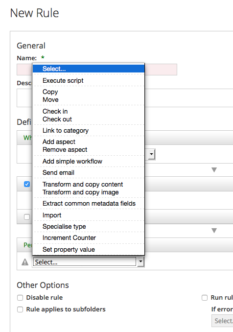
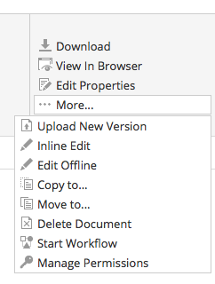
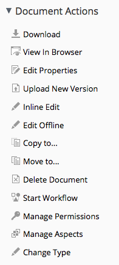
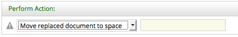
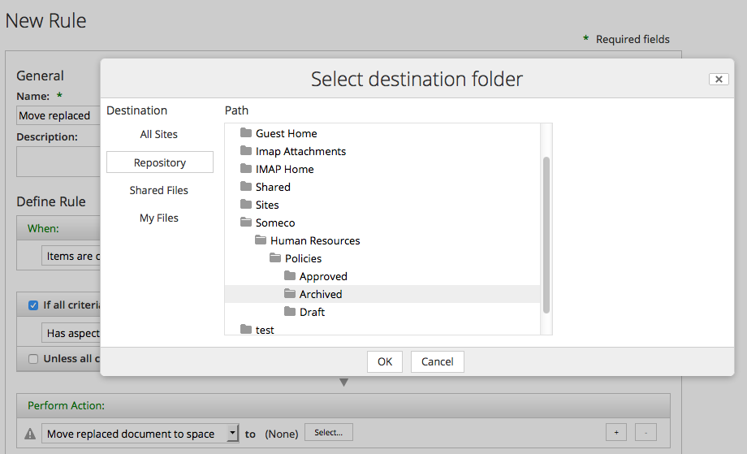
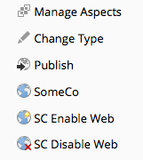
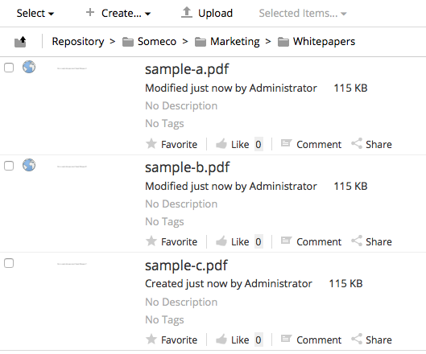
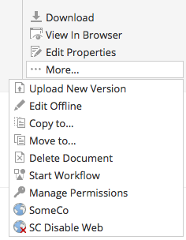

% Creating Custom Actions in Alfresco
% Jeff Potts
% January, 2014

License
=======


This work is licensed under the Creative Commons Attribution-ShareAlike 3.0 Unported License. To view a copy of this license, visit http://creativecommons.org/licenses/by-sa/3.0/ or send a letter to Creative Commons, 444 Castro Street, Suite 900, Mountain View, California, 94041, USA.

Introduction
============
Alfresco is a flexible platform for developing content management
applications. Clients have several options to consider when selecting a
user interface approach. Alfresco comes with a web client, Alfresco Share, that can be
used as-is or customized. Alternatively, developers can create custom
applications using the Content Management Interoperability Services
(CMIS) API or web scripts.

Many times, the out-of-the-box web client is sufficient, even if it has
to be customized slightly to fit your requirements. This is particularly
true when your requirements closely resemble the all-purpose document
management use case.

Deciding whether to go with the out-of-the-box web client, a customized
web client, or building your own user interface from scratch requires
careful thought and analysis that is beyond the scope of this document.

This tutorial is part of a [series of tutorials](http://ecmarchitect.com/alfresco-developer-series) that cover Alfresco from a
configuration and customization perspective. The [previous tutorial](http://ecmarchitect.com/alfresco-developer-series-tutorials/content/tutorial/tutorial.html) discussed
how to create custom content types and then expose those to the Alfresco Share
user interface. The focus in this tutorial is on developing custom
actions and configuring the user interface to show those custom actions.

It is important to note that if you are looking for quick-and-dirty ways
to operate against documents in the repository, you may not need a
custom action. For example, you could:

* Write some Java, Groovy, Python, PHP, or .NET code that leverages an Apache Chemistry library to work with content stored in Alfresco
* Create some server-side JavaScript
that gets executed using the [JavaScript Console](http://share-extras.github.io/addons/js-console/) add-on available from Share Extras
* Use curl or some other HTTP client to make calls against web scripts

None of the above require you to write actions.

Actions are useful when:

* You want to define one or more operations that can be executed repeatedly
* You want to make it easy for end-users to invoke common operations, either by clicking a menu item or by configuring a rule on a folder that will execute the operations automatically
* You want to perform one or more operations on a schedule (which isn't covered in this tutorial)

Part 1 of this document explains how to implement the “back-end” piece
of the action. The document includes two different examples. One action,
called “Move Replaced” will be used as a “Rule Action”. The other action
is called “Set Web Flag” and it will be called from menu items in the
user interface.

Part 2 explains how to configure the Alfresco Share user interface to work with the
custom actions you developed in Part 1.

Setup
=====
Before getting too far down the road, let me tell you about the tools you'll need and then give you a description of the project organization.

Tools
-----
Here is what I am using on my machine:

* Mac OS X 10.9.1
* Java 1.7.0_51
* Apache Maven 3.0.5 (installed using Macports)
* Alfresco Maven SDK, AMP Archetype 1.1.1 (No download necessary)
* Eclipse Java EE IDE for Web Developers, Kepler
* Alfresco Community Edition 4.2.e ([Download](http://www.alfresco.com/products/community))

By default, when you create an Alfresco project using version 1.1.1 of the Alfresco Maven SDK the project will be configured to depend on Alfresco Community Edition 4.2.e.

The Eclipse IDE is optional. Most people working with Alfresco use Eclipse or something similar, so this tutorial will assume that's what you are using.

Project Organization
--------------------
I am going to use the Alfresco Maven SDK to create projects that will package up my customizations as AMPs (Alfresco Module Packages). I will ultimately create two AMPs. One AMP is for the Alfresco web application (the "repo" tier) and the other is for the Alfresco Share web application (the "Share" tier). Unless you have a good reason to do otherwise, this should be your default approach to packaging and deploying your customizations.

I am not going to spend much time talking about how the Alfresco Maven SDK works. If you aren't already familiar with it, you may want to read the [Getting Started with the Alfresco Maven SDK](http://ecmarchitect.com/alfresco-developer-series) tutorial on ecmarchitect.com first and then come back to this one.

This tutorial relies on code from the [Custom Content Types](http://ecmarchitect.com/alfresco-developer-series-tutorials/content/tutorial/tutorial.html) tutorial. The tutorial assumes that the repo tier AMP and Share tier AMP created during that tutorial have been deployed to the Alfresco server you will be deploying your custom actions AMPs to.

If you are planning on following along, go ahead and use the Alfresco Maven SDK to create two new projects. One should use a `groupId` of "com.someco" and an `artifactId` of "actions-tutorial-repo" for the repo tier project and "actions-tutorial-share" for the share tier project.

Part 1: Implementing an Action
==============================
Actions are very commonly used when implementing Alfresco. This part of
the tutorial explains what actions are, sets up a couple of examples,
then shows how actions are implemented in Java.

What is an Action?
------------------
The term, “action” is overloaded quite heavily across the Alfresco
platform (and application development, in general). For the purposes of
this document, an action is a discrete, reusable unit of work that can
be performed against an object in the repository, and can optionally be
configured at run-time by the user. Some of the out-of-the-box actions
include things like: Check-out, Check-in, Add Aspect, Remove Aspect,
Move, Send Email, and Specialize Type.

Sometimes, the term “rule action” is used to describe this type of
action. That's because actions are frequently used when configuring a
rule on a folder. For example, suppose that there is a requirement to
always create a PNG version of GIFs checked in to a specific folder.
This is easily done by creating a rule that watches for new or updated
GIFs and then runs the “Transform and Copy Image” action when it finds
an object that meets the criteria.

The screenshots below show some of the out-of-the-box actions available when
configuring a rule in Alfresco Share:



But actions aren't limited to running as part of a rule. Actions can be
called from menu items in the Alfresco Share user interface. These are often called “UI actions” to distinguish the actual menu item,
the UI action, from the thing that actually does the work, the “rule
action” or simply, the “action”.

These screenshots show the UI actions available in Alfresco Share's document
library's document list as well as the document details page:





So actions can be invoked from a rule and can be triggered from a menu
item. Actions can also be called from code which means they can be
invoked from server-side JavaScript, workflows, web scripts, or any
other piece of code that can get to the Action Service.

Because the same action can be invoked from all of these places, actions
are a powerful way to write content operations once and then leverage
them in many places.

### Example 1: Move Replaced

Using actions and workflow together can be an effective way to customize
the web client for the needs of the business. Consider SomeCo, the
fictitious company introduced in the content types tutorial. Suppose
SomeCo wants to use Alfresco to manage the policies and procedures for
their entire organization. They need to be able to track when a new
policy or procedure is published that supersedes an older policy
document.

SomeCo uses three folders to keep track of the state of their policies:
Draft, Approved, and Archived. SomeCo uses Alfresco's Simple Workflows
to move policies from folder to folder. When someone moves a policy into
the Approved folder, if that policy replaces an older policy, the older
policy needs to be automatically moved to the Archived folder. Alfresco
has a “Move” action, but doesn't have a “Move Replaced” action. A new
“Move Replaced” action can easily be created to accomplish this.

You're going to see how to implement this momentarily.

### Example 2: Set Web Flag

Recall from the first tutorial that SomeCo publishes a subset of the
documents in their repository to a company portal. SomeCo uses a flag on
the object to keep track of which documents should be shown on the
portal. In the first tutorial, that flag was set either by editing the
field in the user interface or by running code. Now it is time to make
it a bit more user-friendly by providing menu items in the user
interface that can enable and disable the flag.

The rest of this document explains how to implement both of these
actions including the configuration necessary to make them available
from the Alfresco Share user interface.

Implementing the Move Replaced Action
-------------------------------------
Actions run against specific nodes. In this example, the action needs to
find the documents that the “actioned upon node” replaces so they can be
moved. In order to do this, the action needs to know where to move the
old documents to and it needs to know how to find the old documents. The
first part, where to move the old documents, will be a parameter that
gets passed to the action. The second part will leverage a “replaces”
relationship.

A "replaces" relationship is a pretty common requirement. In fact,
Alfresco already has a "replaceable" aspect in the out-of-the-box
content model. The “replaceable” aspect defines an association called
“cm:replaces”. So, the out-of-the-box content model already accommodates
documents that replace other documents. All that is needed is some
configuration to expose this relationship to the user interface.

The business logic will reside in an action executer class. This will
allow SomeCo end-users to call the action from a rule configured on any
folder, without further involvement from the development team.

Implementing the action's business logic involves two steps:

1.  Writing the action executer class
2.  Configuring the action in Spring

Once that's done, the action can be called from code using the Action
Service, or it can be wired in to the user interface (including rule
configuration), which is covered in Part 2.

### Step 1: Write the action executer class

At its most basic, an action consists of an Action Executer class and
its associated Spring bean configuration. Implementing an action
involves extending `ActionExecuterAbstractBase` and then implementing the
`executeImpl()` method. Before starting, though, think about similar code
that might already exist within Alfresco that might be a good starting
point for the new action. Alfresco is open source--it would be a shame
to ignore that valuable resource. Plus, following the same patterns to
implement this customization will make it easier for someone to support
and makes it easier to share our code with others or even to contribute
the code back to the Alfresco community project.

The new action is doing a move, so the existing Move action is a good
place to start. In fact, the only difference between the Move action and
the custom Move Replaced action is that the node being moved isn't the
current node--it's the node on the target end of a "replaces"
association.

Alfresco's executer class for the Move action is called
`org.alfresco.repo.action.executer.MoveActionExecuter`. If you have the
Alfresco source you can find it in the repository project. I'll copy it
into my own repository project and call it "[MoveReplacedActionExecuter](https://github.com/jpotts/alfresco-developer-series/blob/master/actions/actions-tutorial-repo/src/main/java/com/someco/action/executer/MoveReplacedActionExecuter.java)".

The out-of-the-box `executeImpl()` method is where the move logic is handled. It looks like
this:

    public void executeImpl(Action ruleAction, NodeRef actionedUponNodeRef)
    {
        NodeRef destinationParent = (NodeRef)ruleAction.getParameterValue(PARAM_DESTINATION_FOLDER);
        try
        {
            fileFolderService.move(actionedUponNodeRef, destinationParent, null);
        }
        catch (FileNotFoundException e)
        {
            // Do nothing
        }
    } 

The code simply grabs the parameter value for the destination folder and
then calls the `FileFolderService` to do the move. This is a good start
for Move Replaced. All I need to do is modify the `executeImpl()` method to
find the nodes related to the current node by a "replaces" association,
and then for each result, set up and perform a move.

    public void executeImpl(Action ruleAction, NodeRef actionedUponNodeRef) {
        // get the replaces associations for this node
        List<AssociationRef> assocRefs = nodeService.getTargetAssocs(actionedUponNodeRef, ((QNamePattern) QName.createQName(NamespaceService.CONTENT_MODEL_1_0_URI, "replaces")) );

        // if there are none, return
        if (assocRefs.isEmpty()) {
             // no work to do, return
             return;
        } else {
            NodeRef destinationParent = (NodeRef)ruleAction.getParameterValue(PARAM_DESTINATION_FOLDER);
            for (AssociationRef assocNode : assocRefs) {
                // create a noderef for the replaces association
                NodeRef targetNodeRef = assocNode.getTargetRef();
                // if the node exists
                if (this.nodeService.exists(targetNodeRef) == true) {
                    try {
                        fileFolderService.move(targetNodeRef, destinationParent, null);
                    } catch (FileNotFoundException e) {
                        // Do nothing
                    }
                }
            } // next assocNode
        } // end if isEmpty
    } 

The only other change needed is to change the value of the constant NAME
from "move" to "move-replaced". (Throughout this document I'll only
include relevant pieces of these classes—check the source that
accompanies this tutorial for code that actually compiles).

### Step 2: Configure the action in Spring

In the content types tutorial, you learned that Spring bean
configurations go in the context file for the AMP. That file
is called "service-context.xml" and it resides in:

    $TUTORIAL_HOME/actions-tutorial-repo/src/main/amp/config/alfresco/module/actions-tutorial-repo/context

The file is created for you by the Alfresco Maven SDK. Initially, it contains some `bean` elements for some demo classes that are also created by the Alfresco Maven SDK. Add the following `bean` element to the existing list of `beans`:

    <bean id="move-replaced" class="com.someco.action.executer.MoveReplacedActionExecuter" parent="action-executer">
        <property name="fileFolderService">
            <ref bean="FileFolderService" />
        </property>
        <property name="nodeService">
            <ref bean="NodeService" />
        </property>
    </bean>

That's all there is to it. You can now invoke either of these two actions with the Action Service.

### Testing the Action

In the source code that accompanies this tutorial, I've included some unit tests. The unit tests just attempt to use the `ActionService` to get the action. For the Move Replaced action, I also execute the action.

If you are following along in your own projects, you can copy the `MoveReplacedActionTest` class into:

    $TUTORIAL_HOME/actions-tutorial-repo/src/test/java/com/someco/actions/test

Once you do that (or if you have simply checked out the tutorial source from GitHub) you can then run `mvn install`. When you do that, Maven will compile your action and run the tests against Alfresco running on an embedded Tomcat server.

So at this point, you've got one new custom action, but it isn't configured in the Alfresco Share user interface. Before doing that, let's look at another Action Executer example, then we'll configure them both in the UI.

Implementing the Set Web Flag action
------------------------------------
This action will be used to set the flag on content which should be
shown in the SomeCo portal. Recall from the content types tutorial that
the property that controls whether or not content should show up in the portal is a boolean named `sc:isActive` which is defined as part
of an aspect named `sc:webable`. Also in that aspect is a date property
named `sc:published` that keeps track of when the content was last
published to the portal.

The Set Web Flag action, then, needs to set the `sc:isActive` flag. The
value to set it to (`true` or `false`) can be passed in as a parameter to
the action. When the flag is set to `true`, the action should set the
`sc:published` property with the current date.

This action could be called from a rule, but SomeCo intends to configure
a UI action in the user interface to allow end-users the ability to
enable or disable a piece of content for display on the portal with a
single click.

Just like in the Move Replaced example, the steps are:

1.  Write the action executer class
2.  Configure the action in Spring

Then, the action will be ready to use.

### Step 1: Write the SetWebFlag action executer class

Like the `MoveReplacedAction`, this action class extends
`ActionExecuterAbstractBase`. The action takes a parameter that specifies
the value for the `sc:isActive` flag. Actions declare parameters by
overriding the `addParameterDefinitions()` method, like this:

    @Override
    protected void addParameterDefinitions(List<ParameterDefinition> paramList) {
        paramList.add(
            new ParameterDefinitionImpl(
                    PARAM_ACTIVE,
                    DataTypeDefinition.BOOLEAN,
                    false,
                    getParamDisplayLabel(PARAM_ACTIVE)));
    }

The constructor for the `ParameterDefinitionImpl` takes the name of the
parameter, the parameter's data type, whether or not the parameter is
mandatory, and a label. If the custom action had additional parameters
this method would have one `paramList.add()` call for each parameter.

The next step is to create the action's logic in the `executeImpl()` method:

    @Override
    protected void executeImpl(Action action, NodeRef actionedUponNodeRef) {    
        Boolean activeFlag = (Boolean)action.getParameterValue(PARAM_ACTIVE);

        if (activeFlag == null) activeFlag = true; // default

        // set the sc:isActive property to true
        Map<QName, Serializable> properties = nodeService.getProperties(actionedUponNodeRef);
        properties.put(
            QName.createQName(SomeCoModel.NAMESPACE_SOMECO_CONTENT_MODEL, SomeCoModel.PROP_IS_ACTIVE), activeFlag);

        if (activeFlag) {
            // set the sc:published property to now
            properties.put(
                QName.createQName(SomeCoModel.NAMESPACE_SOMECO_CONTENT_MODEL, SomeCoModel.PROP_PUBLISHED), new Date());
        }
        
        // if the aspect has already been added, set the properties
        if (nodeService.hasAspect(actionedUponNodeRef,
                    QName.createQName(
                        SomeCoModel.NAMESPACE_SOMECO_CONTENT_MODEL,
                        SomeCoModel.ASPECT_SC_WEBABLE))) {
            nodeService.setProperties(actionedUponNodeRef, properties);
        } else {
            // otherwise, add the aspect and set the properties
            nodeService.addAspect(actionedUponNodeRef,
                    Qname.createQName(
                        SomeCoModel.NAMESPACE_SOMECO_CONTENT_MODEL,
                        SomeCoModel.ASPECT_SC_WEBABLE), properties);
        }                  
    }

The logic should be pretty easy to follow. The code grabs the value of
the `active` parameter. Then, it sets up a `Map` to hold properties. If the
active flag is being set to `true`, the date property is added to the `Map`.
The last part of the method just checks to see whether the aspect needs
to be added or not. If so, the aspect can be added and the properties
set in a single call.

### Step 2: Configure the action in Spring

The Spring configuration for this action goes in the same context file
as the pervious action:

    <bean id="set-web-flag" class="com.someco.action.executer.SetWebFlag" parent="action-executer">
        <property name="nodeService">
            <ref bean="NodeService" />
        </property>
    </bean>

The action can now be invoked by the Action Service. If you want, you can test it using `mvn install` just like you did for the Move Replaced action.

Localizing the actions
----------------------

This step isn't strictly necessary at this point, but it will save a step later. There are some places in the Alfresco Share user interface that get localized values from the repository tier. So a user-friendly title and description for each of these actions needs to be set.

Following the same pattern as the content tutorial, I created a "messages" folder in:

    $TUTORIAL_HOME/actions-tutorial-repo/src/main/amp/config/alfresco/module/actions-tutorial-repo

In that folder I created a file called "somecoactions.properties" with the following content:

    # Move Replaced action
    move-replaced.title=Move replaced document to space
    move-replaced.description=This will move the target node of a replaces association to a specified space.
    
    # Set web flag action
    set-web-flag.title=Sets the SC Web Flag
    set-web-flag.description=This will add the sc:webable aspect and set the isActive flag.

Spring needs to know about this properties bundle, so I added this bean to service-context.xml:

    <bean id="${project.artifactId}_actionResourceBundles" parent="actionResourceBundles">
        <property name="resourceBundles">
            <list>
                <value>alfresco.module.${project.artifactId}.messages.somecoactions</value>
            </list>
        </property>
    </bean>

Now when Alfresco Share asks for the title or description of these actions, it will get the appropriate values.

Both of these actions are now ready to be wired in to the user interface. That's
covered in Part 2.

Part 2: Configuring the Action's Front-End in Share
===================================================
In Part 1 of this document you learned how to create an Action Executer
class. The result was an action that could be called from code. But both
actions need to be invoked by end-users. In the case of the Move
Replaced action, an end-user will configure a rule that will invoke the
action. When the end-user configures the action while setting up the rule, they need to specify
the directory to send the replaced documents to. That means the user
interface needs to know how to let the end user pick a target folder.

The Set Web Flag action gives end-users the ability to set the active
flag and the publish date with a single click of a menu item. So the
user interface needs to know where to show that menu item and how to
invoke the `set-web-flag` action in the repository.

Configuring the Replaceable Aspect in Share
-------------------------------------------
Alfresco's out-of-the-box content model already defines an association
called `cm:replaces` as part of the `cm:replaceable` aspect. But neither
the aspect nor the association are configured to be displayed in the
Share user interface. That's easy to fix. All you have to do is edit share-config-custom.xml and then localize the labels.

### Step 1: Edit share-config-custom.xml

Recall from the content types tutorial that the Share user interface
configuration resides in a file called “share-config-custom.xml”. The actions-tutorial-share project will have its own share-config-custom.xml that contains Share configuration specific to the custom actions. The file resides under:

    $TUTORIAL_HOME/actions-tutorial-share/src/main/resources/META-INF

The `cm:replaceable` aspect can be added to the list of aspects a user can
see by adding some document library configuation to share-config-custom.xml, like this:

    <alfresco-config>
        <!-- Document Library config section -->
        <config evaluator="string-compare" condition="DocumentLibrary">
            <aspects>
                <!-- Aspects that a user can see -->
                <visible>
                    <aspect name="cm:replaceable" />
                </visible>
    
                <!-- Aspects that a user can add. Same as "visible" if left empty -->
                <addable>
                </addable>
    
                <!-- Aspects that a user can remove. Same as "visible" if left empty -->
                <removeable>
                </removeable>
            </aspects>
        </config>
    </alfresco-config>

Next, the `cm:replaces` association needs to show up when editing
properties. In this example, SomeCo will use instances of `cm:content`
for policies, but this would work the same way if a specific content
type, like `sc:hrPolicy`, were used instead. So I've copied the form
configuration for `cm:content` from the out-of-the-box form
configuration into share-config-custom.xml.

Just like in the content
types tutorial, the association is configured by adding children to the
`field-visibility` and `appearance` elements, like this:

               <show id="surf:mid"/>
               <show id="surf:label"/>
               
               <!-- cm:replaceable -->
               <show id="cm:replaces" />
               
            </field-visibility>

and this:

               <field id="cm:sentdate" read-only="true" />
               <field id="cm:subjectline" read-only="true" />
               <field id="cm:replaces" label-id="assoc.cm_replaces"/>
            </appearance>

### Step 2: Localize the labels

The last step in exposing the `cm:replaceable` aspect and `cm:replaces`
association is localizing the labels. As you saw in the content types tutorial, custom labels go in:

    $TUTORIAL_HOME/actions-tutorial-share/src/main/amp/config/alfresco/module/actions-tutorial-share/messages

I'll create a new file for this module called scActions.properties. In it goes the following:

    #cm:replaceable
    aspect.cm_replaceable=Replaceable
    assoc.cm_replaces=Replaces

The custom properties file needs to be configured using Spring. So, again, just like the custom content types tutorial, I'll create a context file called "actions-article-share-context.xml" in:

    $TUTORIAL_HOME/actions-tutorial-share/src/main/amp/config/alfresco/web-extension

Initially, the file contains a Spring bean that points to the properties file, like this:

    <?xml version='1.0' encoding='UTF-8'?>
    <!DOCTYPE beans PUBLIC '-//SPRING//DTD BEAN//EN' 'http://www.springframework.org/dtd/spring-beans.dtd'>
    <beans>
    
       <!-- Add Someco messages -->
       <bean id="${project.artifactId}_resources" class="org.springframework.extensions.surf.util.ResourceBundleBootstrapComponent">
          <property name="resourceBundles">
             <list>
             	<value>alfresco.module.${project.artifactId}.messages.scActions</value>
             </list>
          </property>
       </bean>
    
    </beans>

Now the replaceable aspect can be added to and removed from documents using Alfresco Share. The next step is to configure the Move Replaced Rule Action in Share.

Configuring the Move Replaced Rule Action in Share
--------------------------------------------------
Share is pretty smart. If you deploy the Move Replaced action as-is it
will automatically get added to the list of actions users can select
when configuring a rule. So for simple actions, you won't have to do
anything further. But in this example, the action takes an argument. By
default, Share will try to render a plain text field for the argument, like this:



A plain text field for the parameter might work in some cases, but this action takes a node reference
as an argument and making an end-user provide a node reference for the
target folder would be a very bad thing. Instead, Share needs to render
a folder picker dialog for the target folder argument. Luckily, Alfresco
has already developed such a dialog—Share just has to be told to use it.

In Alfresco 4, a lot of work has been done to make customizing and
extending the user interface easier. Unfortunately, at the moment,
getting a folder picker to show up for this action takes a bit more work
than it ought to. My guess is that this will get resolved in the future.
Until then, here is what is involved:

1.  Override the rule config action web script to point to a custom
    client-side component and to set the order the action appears in the
    action list.
2.  Override the rule details and rule edit web script to include a
    “script” reference in the “head” section of the page that points to
    the client-side JavaScript where the custom client-side component
    lives.
3.  Write the custom client-side component.

It looks like a pain, but once you figure it out it isn't too bad. And
it is a lot easier than it used to be if that makes you feel any better.
Let's go through the steps.

### Step 1: Specify the custom client-side component and set the action order

In Alfresco 4, a lot of the action configuration has been pulled into
share-config-custom.xml. But rule config still lives in the rule
config web script. This isn't a big deal—it is easy to override one or
more files that make up a web script. In this case, copy the
rule-config-action.get.config.xml file from:

    $TOMCAT_HOME/webapps/share/WEB-INF/classes/alfresco/site-webscripts/org/alfresco/components/rules/config

into your own project. For example, in the code that accompanies this
tutorial, I copied the file into:

    $TUTORIAL_HOME/actions-tutorial-share/src/main/amp/config/alfresco/web-extension/site-webscripts/org/alfresco/components/rules/config

The first change is to specify a custom client-side JavaScript
component:

    <rule-config type="action">
       <component>SomeCo.RuleConfigActionCustom</component>
       <config-definitions webscript="/api/actiondefinitions">

This will be a new client-side JavaScript component that will get
created shortly.

Next, the action gets arranged in the list of actions. In this case, it
makes sense to see it in the list right after “Move” so a new `action` element gets added accordingly:

    <menu>
        <group>
            <item id="select"/>
        </group>
        <group>
            <action name="script"/>
        </group>
        <group>
            <action name="copy"/>
            <action name="move"/>
            <action name="move-replaced"/>
        </group>

Finally, the `move-replaced` action gets bound with a client-side JavaScript function called `MoveReplaced`:

      <action name="copy">Copy</action>
      <action name="move">Move</action>
      <action name="move-replaced">MoveReplaced</action>      
      <action name="simple-workflow">SimpleWorkflow</action>

With this configuration in place, the custom Move Replaced action will show up in the list of actions that can be performed as part of a rule.

### Step 2: Add a reference to the custom client-side JavaScript file to the head

The `move-replaced` action is going to be invoking some client-side JavaScript. So a reference to the file that contains the JavaScript needs to be added to the page so it can be loaded by the browser. There are two ways to do this:

* Prior to Alfresco 4.2 you can do this by overriding the ".get.head.ftl" part of the web script and add your reference there in a `script` tag.
* Starting with Alfresco 4.2, that approach is deprecated. Instead, you add the script tag to the Freemarker view as a dependency.

Let me show you each option and you can pick the right one depending on which version you are running.

#### Adding the Client-Side JavaScript Reference to the Head Web Script

The client-side JavaScript file where the custom client-side component
resides needs to be pulled in to the “\<head\>” section of the page so
the browser knows about it. Before Alfresco 4.2, web scripts that end with “head.ftl” were
used for this purpose. For rules, there are two web scripts that will
need to refer to the custom client-side JavaScript: “rule details” and
“rule edit”. So the rule-details.get.head.ftl and rule-edit.get.head.ftl
files are copied from:

    $TOMCAT_HOME/webapps/share/WEB-INF/classes/alfresco/site-webscripts/org/alfresco/components/rules

Into the tutorial project under:

    $TUTORIAL_HOME/actions-tutorial-share/src/main/amp/config/alfresco/web-extension/site-webscripts/org/alfresco/components/rules

The modifications to both are identical. All we need to do is add a new `script` element to the end of the list, like this:

    <@link rel="stylesheet" type="text/css" href="${page.url.context}/res/components/rules/rule-details.css" />
    <@script type="text/javascript" src="${page.url.context}/res/components/rules/rule-details.js"></@script>
    <!--Custom javascript file include for detail mode -->
    <@script type="text/javascript" src="${page.url.context}/someco/components/rules/config/rule-config-action-custom.js"></@script> 

Now when the page renders, the web script framework will insert the reference to the custom JavaScript into the `head` tag of the page.

#### Adding the Client-Side JavaScript Reference to the Freemarker as a Dependency

Starting with Alfresco 4.2, the preferred way to point to a client-side resource is by adding it to the view itself. To do that, the rule-details.get.html.ftl and rule-edit.get.html.ftl files are copied from:

    $TOMCAT_HOME/webapps/share/WEB-INF/classes/alfresco/site-webscripts/org/alfresco/components/rules

Into the tutorial project under:

    $TUTORIAL_HOME/actions-tutorial-share/src/main/amp/config/alfresco/web-extension/site-webscripts/org/alfresco/components/rules

In both files, the new `script` element is added to the end of the JavaScript dependencies, like this:

    <@markup id="js">
        <#-- JavaScript Dependencies -->
        ...SNIP...
        <!--Custom javascript file include for detail mode -->
        <@script type="text/javascript" src="${url.context}/res/components/someco/rules/config/rule-config-action-custom.js" group="rules_custom"></@script>
    </@>

Okay, at this point, regardless of which of the two options you chose for adding the client-side JavaScript file to `head`, the rule form will be looking for a custom
client-side JavaScript component called SomeCo.RuleConfigActionCustom,
the action will show up in the right place, and the page's `head`
element will include a reference to the custom client-side JavaScript
file where the component will reside. It's time to implement the
client-side JavaScript.

### Step 3: Implement the custom client-side JavaScript component

The FreeMarker files have been modified to include a reference to a file
called rule-config-action-custom.js. This file will contain client-side JavaScript. It goes in:

    $TUTORIAL_HOME/actions-tutorial-share/src/main/amp/web/components/someco/rules/config

Alfresco has their rule-related client-side JavaScript under
“components/rules/config” so I used the same folder structure, using "someco" to keep my stuff separate from Alfresco's.

The first thing the rule-config-action-custom.js file does is declare a
SomeCo namespace. It is important that you namespace everything in
Alfresco to avoid collisions with Alfresco's code or other add-ons you
might install.

    if (typeof SomeCo == "undefined" || !SomeCo)
    {
       var SomeCo = {};
    }

Next, comes the constructor for the component (I've left out some boring
stuff, check the [source](https://github.com/jpotts/alfresco-developer-series/blob/master/actions/actions-tutorial-share/src/main/amp/web/components/someco/rules/config/rule-config-action-custom.js) for the full listing):


    SomeCo.RuleConfigActionCustom = function(htmlId)
    {
       SomeCo.RuleConfigActionCustom.superclass.constructor.call(this, htmlId);
 
       // Re-register with our own name
       this.name = "SomeCo.RuleConfigActionCustom";
       Alfresco.util.ComponentManager.reregister(this);
 
       // Instance variables
       this.customisations = YAHOO.lang.merge(this.customisations, SomeCo.RuleConfigActionCustom.superclass.customisations);
       this.renderers = YAHOO.lang.merge(this.renderers, SomeCo.RuleConfigActionCustom.superclass.renderers);
       
       return this;
    };

If this is your first foray into the world of object-oriented
client-side JavaScript, relax. What, you thought just because “Java” and
“JavaScript” have a word in common that object inheritance would work
the same way? How literal of you! Basically, what's going on here is
that the constructor is calling its superclass constructor, then it is
registering itself with the Alfresco component manager. The YUI merge
calls provide a way to avoid re-typing a bunch of code that exists in
the parent class.

The final bit is where the extend actually happens, and the `MoveReplaced`
handler is defined:

    YAHOO.extend(SomeCo.RuleConfigActionCustom, Alfresco.RuleConfigAction,
    {
 
       /**
        * CUSTOMISATIONS
        */
 
       customisations:
       {         
          MoveReplaced:
          {
             text: function(configDef, ruleConfig, configEl)
             {
                  // Display as path
                  this._getParamDef(configDef, "destination-folder")._type = "path";
                  return configDef;
             },
             edit: function(configDef, ruleConfig, configEl)
             {
                 // Hide all parameters since we are using a cusotm ui but set default values
                 this._hideParameters(configDef.parameterDefinitions);
 
                 // Make parameter renderer create a "Destination" button that displays an destination folder browser
                 configDef.parameterDefinitions.push({
                    type: "arca:destination-dialog-button",
                    displayLabel: this.msg("label.to"),
                    _buttonLabel: this.msg("button.select-folder"),
                    _destinationParam: "destination-folder"
                 });
                 return configDef;
             }
          },
       },
 
    });

This part is a copy of the out-of-the-box handler for `Move` with the
object renamed to `MoveReplaced`. The `MoveReplaced` object has two methods:
`text` and `edit`. The `text` method returns what is displayed for the component in read mode.
Edit is for edit mode. The `edit` method is what is responsible for
generating the button that invokes the folder picker. In this case, `edit`
leverages an existing renderer called `arca:destination-dialog-button`
that is defined in the superclass. If you needed to produce markup for a
parameter for which Alfresco doesn't already have a renderer, you would
add the appropriate code to the renderers object.

With this final step in place, end-users can configure a rule that
invokes the Move Replaced action. The rule editor will use the custom
handler for the action so that a folder picker dialog is used to select
the target folder.

You can see this happening in the screenshot below. You can see the
dialog that gets launched when the Select button is clicked as well as
the little folder icon and folder path that are rendered once a
selection is made.



Note that in my installation, I had trouble getting the Alfresco Maven SDK to package the components directory into the AMP. I addressed this by creating a file called "file-mapping.properties" in:

    $TUTORIAL_HOME/actions-tutorial-share/src/main/amp

With the following content:

    /web/components=/components

This just tells the MMT (Module Management Tool) to put the files and folders it finds in the AMP under "/web/components" in a directory called "/components" relative to the Share web app root.

### Testing Your Share Configuration

You can use the Alfresco Maven SDK to run Alfresco Share on an embedded Tomcat server. It will need a running Alfresco repository to function, and that Alfresco repository needs to be running the repo tier AMP you created in Part 1.

The Set Web Flag action you created in Part 1 depends on the SomeCo Content Model created in a previous tutorial. So your Alfresco repository will need that AMP as well.

The way I handled this was as follows:

1. Check out the source code for the content-tutorial-repo and content-tutorial-share projects.
2. Switch to the content-tutorial-repo project directory and run `mvn install` to create the AMP.
3. I run Alfresco manually installed as an exploded WAR. I want to install my content-tutorial-repo AMP in that exploded WAR. I can do that easily using Maven by running:

    ```
    mvn alfresco:install -Dmaven.alfresco.warLocation=$TOMCAT_HOME/webapps/alfresco
    ```

4. Now repeat steps 2 and 3 for the content-tutorial-share project, but this time, use $TOMCAT_HOME/webapps/share as the WAR location.
5. The Alfresco installation now has the content tutorial repo and Share AMPs deployed to it. Now steps 2 and 3 can be repeated for the actions-tutorial-repo project, deploying that AMP to $TOMCAT_HOME/webapps/alfresco.

At this point you have an Alfresco installation with everything your Share project expects. To test your Share customizations so far you have two options:

* Deploy the actions-tutorial-share AMP to the Alfresco repository using steps 2 and 3 above.
* Run your actions-tutorial-share project using the embedded Tomcat server, and let it point to the standalone Tomcat server you deployed the other AMPs to.

I am going to go with the second one because it allows me to quickly iterate on my Share project and test changes without having to restart the entire Alfresco stack.

So, to do that, I'm going start up my standalone Tomcat server that I just deployed my repo tier AMPs to. Then, I'm going to switch to my actions-tutorial-share project directory and run:

    mvn integration-test -Pamp-to-war -Dmaven.tomcat.port=8081

That starts Alfresco Share on my embedded Tomcat server on port 8081 running the customizations in actions-tutorial-share. It will automatically find the Alfresco repository running on a standalone Tomcat at port 8080.

Configuring the Set Web Flag UI Action in Share
-----------------------------------------------

Now it is time to shift focus from rule actions to UI actions. SomeCo
wants end-users to be able to click an item in the menu that either
enables or disables the web flag. Alfresco 4 has a framework that allows
you to easily add new UI actions to the menu. You can configure:

* UI actions that call a web page (external or within Share),
* UI actions that invoke rule actions on the repository tier that take
    no parameters,
* UI actions that invoke rule actions on the repository tier that
    launch a dialog to gather parameters before passing those parameters
    to an action on the repository tier,
* UI actions that call arbitrary client-side JavaScript action
    handlers.

Recall that the Set Web Flag action you wrote in Part 1 takes one parameter—the value of the
`active` flag. I could use the action framework out-of-the-box to invoke a
dialog that lets the user set the action flag to `true` or `false` and then
call the set web flag action. But that doesn't meet the single-click
requirement, and a form is overkill to grab one boolean value.

If you look in the list above, you'll see there isn't an option to
hardcode arbitrary parameters in the action config when the action is
called. So we're forced to either call a custom client-side JavaScript
action handler or add new actions to the repository tier that don't take
parameters. There's no “right” answer here—it's just a matter of where
you want to write the code. At some point, Alfresco will probably
enhance the framework to meet this use case. Until then, for this
example, I'm going to go the “no parameter” route, which means I'll have
to add two new actions on the repository tier that don't require
parameters to be passed in.

So, the steps to follow for this example are:

1.  Create two new repository tier actions that take no parameters
2.  Update share-config-custom.xml with the action configuration
3.  Create icons and localize the strings

### Step 1: Create two new repository tier actions

You created action executer classes in Part 1 of this tutorial so this
is nothing new. We're creating two new ones that don't take any parameters because we want to easily take advantage of the logic Alfresco Share already has for invoking actions that don't take parameters. There needs to be one action for enabling the active
flag and one for disabling it and neither should take a parameter. By
sub-classing the existing `SetWebFlag` action, code can be kept to a
minimum. Here's the `EnableWebFlag` action executer in its entirety:

    public class EnableWebFlag extends SetWebFlag {
        @Override
        protected void executeImpl(Action action, NodeRef actionedUponNodeRef) {
            action.setParameterValue(SetWebFlag.PARAM_ACTIVE, true);
            super.executeImpl(action, actionedUponNodeRef);
        }
    }

The `DisableWebFlag` action looks just like this but sets the `active` flag
to `false`. I won't repeat it here.

The Spring configuration for the action is similarly short:

    <bean id="enable-web-flag" class="com.someco.action.executer.EnableWebFlag" parent="set-web-flag">
        <property name="publicAction">
            <value>false</value>
        </property>
    </bean>

Again, I'm leaving out the `disable-web-flag` bean but it looks just like
this one with a different class. Setting the `publicAction` property to
false hides these actions from the action dropdowns. There's no real
reason to do that, in this case—it's just an example.

### Step 2: Update share-config-custom.xml with the action configuration

The next step is to configure the Share user interface to show the UI
actions in the document library and document details menus. While we're
at it, I'm going to also drop in a UI action that calls a web page just
for kicks.

The action config has moved to share-config-custom.xml in Alfresco 4.
Action configuration consists of two parts. The `actions` element
contains a list of action definitions. The `actionGroups` element
contains a list of action groups. Action groups are things like the list
of actions shown in the document library document list or the document
details page.

Actions and action groups live in the `DocLibActions` config within
share-config-custom.xml. Here are the action definitions for the web
site action and web enable:

    <!-- Actions -->
    <config evaluator="string-compare" condition="DocLibActions">
        <actions>
            <action id="someco-web-site" type="link" label="actions.someco.web-site" icon="someco-website">
                <param name="href">http://ecmarchitect.com</param>
                <param name="target">_blank</param>
            </action>
            <action id="someco-web-enable" type="javascript" label="actions.someco.web-enable" icon="someco-create-website">
                <param name="function">onActionSimpleRepoAction</param>
                <permissions>
                    <permission allow="true">Write</permission>
                </permissions>
                <param name="action">enable-web-flag</param>
                <param name="successMessage">message.web-flag.enabled</param>
                <param name="failureMessage">message.web-flag.failure</param>
            </action>

The `someco-web-site` action is really simple. It is a `link` type of an
action, which means it is invoking a URL that is provided in a
parameter. The labels and icons will get set up in the next step.

The `someco-web-enable` action is a little more involved. It is a
“javascript” action, which means it is calling a client-side JavaScript
handler. What's cool is that Alfresco has already provided a client-side
handler called “onSimpleRepoAction”. It just needs to know the name of
the repository tier action to invoke (the ones created in Step 1) and
messages to display on success and failure.

I've left out `someco-web-disable` because it is so similar.

This action uses the built-in `onActionSimpleRepoAction`, but what if you
needed to gather parameters from the end-user before calling the action?
For that you can use `onActionFormDialog`. The `itemId` specifies a form ID
corresponding to a form defined in share-config-custom.xml. Take a
look at the out-of-the-box `document-transform` action as an example.

The last part of the config is the action definitions. This slots the
actions into the appropriate groups:

        <actionGroups>
            <actionGroup id="document-browse">
                <action index="500" id="someco-web-site" />
                <action index="510" id="someco-web-enable" />
                <action index="520" id="someco-web-disable" />                
            </actionGroup>
            <actionGroup id="document-details">
                <action index="500" id="someco-web-site" />
                <action index="510" id="someco-web-enable" />
                <action index="520" id="someco-web-disable" />                
            </actionGroup>
        </actionGroups>
    </config>

There are a couple of things to note about the action configuration.
First, you don't have to copy in the out-of-the-box actions and action
groups. They will get merged in. Second, the order of the action items
in the list can be controlled by setting the index attribute. The higher
the index, the lower in the list the menu items appear.

### Step 3: Create icons and localize the strings

The last step is to provide some icons for the actions and localize the
action labels. In step 2 the action element had an “icon” attribute.
Alfresco will look in a path for an icon that starts with that name and
ends with “-16.png”. Entirely lacking in graphics skills, I grabbed a
couple of out-of-the-box icons that looked somewhat applicable and
copied them in to my project under:

    $TUTORIAL_HOME/actions-tutorial-share/src/main/amp/web/components/documentlibrary/actions

Because this is Alfresco's
folder structure, I made sure to name the icons starting with “someco”
so they would not be confused with others.

The localized strings can go in the existing scActions.properties file.
Here they are:

    #actions
    actions.someco.web-site=SomeCo
    actions.someco.web-enable=SC Enable Web
    actions.someco.web-disable=SC Disable Web
    message.web-flag.enabled=Successfully enabled the SomeCo active flag
    message.web-flag.disabled=Successfully disabled the SomeCo active flag
    message.web-flag.failure=Error setting the SomeCo active flag

With icons and localized strings in place, you can deploy and run and
everything should work. (If you are following along, don't forget to
deploy both the repository tier AMP and the share tier AMP
because you made changes in both).

But, what you'll notice is that both the Enable and Disable UI actions
show up at the same time, which is lame. Check it out:



The enable should only show up when the active flag is not set to `true`. The disable should only show up
when the active flag is set to `true`. That's easy to fix with an evaluator and that's covered in the next section.

Finishing Touches: Evaluators & Indicators
------------------------------------------
If you are writing a UI action that should show up all of the time, you
don't need to do anything else. But hiding a UI action based on certain
conditions is a pretty common requirement. In this example, the UI
action needs to hide based on a metadata value. Alfresco has several
“evaluators” that can be leveraged out-of-the-box to do this. You can
hide UI actions based on things like:

* The presence of an aspect
* The type of a node
* Mimetype
* The type of site the document library is sitting in
* The name of the site

Evaluators can also be chained together if multiple conditions need to
apply. The out-of-the-box evaluators live in
slingshot-document-library-context.xml so refer to that file for the
full list of evaluators and an example of how chaining works. You can
also write completely new evaluators using Java deployed to the Share
tier.

For this example, the out-of-the-box “value” evaluator will do quite
nicely. The steps, then, will be as follows:

1.  Declare a new evaluator in Spring config that extends the “value”
    evaluator
2.  Update the action config in share-config-custom.xml to point to the
    evaluator

Alfresco 4 has also made it easy to configure “indicators”, which are
little icons in the document library column. This isn't entirely
relevant to the subject at hand, but because they work just like
evaluators and because it makes it easy to see from the document library
which content has the active flag set, I'm going to add a third step:

3.  Update the share-config-custom.xml file to show a document library
    indicator

After these steps are complete, the UI actions will show or hide
themselves appropriately and end-users will be able to see documents
with the `sc:isActive` flag set to `true` from the document list.

### Step 1: Declare a new evaluator in Spring config

Only one evaluator is needed for this example. The evaluator just needs
to know the value of the `sc:isActive` flag—the UI actions can show or hide
themselves based on that. Evaluators live in Spring config. This project already
has “actions-article-share-context.xml” so I added the evaluator
to that file:


    <bean id="someco.evaluator.doclib.action.isActive" parent="evaluator.doclib.action.value">
        <property name="accessor" value="node.properties.sc:isActive" />
        <property name="comparator">
            <bean class="org.alfresco.web.evaluator.StringEqualsComparator">
                <property name="value" value="true" />
            </bean>
        </property>
    </bean>

This bean extends the out-of-the-box “value” evaluator and provides
properties specific to our needs. In this case, the `accessor` is the
name of the property the evaluator needs to inspect. The comparator does
a string comparison against the value of “true”. Note the use of
“someco” in the bean ID. This is another place where you want to make
sure you are using your own namespace.

All evaluators work similarly. If you wanted to check for a specific
aspect, for example, you would extend the aspect evaluator and then
specify the aspect you are looking for in one of the properties.

### Step 2: Update the action config in share-config-custom.xml

With an evaluator declared the next step is to tell the action
configuration which evaluator to use to decide whether or not to show
the UI action. So, back over in share-config-custom.xml, I've added two new `evaluator` elements to the existing `action` elements. The `evaluator` elements point to the `someco.evaluator.doclib.action.isActive` evaluator configured in the previous step:

            <action id="someco-web-enable" type="javascript" label="actions.someco.web-enable" icon="someco-create-website">
                <param name="function">onActionSimpleRepoAction</param>
                <permissions>
                    <permission allow="true">Write</permission>
                </permissions>
                <param name="action">enable-web-flag</param>
                <param name="successMessage">message.web-flag.enabled</param>
                <param name="failureMessage">message.web-flag.failure</param>
                <evaluator negate="true">someco.evaluator.doclib.action.isActive</evaluator>
            </action>
            <action id="someco-web-disable" type="javascript" label="actions.someco.web-disable" icon="someco-delete-website">
                <param name="function">onActionSimpleRepoAction</param>
                <permissions>
                    <permission allow="true">Write</permission>
                </permissions>
                <param name="action">disable-web-flag</param>
                <param name="successMessage">message.web-flag.disabled</param>
                <param name="failureMessage">message.web-flag.failure</param>
                <evaluator>someco.evaluator.doclib.action.isActive</evaluator>
            </action>

Both actions use the same evaluator. For the `someco-web-enable` action,
the evaluator is negated. So if the evaluator returns true (i.e., the
`sc:isActive` property is set to `true`) the web enable action will be
hidden. If the evaluator returns `false`, the action will show itself.

### Step 3: Update the share-config-custom.xml file to show a document library indicator

The last step is really not needed at all if all you are doing is adding
an action to the menu. But because it is easy to do and leverages the
same evaluator written in the previous step, I didn't think you'd mind.

The goal here is to show a little icon in the document library only if
the `sc:isActive` property is set to `true`. If you are already thinking,
“Hey, that sounds like an evaluator!” you've got it.

Indicators are part of the “DocumentLibrary” config in
share-config-custom.xml. All it needs is a pointer to an evaluator. In
this case, the one created earlier can be reused:

        </types>
        
        <!-- Custom Indicators -->
        <indicators>
            <indicator id="someco-website" index="10">
                <evaluator>someco.evaluator.doclib.action.isActive</evaluator>
            </indicator>
        </indicators>
    </config>

Alfresco will use the indicator's id attribute appended with “-16.png”
for the icon. I copied the same icon used for the “enable” action into:

    $TUTORIAL_HOME/actions-tutorial-share/src/main/amp/web/components/documentlibrary/indicators

for this purpose.

Now you have seen that evaluators can be used to show UI actions and indicators. If the evaluator returns `true` the UI action or indicator is shown. If it returns `false` the UI action or indicator is hidden. In the UI actions, you saw that the `negate` attribute can be used to invert what the evaluator returns. That was used to hide the `someco-web-enable` UI action when the `isActive` flag was already `true`.

That's it. You can now deploy the AMPs to an Alfresco server.

Deploy & Test
=============

If you've been following along and you've waited to deploy until now,
it's time to try it out.

You'll need to deploy a total of four AMPs (two repository tier AMPs and two Share tier AMPs) for this to work because the action tutorial AMPs depend on the content tutorial AMPs. From the root of any of these projects you can run:

    mvn install
    mvn alfresco:install -Dmaven.alfresco.warLocation=$TOMCAT_HOME/webapps/[alfresco or share]

In my case, I run the alfresco.war and share.war files exploded under \$TOMCAT\_HOME/webapps, so I would specify \$TOMCAT\_HOME/webapps/alfresco or \$TOMCAT\_HOME/webapps/share for my `warLocation` depending on which AMPs I am installing. If you are running the WAR files unexploded you can specify the file path of each WAR.

If everything is working correctly, you should see the SomeCo web site
link and either the SC Web Enable or the SC Web Disable menu items from
both the browse menu and the details page as shown below.




                                                                                


Clicking the “SomeCo” menu item will open a browser window to the URL
specified in the configuration. Clicking the “SC Disable Web” should
invoke the action on the repository tier and then refresh the metadata
and the action list.

Topics to Explore On Your Own
=============================

This tutorial has shown how actions can be used to implement reusable
operations that can be run against content in the repository. Those
actions can be called from code using the Action Service and they can be
invoked from the user interface by configuring rules or by setting up UI
actions and placing those alongside other menu items in places like the
document list and the details page. Hopefully it has sparked some ideas
about how you could use custom actions in your next Alfresco
implementation.

There are a few topics I did not have room to address here that you may want to dig into on your own:

* Actions can be scheduled. For example, you might have an action that sends an email summary of all the documents that have changed in a given folder in a day.
* Rule actions can be configured to run a specific server-side JavaScript file if they are running in the background and error out. This might be useful if your action fails and leaves your content in a partial state.
* In the rule configuration part, I am using an older style of extending the out-of-the-box rule configuration component. The alternative is to use an Alfresco Share Module to override the rule configuration web script instead of overriding it directly.
* You can use your own forms to gather data needed to pass along to an action.
* There are many out-of-the-box evaluators you can use to show or hide UI actions. You can also develop your own with Java.
* The way the tutorial projects are set up, combined with how the Alfresco Maven SDK works means that testing these projects is a bit of a pain. You had to deploy the dependent AMPs yourself, for example. You may find ways to structure your projects that make improvements in this area.

Where to Find More Information
==============================

* The complete source code for these examples is available on [GitHub](https://github.com/jpotts/alfresco-developer-series).
* Official documentation for both Enterprise Edition and Community Edition is available at [docs.alfresco.com](http://docs.alfresco.com/).
* [Mike Hatfield](http://blogs.alfresco.com/wp/mikeh/) and [David Draper](http://blogs.alfresco.com/wp/ddraper/) are two examples of Alfresco engineer blogs that are extremely useful if you are customizing Share.
* For deployment help, see [Packaging and Deploying Extensions](http://wiki.alfresco.com/wiki/Packaging_And_Deploying_Extensions) in the Alfresco wiki.
* For general development help, see the [Developer Guide](http://wiki.alfresco.com/wiki/Developer_Guide).
* For help customizing the data dictionary, see the [Data Dictionary](http://wiki.alfresco.com/wiki/Data_Dictionary_Guide) wiki page.
* If you are ready to cover new ground, try another [ecmarchitect.com](http://ecmarchitect.com) tutorial in the [Alfresco Developer Series](http://ecmarchitect.com/alfresco-developer-series).

