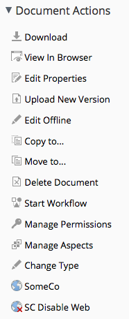

Title: Creating Custom Actions in Alfresco
Author: Jeff Potts

# About the Second Edition 

This tutorial was originally written in January of 2007. I think it was
actually the first Alfresco tutorial I wrote even though I think of
“Custom Content Types” as the logical place to start from the
perspective of someone ramping up on the platform.

The original version was very short—it focused only on how to make a
custom action configurable within a rule in Alfresco Explorer.

The second edition greatly expands on the first by building on the
SomeCo example started in the “Custom Content Types” tutorial and adding
a second action example that sets a custom property defined in the
example SomeCo model.

Similar to the second edition of “content types”, my main intent of
writing this revision was to illustrate how to use the action
configuration new to Alfresco 4 to wire the actions into the Alfresco
Share user interface.

The old Alfresco Explorer instructions still exist. I've moved those to
the Appendix. They work fine in Alfresco 4, so if you are stuck on
Explorer, but have upgraded to Alfresco 4, you'll still find it useful.

The new action-related extension points in Alfresco 4 make it much, much
easier to add shortcuts and other usability improvements to Share with
drastically less code than you'd need to do the same thing in older
versions. After you read this tutorial, you'll be able to add all sorts
of cool things to your Alfresco installation. If you do, I hope you
consider packaging them up as an AMP, putting the source somewhere
public, and listing them on
[http://addons.alfresco.com](http://addons.alfresco.com/).

As always, please let me know if you found this helpful. Any and all
feedback is welcome on my blog at
[http://ecmarchitect.com](http://ecmarchitect.com/).

Have fun!

Jeff

# License

This work is licensed under the Creative Commons Attribution-ShareAlike 3.0 Unported License. To view a copy of this license, visit http://creativecommons.org/licenses/by-sa/3.0/ or send a letter to Creative Commons, 444 Castro Street, Suite 900, Mountain View, California, 94041, USA.

# Table of Contents

* [Introduction][introduction]

* [Setup][setup]

* [Part 1: Implementing an Action][part1]
    * [What is an Action?][whatIsAnAction]
        * [Example 1: Move Replaced][example1]
        * [Example 2: Set Web Flag][example2]
    * [Implementing the Move Replaced Action][implementingTheMoveReplacedAction]
        * [Step 1: Write the action executer class][writeTheActionExecuterClass]
        * [Step 2: Configure the action in Spring][configureTheActionInSpring]
    * [Implementing the Set Web Flag action][implementingTheSetWebFlagAction]
        * [Step 1: Write the SetWebFlag action executer class][writeTheSetWebFlagActionExecuterClass]
        * [Step 2: Configure the action in Spring][configureTheSetWebFlagActionInSpring]
    * [Java versus Server-side JavaScript][JavaVersusServerSideJavaScript]

* [Part 2: Configuring the Action's Front-End in Share][configuringTheActionsFrontEndInShare]
    * [Configuring the Replaceable Aspect in Share][configuringTheReplaceableAspectInShare]
    * [Configuring the Move Replaced Rule Action in Share][configuringTheMoveReplacedRuleActionInShare]
        * [Step 1: Specify the custom client-side component and set the action order][specifyTheCustomClientSideComponent]
        * [Step 2: Add a reference to the custom client-side JavaScript file to the head][addReferenceToTheCustomClientSideJavaScript]
        * [Step 3: Implement the custom client-side JavaScript component][implementTheCustomClientSideJavaScript]
    * [Configuring the Set Web Flag UI Action in Share][configuringTheSetWebFlagUIActionInShare]
        * [Step 1: Create two new repository tier actions][createTwoNewRepositoryTierActions]
        * [Step 2: Update share-config-custom.xml with the action configuration][updateShareConfigWithActionConfig]
        * [Step 3: Create icons and localize the strings][createIconsAndLocalizeTheStrings]
    * [Finishing Touches: Evaluators & Indicators][finishingTouches]
        * [Step 1: Declare a new evaluator in Spring config][declareANewEvaluator]
        * [Step 2: Update the action config in share-config-custom.xml][updateTheActionConfigInShareConfig]
        * [Step 3: Update the share-config-custom.xml file to show a document library indicator][showADocumentLibraryIndicator]
    * [Deploy & Test][deployAndTestShare]

* [Conclusion][conclusion]
    * [Where to find more information][whereToFindMoreInfo]
    * [About the Author][aboutTheAuthor]

* [Appendix][appendix]
    * [Configuring the Replaceable Aspect in Explorer][configuringTheReplaceableAspectInExplorer]
    * [Configuring the Move Replaced Rule Action in Explorer][configuringTheMoveReplacedRuleActionInExplorer]
        * [Step 1: Create an action handler class][createAnActionHandlerClass]
        * [Step 2: Create a corresponding JSP page][createACorrespondingJSPPage]
        * [Step 3: Localize the Move Replaced Action][localizeTheMoveReplacedActionForExplorer]
    * [Configuring the Set Web Flag UI Action in Explorer][configuringTheSetWebFlagActionInExplorer]
        * [Step 1: Create a JSF-managed Bean][createJSFManagedBean]
        * [Step 2: Update web-client-config-custom.xml with the new UI action][updateWebClientConfigCustomWithNewAction]
        * [Step 3: Localize the Set Web Flag action][localizeTheSetWebFlagActionForExplorer]
    * [Configuring the Evaluator to Show/Hide the Set Web Flag UI Action in Explorer][configuringShowHideInExplorer]

## Introduction [introduction]

Alfresco is a flexible platform for developing content management
applications. Clients have several options to consider when selecting a
user interface approach. Alfresco comes with two web clients that can be
used as-is or customized. Alternatively, developers can create custom
applications using the Content Management Interoperability Services
(CMIS) API, web scripts, the web services API or the foundation API.

Many times, the out-of-the-box web client is sufficient, even if it has
to be customized slightly to fit your requirements. This is particularly
true when your requirements closely resemble the all-purpose document
management use case.

Deciding whether to go with the out-of-the-box web client, a customized
web client, or building your own user interface from scratch requires
careful thought and analysis that is beyond the scope of this document.

This article is the second in a series that covers Alfresco from a
configuration and customization perspective. The first article discussed
how to create custom content types and then expose those to the Alfresco
user interface. The focus in this article is on developing custom
actions and configuring the user interface to show those custom actions.

It is important to note that if you are looking for quick-and-dirty ways
to operate against documents in the repository, you may not need a
custom action. For example, you could create some server-side JavaScript
that gets called from the “Execute Script” action. Or, you could run
server-side JavaScript using the JavaScript Console add-on available
from Share Extras (see “Where to find more information” for a link).
There are CMIS APIs that allow you to perform bulk operations from the
command line.

Actions are useful when:

-   You want to define one or more operations that can be executed
    repeatedly

-   You want to make it easy for end-users to invoke common operations,
    either by clicking a menu item or by configuring a rule on a folder
    that will execute the operations automatically

-   You want to perform one or more operations on a schedule (which
    isn't covered in this document)

Part 1 of this document explains how to implement the “back-end” piece
of the action. The document includes two different examples. One action,
called “Move Replaced” will be used as a “Rule Action”. The other action
is called “Set Web Flag” and it will be called from menu items in the
user interface.

Part 2 explains how to configure the user interface to work with the
custom actions. The first edition of this tutorial focused on the
Alfresco Explorer web client. This edition focuses on the Alfresco Share
web client. The Alfresco Explorer sections have been moved to the
Appendix if you need them.

## Setup [setup]

Before getting too far down the road, here are a couple of notes about
my setup:

-   Mac OS X Lion 10.7.2

-   MySQL 5.1.60 (Macports)

-   Tomcat 6.0.32

-   Java 1.6.0\_29

-   Alfresco 4.0.c Community, WAR-only distribution

Other operating systems, databases, application servers, and Alfresco
versions will work with the examples in Part 1, but in Part 2 I use some
Share extension points that are new in Alfresco 4, so older versions may
not work with the Share configuration examples.

The code that accompanies this article is split into two Eclipse
projects—one for repository tier configuration and customization and the
other for Share tier configuration and customization. Each has its own
build script which copies the artifacts into the appropriate places
within the exploded Alfresco and Share WARs. In real life, you'll want
to package your customizations as AMPs for both the repository and Share
tiers.

The code is inclusive of the code from the “Custom Content Types, 2^nd^
Edition” tutorial with the exception of the Web Services and CMIS
examples. This example uses the SomeCo content model established in that
tutorial. If you don't understand how to extend Alfresco's content model
with your own or how to configure custom models in the Share and
Explorer user interfaces, read that tutorial first.

# Part 1: Implementing an Action [part1]

Actions are very commonly used when implementing Alfresco. This part of
the tutorial explains what actions are, sets up a couple of examples,
then shows how actions are implemented in Java.

## What is an Action? [whatIsAnAction]

The term, “action” is overloaded quite heavily across the Alfresco
platform (and application development, in general). For the purposes of
this document, an action is a discrete, reusable unit of work that can
be performed against an object in the repository, and can optionally be
configured at run-time by the user. Some of the out-of-the-box actions
include things like: Check-out, Check-in, Add Aspect, Remove Aspect,
Move, Send Email, and Specialize Type.

Sometimes, the term “rule action” is used to describe this type of
action. That's because actions are frequently used when configuring a
rule on a folder. For example, suppose that there is a requirement to
always create a PNG version of GIFs checked in to a specific folder.
This is easily done by creating a rule that watches for new or updated
GIFs and then runs the “Transform and Copy Image” action when it finds
an object that meets the criteria.

The screenshots below show the out-of-the-box actions available when
configuring a rule in Alfresco. Drawing 1 is Alfresco Explorer and
Drawing 2 is Alfresco Share.

*Drawing 1: Actions in Explorer rule config*

*Drawing 2: Actions in Share rule config*

But actions aren't limited to running as part of a rule. Actions can be
called from menu items in the user interface (both Explorer and Share).
These are often called “UI actions” to distinguish the actual menu item,
the UI action, from the thing that actually does the work, the “rule
action” or simply, the “action”.

These screenshots show the “browse” UI actions and the “details” UI
actions in Alfresco Explorer:

*Drawing 3: Browse UI actions in Explorer*

*Drawing 4: Details UI actions in Explorer*

Similarly, Alfresco Share has UI actions available in the document
library's document list as well as the document details page:

*Drawing 5: Browse UI actions in Share*

*Drawing 6: Details UI actions in Share*

So actions can be invoked from a rule and can be triggered from a menu
item. Actions can also be called from code which means they can be
invoked from server-side JavaScript, workflows, web scripts, or any
other piece of code that can get to the Action Service.

Because the same action can be invoked from all of these places, actions
are a powerful way to write content operations once and then leverage
them in many places.

### Example 1: Move Replaced [example1]

Using actions and workflow together can be an effective way to customize
the web client for the needs of the business. Consider SomeCo, the
fictitious company introduced in the content types tutorial. Suppose
SomeCo wants to use Alfresco to manage the policies and procedures for
their entire organization. They need to be able to track when a new
policy or procedure is published that supersedes an older policy
document.

SomeCo uses three folders to keep track of the state of their policies:
Draft, Approved, and Archived. SomeCo uses Alfresco's Simple Workflows
to move policies from folder to folder. When someone moves a policy into
the Approved folder, if that policy replaces an older policy, the older
policy needs to be automatically moved to the Archived folder. Alfresco
has a “Move” action, but doesn't have a “Move Replaced” action. A new
“Move Replaced” action can easily be created to accomplish this.

### Example 2: Set Web Flag [example2]

Recall from the first tutorial that SomeCo publishes a subset of the
documents in their repository to a company portal. SomeCo uses a flag on
the object to keep track of which documents should be shown on the
portal. In the first tutorial, that flag was set either by editing the
field in the user interface or by running code. Now it is time to make
it a bit more user-friendly by providing menu items in the user
interface that can enable and disable the flag.

The rest of this document explains how to implement both of these
actions including the configuration necessary to make them available
from the user interface.

## Implementing the Move Replaced Action [implementingTheMoveReplacedAction]

Actions run against specific nodes. In this example, the action needs to
find the documents that the “actioned upon node” replaces so they can be
moved. In order to do this, the action needs to know where to move the
old documents to and it needs to know how to find the old documents. The
first part, where to move the old documents, will be a parameter that
gets passed to the action. The second part will leverage a “replaces”
relationship.

A "replaces" relationship is a pretty common requirement. In fact,
Alfresco already has a "replaceable" aspect in the out-of-the-box
content model. The “replaceable” aspect defines an association called
“cm:replaces”. So, the out-of-the-box content model already accommodates
documents that replace other documents. All that is needed is some
configuration to expose this relationship to the user interface.

The business logic will reside in an action executer class. This will
allow SomeCo end-users to call the action from a rule configured on any
folder, without further involvement from the development team.

Implementing the action's business logic involves two steps:

1.  Writing the action executer class

2.  Configuring the action in Spring

Once that's done, the action can be called from code using the Action
Service, or it can be wired in to the user interface (including rule
configuration), which is covered in Part 2.

### Step 1: Write the action executer class [writeTheActionExecuterClass]

At its most basic, an action consists of an Action Executer class and
its associated Spring bean configuration. Implementing an action
involves extending ActionExecuterAbstractBase and then implementing the
executeImpl method. Before starting, though, think about similar code
that might already exist within Alfresco that might be a good starting
point for the new action. Alfresco is open source--it would be a shame
to ignore that valuable resource. Plus, following the same patterns to
implement this customization will make it easier for someone to support
and makes it easier to share our code with others or even to contribute
the code back to the Alfresco community project.

The new action is doing a move, so the existing Move action is a good
place to start. In fact, the only difference between the Move action and
the custom Move Replaced action is that the node being moved isn't the
current node--it's the node on the target end of a "replaces"
association.

Alfresco's executer class for the Move action is called
org.alfresco.repo.action.executer.MoveActionExecuter. If you have the
Alfresco source you can find it in the repository project. I'll copy it
into my own repository project and call it MoveReplacedActionExecuter.
The executeImpl method is where the move logic is handled. It looks like
this:

    public void executeImpl(Action ruleAction, NodeRef actionedUponNodeRef)
    {
        NodeRef destinationParent = (NodeRef)ruleAction.getParameterValue(PARAM_DESTINATION_FOLDER);
        try
        {
            fileFolderService.move(actionedUponNodeRef, destinationParent, null);
        }
        catch (FileNotFoundException e)
        {
            // Do nothing
        }
    } 

*Listing 1: Alfresco's out-of-the-box action executer for Move*

The code simply grabs the parameter value for the destination folder and
then calls the FileFolderService to do the move. This is a good start
for Move Replaced. All I need to do is modify the executeImpl method to
find the nodes related to the current node by a "replaces" association,
and then for each result, set up and perform a move.

    public void executeImpl(Action ruleAction, NodeRef actionedUponNodeRef) {
        // get the replaces associations for this node
        List<AssociationRef> assocRefs = nodeService.getTargetAssocs(actionedUponNodeRef, ((QNamePattern) QName.createQName(NamespaceService.CONTENT_MODEL_1_0_URI, "replaces")) );

        // if there are none, return
        if (assocRefs.isEmpty()) {
             // no work to do, return
             return;
        } else {
            NodeRef destinationParent = (NodeRef)ruleAction.getParameterValue(PARAM_DESTINATION_FOLDER);
            for (AssociationRef assocNode : assocRefs) {
                // create a noderef for the replaces association
                NodeRef targetNodeRef = assocNode.getTargetRef();
                // if the node exists
                if (this.nodeService.exists(targetNodeRef) == true) {
                    try {
                        fileFolderService.move(targetNodeRef, destinationParent, null);
                    } catch (FileNotFoundException e) {
                        // Do nothing
                    }
                }
            } // next assocNode
        } // end if isEmpty
    } 

*Listing 2: The custom action executer for Move Replaced*

The only other change needed is to change the value of the constant NAME
from "move" to "move-replaced". (Throughout this document I'll only
include relevant pieces of these classes—check the source that
accompanies this article for code that actually compiles).

### Step 2: Configure the action in Spring [configureTheActionInSpring]

In the content types tutorial, you learned that Spring bean
configurations go in files that end with “context.xml”. Those files
reside in the “extension” directory to keep them separate from the rest
of the Alfresco web application. For this example, I created a file
called “someco-action-context.xml” and placed it in
/config/alfresco/extension. It contains the following:

    <?xml version='1.0' encoding='UTF-8'?>
    <!DOCTYPE beans PUBLIC '-//SPRING//DTD BEAN//EN' 'http://www.springframework.org/dtd/spring-beans.dtd'>
    
    <beans>
        <bean id="move-replaced" class="com.someco.action.executer.MoveReplacedActionExecuter" parent="action-executer">
            <property name="fileFolderService">
                <ref bean="FileFolderService" />
            </property>
            <property name="nodeService">
                <ref bean="NodeService" />
            </property>
        </bean>
    </beans>

*Listing 3: Spring configuration for Move Replaced*

That's all there is to it. You could compile the
MoveReplacedActionExecuter class, JAR it up, and deploy it to Alfresco's
WEB-INF/lib. The Spring context file goes in
WEB-INF/classes/alfresco/extension. In fact, the Ant build file that
accompanies this code does just that. Once in place, the action can be
invoked from code. That's obviously not going to be useful for end
users, though. Before wiring the action into the user interface, let's
look at another Action Executer example.

## Implementing the Set Web Flag action [implementingTheSetWebFlagAction]

This action will be used to set the flag on content which should be
shown in the SomeCo portal. Recall from the content types tutorial that
the property is a boolean named “sc:isActive” which is defined as part
of an aspect named “sc:webable”. Also in that aspect is a date property
named “sc:published” that keeps track of when the content was last
published to the portal.

The Set Web Flag action, then, needs to set the “sc:isActive” flag. The
value to set it to (true or false) can be passed in as a parameter to
the action. When the flag is set to true, the action should set the
“sc:published” property with the current date.

This action could be called from a rule, but SomeCo intends to configure
a UI action in the user interface to allow end-users the ability to
enable or disable a piece of content for display on the portal with a
single click.

Just like in the Move Replaced example, the steps are:

1.  Write the action executer class

2.  Configure the action in Spring

Then, the action will be ready to use.

### Step 1: Write the SetWebFlag action executer class [writeTheSetWebFlagActionExecuterClass]

Like the MoveReplacedAction, this action extends
ActionExecuterAbstractBase. The action takes a parameter that specifies
the value for the “sc:isActive” flag. Actions declare parameters by
overriding the addParameterDefinitions method:

    @Override
    protected void addParameterDefinitions(List<ParameterDefinition> paramList) {
        paramList.add(
            new ParameterDefinitionImpl(
                    PARAM_ACTIVE,
                    DataTypeDefinition.BOOLEAN,
                    false,
                    getParamDisplayLabel(PARAM_ACTIVE)));
    }

*Listing 4: Declaring a parameter for an action*

The constructor for the ParameterDefinitionImpl takes the name of the
parameter, the parameter's data type, whether or not the parameter is
mandatory, and a label. If the custom action had additional parameters
this method would have one paramList.add call for each parameter.

The next step is to create the action's logic in the executeImpl method:

    @Override
    protected void executeImpl(Action action, NodeRef actionedUponNodeRef) {    
        Boolean activeFlag = (Boolean)action.getParameterValue(PARAM_ACTIVE);

        if (activeFlag == null) activeFlag = true; // default

        // set the sc:isActive property to true
        Map<QName, Serializable> properties = nodeService.getProperties(actionedUponNodeRef);
        properties.put(
            QName.createQName(SomeCoModel.NAMESPACE_SOMECO_CONTENT_MODEL, SomeCoModel.PROP_IS_ACTIVE), activeFlag);

        if (activeFlag) {
            // set the sc:published property to now
            properties.put(
                QName.createQName(SomeCoModel.NAMESPACE_SOMECO_CONTENT_MODEL, SomeCoModel.PROP_PUBLISHED), new Date());
        }
        
        // if the aspect has already been added, set the properties
        if (nodeService.hasAspect(actionedUponNodeRef,
                    QName.createQName(
                        SomeCoModel.NAMESPACE_SOMECO_CONTENT_MODEL,
                        SomeCoModel.ASPECT_SC_WEBABLE))) {
            nodeService.setProperties(actionedUponNodeRef, properties);
        } else {
            // otherwise, add the aspect and set the properties
            nodeService.addAspect(actionedUponNodeRef,
                    Qname.createQName(
                        SomeCoModel.NAMESPACE_SOMECO_CONTENT_MODEL,
                        SomeCoModel.ASPECT_SC_WEBABLE), properties);
        }                  
    }

*Listing 5: Action executer for Set Web Flag*

The logic should be pretty easy to follow. The code grabs the value of
the active parameter. Then, it sets up a map to hold properties. If the
active flag is being set to true, the date property is added to the map.
The last part of the method just checks to see whether the aspect needs
to be added or not. If so, the aspect can be added and the properties
set in a single call.

### Step 2: Configure the action in Spring [configureTheSetWebFlagActionInSpring]

The Spring configuration for this action goes in the same context file
as the pervious action:

    <bean id="set-web-flag" class="com.someco.action.executer.SetWebFlag" parent="action-executer">
        <property name="nodeService">
            <ref bean="NodeService" />
        </property>
    </bean>

*Listing 6: Spring configuration for Set Web Flag*

This action is now ready to be wired in to the user interface. That's
covered in Part 2.

## Java versus Server-side JavaScript [JavaVersusServerSideJavaScript]

A quick side-note before moving on to the front-end: The action executer
examples shown in Part 1 were both implemented in Java. However, action
executers can also be implemented using server-side JavaScript. The
steps are the same: write the logic, then configure it through Spring.
This is an attractive option for teams lacking in Java skills. The
tradeoff is that the JavaScript API does not have 100% of the feature
set of the Alfresco Java API. You may also see a performance difference
with the JavaScript API, which essentially wraps the lower-level Java
API.

# Part 2: Configuring the Action's Front-End in Share [configuringTheActionsFrontEndInShare]

In Part 1 of this document you learned how to create an Action Executer
class. The result was an action that could be called from code. But both
actions need to be invoked by end-users. In the case of the Move
Replaced action, an end-user will configure a rule that will invoke the
action. When the end-user configures the action, they need to specify
the directory to send the replaced documents to. That means the user
interface needs to know how to let the end user pick a target folder.

The Set Web Flag action gives end-users the ability to set the active
flag and the publish date with a single click of a menu item. So the
user interface needs to know where to show that menu item and how to
invoke the SetWebFlag action in the repository.

The specific steps to configure the user interface for these two actions
depend on the web client being used. Alfresco Explorer used to be the
only choice. Alfresco Share is usually the preferred web client these
days. Alfresco 4 added some extensibility features that make it much
easier to configure actions in Share than it used to be. So I'll use
Share and if you need to see how to do the exact same thing in Explorer,
check the Appendix.

## Configuring the Replaceable Aspect in Share [configuringTheReplaceableAspectInShare]

Alfresco's out-of-the-box content model already defines an association
called “cm:replaces” as part of the “cm:replaceable” aspect. But neither
the aspect nor the association are configured to be displayed in the
Share user interface. That's easy to fix.

Recall from the content types tutorial that the Share user interface
configuration resides in a file called “share-config-custom.xml”. The
“cm:replaceable” aspect can be added to the list of aspects a user can
see, like this:

            <visible>
                <aspect name="sc:webable" />
                <aspect name="sc:productRelated" />
                <aspect name="cm:replaceable" />
            </visible>

*Listing 7: Adding the replaceable aspect to the list of visible
aspects*

Next, the “cm:replaces” association needs to show up when editing
properties. In this example, SomeCo will use instances of “cm:content”
for policies, but this would work the same way if a specific content
type, like “sc:hrPolicy”, were used instead. So I've copied the form
configuration for “cm:content” from the out-of-the-box form
configuration into “share-config-custom.xml”. Just like in the content
types tutorial, the association is configured by adding children to the
“field visibility” and “appearance” elements, like this:

               <!-- cm:geographic aspect -->
               <show id="cm:latitude" />
               <show id="cm:longitude" />
               
               <!-- cm:replaceable -->
               <show id="cm:replaces" />

            </field-visibility>

*Listing 8: Configuring the cm:replaces association*

and this:

               <field id="cm:sentdate" read-only="true" />
               <field id="cm:subjectline" read-only="true" />
               <field id="cm:replaces" label-id="assoc.cm_replaces"/>
            </appearance>

*Listing 9: Configuring the cm:replaces association*

The last step in exposing the “cm:replaceable” aspect and “cm:replaces”
association is localizing the labels. The
web-extension/messages/scModel.properties file already exists, so add
the following:

    #cm:replaceable
    aspect.cm_replaceable=Replaceable
    assoc.cm_replaces=Replaces

*Listing 10: Localizing the replaceable aspect*

The next step is to configure the Move Replaced Rule Action in Share.

## Configuring the Move Replaced Rule Action in Share [configuringTheMoveReplacedRuleActionInShare]

Share is pretty smart. If you deploy the Move Replaced action as-is it
will automatically get added to the list of actions users can select
when configuring a rule. So for simple actions, you won't have to do
anything further. But in this example, the action takes an argument. By
default, Share will try to render a plain text field for the argument
which might work in some cases. But this action takes a node reference
as an argument and making an end-user provide a node reference for the
target folder would be a very bad thing. Instead, Share needs to render
a folder picker dialog for the target folder argument. Luckily, Alfresco
has already developed such a dialog—Share just has to be told to use it.

In Alfresco 4, a lot of work has been done to make customizing and
extending the user interface easier. Unfortunately, at the moment,
getting a folder picker to show up for this action takes a bit more work
than it ought to. My guess is that this will get resolved in the future.
Until then, here is what is involved:

1.  Override the rule config action web script to point to a custom
    client-side component and to set the order the action appears in the
    action list.

2.  Override the rule details and rule edit web script to include a
    “script” reference in the “head” section of the page that points to
    the client-side JavaScript where the custom client-side component
    lives.

3.  Write the custom client-side component.

It looks like a pain, but once you figure it out it isn't too bad. And
it is a lot easier than it used to be if that makes you feel any better.
Let's go through the steps.

### Step 1: Specify the custom client-side component and set the action order [specifyTheCustomClientSideComponent]

In Alfresco 4, a lot of the action configuration has been pulled into
share-form-config-custom.xml. But rule config still lives in the rule
config web script. This isn't a big deal—it is easy to override one or
more files that make up a web script. In this case, copy the
rule-config-action.get.config.xml file from
\$TOMCAT\_HOME/webapps/share/WEB-INF/classes/alfresco/site-webscripts/org/alfresco/components/rules/config
into your own project. For example, in the code that accompanies this
article, I copied the file into
config/alfresco/web-extension/site-webscripts/org/alfresco/components/rules/config.

The first change is to specify a custom client-side JavaScript
component:

    <rule-config type="action">
       <component>SomeCo.RuleConfigActionCustom</component>
       <config-definitions webscript="/api/actiondefinitions">

*Listing 11: Configuring Share to use a custom client-side component for
rule config*

This will be a new client-side JavaScript component that will get
created shortly.

Next, the action gets arranged in the list of actions. In this case, it
makes sense to see it in the list right after “Move”:

    <menu>
        <group>
            <item id="select"/>
        </group>
        <group>
            <action name="script"/>
        </group>
        <group>
            <action name="copy"/>
            <action name="move"/>
            <action name="move-replaced"/>
        </group>

*Listing 12: Placing the Move Replaced action in the rule action list*

Finally, the action gets bound with a client-side JavaScript function:

      <action name="copy">Copy</action>
      <action name="move">Move</action>
      <action name="move-replaced">MoveReplaced</action>      
      <action name="simple-workflow">SimpleWorkflow</action>

*Listing 13: Specifying which client-side handler to use for Move
Replaced*

### Step 2: Add a reference to the custom client-side JavaScript file to the head [addReferenceToTheCustomClientSideJavaScript]

The client-side JavaScript file where the custom client-side component
resides needs to be pulled in to the “\<head\>” section of the page so
the browser knows about it. Web scripts that end with “head.ftl” are
used for this purpose. For rules, there are two web scripts that will
need to refer to the custom client-side JavaScript: “rule details” and
“rule edit”. So the rule-details.get.head.ftl and rule-edit.get.head.ftl
files are copied from
\$TOMCAT\_HOME/webapps/share/WEB-INF/classes/alfresco/site-webscripts/org/alfresco/components/rules.
The modifications to both are identical and are as follows:

    <@link rel="stylesheet" type="text/css" href="${page.url.context}/res/components/rules/rule-details.css" />
    <@script type="text/javascript" src="${page.url.context}/res/components/rules/rule-details.js"></@script>
    <!--Custom javascript file include for detail mode -->
    <@script type="text/javascript" src="${page.url.context}/someco/components/rules/config/rule-config-action-custom.js"></@script> 

*Listing 14: Adding the client-side JavaScript reference to head*

Okay, at this point, the rule form will be looking for a custom
client-side JavaScript component called SomeCo.RuleConfigActionCustom,
the action will show up in the right place, and the page's “\<head\>”
element will include a reference to the custom client-side JavaScript
file where the component will reside. It's time to implement the
client-side JavaScript.

### Step 3: Implement the custom client-side JavaScript component [implementTheCustomClientSideJavaScript]

The FreeMarker files have been modified to include a reference to a file
called rule-config-action-custom.js. By convention, I include
client-side JavaScript in my Eclipse project under “src/web/someco”.
Alfresco has their rule-related client-side JavaScript under
“components/rules/config” so I used the same folder structure.

The first thing the rule-config-action-custom.js file does is declare a
SomeCo namespace. It is important that you namespace everything in
Alfresco to avoid collisions with Alfresco's code or other add-ons you
might install.

    if (typeof SomeCo == "undefined" || !SomeCo)
    {
       var SomeCo = {};
    }

*Listing 15: Declaring a SomeCo namespace in client-side JavaScript*

Next, comes the constructor for the component (I've left out some boring
stuff, check the source for the full listing):

   SomeCo.RuleConfigActionCustom = function(htmlId)
   {
      SomeCo.RuleConfigActionCustom.superclass.constructor.call(this, htmlId);

      // Re-register with our own name
      this.name = "SomeCo.RuleConfigActionCustom";
      Alfresco.util.ComponentManager.reregister(this);

      // Instance variables
      this.customisations = YAHOO.lang.merge(this.customisations, SomeCo.RuleConfigActionCustom.superclass.customisations);
      this.renderers = YAHOO.lang.merge(this.renderers, SomeCo.RuleConfigActionCustom.superclass.renderers);
      
      return this;
   };

*Listing 16: Snippet of client-side JavaScript showing the
RuleConfigActionCustom constructor*

If this is your first foray into the world of object-oriented
client-side JavaScript, relax. What, you thought just because “Java” and
“JavaScript” have a word in common that object inheritance would work
the same way? How literal of you! Basically, what's going on here is
that the constructor is calling its superclass constructor, then it is
registering itself with the Alfresco component manager. The YUI merge
calls provide a way to avoid re-typing a bunch of code that exists in
the parent class.

The final bit is where the extend actually happens, and the MoveReplaced
handler is defined:

   YAHOO.extend(SomeCo.RuleConfigActionCustom, Alfresco.RuleConfigAction,
   {

      /**
       * CUSTOMISATIONS
       */

      customisations:
      {         
         MoveReplaced:
         {
            text: function(configDef, ruleConfig, configEl)
            {
                 // Display as path
                 this._getParamDef(configDef, "destination-folder")._type = "path";
                 return configDef;
            },
            edit: function(configDef, ruleConfig, configEl)
            {
                // Hide all parameters since we are using a cusotm ui but set default values
                this._hideParameters(configDef.parameterDefinitions);

                // Make parameter renderer create a "Destination" button that displays an destination folder browser
                configDef.parameterDefinitions.push({
                   type: "arca:destination-dialog-button",
                   displayLabel: this.msg("label.to"),
                   _buttonLabel: this.msg("button.select-folder"),
                   _destinationParam: "destination-folder"
                });
                return configDef;
            }
         },
      },

   });

*Listing 17: Defining the MoveReplaced client-side handler*

This part is a copy of the out-of-the-box handler for Move with the
object renamed to MoveReplaced. The MoveReplaced object has two methods:
text and edit. Text is what is displayed for the component in read mode.
Edit is for edit mode. The edit method is what is responsible for
generating the button that invokes the folder picker. In this case, edit
leverages an existing renderer called “arca:destination-dialog-button”
that is defined in the superclass. If you needed to produce markup for a
parameter for which Alfresco doesn't already have a renderer, you would
add the appropriate code to the renderers object.

With this final step in place, end-users can configure a rule that
invokes the Move Replaced action. The rule editor will use the custom
handler for the action so that a folder picker dialog is used to select
the target folder.

You can see this happening in the screenshot below. You can see the
dialog that gets launched when the Select button is clicked as well as
the little folder icon and folder path that are rendered once a
selection is made.

*Drawing 7: Configuring the Move Replaced action in Share*

## Configuring the Set Web Flag UI Action in Share [configuringTheSetWebFlagUIActionInShare]

Now it is time to shift focus from rule actions to UI actions. SomeCo
wants end-users to be able to click an item in the menu that either
enables or disables the web flag. Alfresco 4 has a framework that allows
you to easily add new UI actions to the menu. You can configure:

-   UI actions that call a web page (external or within Share),

-   UI actions that invoke rule actions on the repository tier that take
    no parameters,

-   UI actions that invoke rule actions on the repository tier that
    launch a dialog to gather parameters before passing those parameters
    to an action on the repository tier,

-   UI actions that call arbitrary client-side JavaScript action
    handlers.

Recall that the Set Web Flag action takes one parameter—the value of the
active flag. I could use the action framework out-of-the-box to invoke a
dialog that lets the user set the action flag to true or false and then
call the set web flag action. But that doesn't meet the single-click
requirement, and a form is overkill to grab one boolean value.

If you look in the list above, you'll see there isn't an option to
hardcode arbitrary parameters in the action config when the action is
called. So we're forced to either call a custom client-side JavaScript
action handler or add new actions to the repository tier that don't take
parameters. There's no “right” answer here—it's just a matter of where
you want to write the code. At some point, Alfresco will probably
enhance the framework to meet this use case. Until then, for this
example, I'm going to go the “no parameter” route, which means I'll have
to add two new actions on the repository tier that don't require
parameters to be passed in.

So, the steps to follow for this example are:

1.  Create two new repository tier actions that take no parameters

2.  Update share-config-custom.xml with the action configuration

3.  Create icons and localize the strings

### Step 1: Create two new repository tier actions [createTwoNewRepositoryTierActions]

You created action executer classes in Part 1 of this tutorial so this
is nothing new. There needs to be one action for enabling the active
flag and one for disabling it and neither should take a parameter. By
sub-classing the existing SetWebFlag action, code can be kept to a
minimum. Here's the EnableWebFlag action executer in its entirety:

    public class EnableWebFlag extends SetWebFlag {
        @Override
        protected void executeImpl(Action action, NodeRef actionedUponNodeRef) {
            action.setParameterValue(SetWebFlag.PARAM_ACTIVE, true);
            super.executeImpl(action, actionedUponNodeRef);
        }
    }

*Listing 18: Sub-classing SetWebFlag to provide a new action that
doesn't require parameters*

The DisableWebFlag action looks just like this but sets the active flag
to false. I won't repeat it here.

The Spring configuration for the action is similarly short:

    <bean id="enable-web-flag" class="com.someco.action.executer.EnableWebFlag" parent="set-web-flag">
        <property name="publicAction">
            <value>false</value>
        </property>
    </bean>

*Listing 19: Spring configuration for Enable Web Flag*

Again, I'm leaving out the disable-web-flag bean but it looks just like
this one with a different class. Setting the “publicAction” property to
false hides these actions from the action dropdowns. There's no real
reason to do that, in this case—it's just an example.

### Step 2: Update share-config-custom.xml with the action configuration [updateShareConfigWithActionConfig]

The next step is to configure the Share user interface to show the UI
actions in the document library and document details menus. While we're
at it, I'm going to also drop in a UI action that calls a web page just
for kicks.

The action config has moved to share-config-custom.xml in Alfresco 4.
Action configuration consists of two parts. The “actions” element
contains a list of action definitions. The “actionGroups” element
contains a list of action groups. Action groups are things like the list
of actions shown in the document library document list or the document
details page.

Actions and action groups live in the “DocLibActions” config within
share-config-custom.xml. Here are the action definitions for the web
site action and web enable:

    <!-- Actions -->
    <config evaluator="string-compare" condition="DocLibActions">
        <actions>
            <action id="someco-web-site" type="link" label="actions.someco.web-site" icon="someco-website">
                <param name="href">http://ecmarchitect.com</param>
                <param name="target">_blank</param>
            </action>
            <action id="someco-web-enable" type="javascript" label="actions.someco.web-enable" icon="someco-create-website">
                <param name="function">onActionSimpleRepoAction</param>
                <permissions>
                    <permission allow="true">Write</permission>
                </permissions>
                <param name="action">enable-web-flag</param>
                <param name="successMessage">message.web-flag.enabled</param>
                <param name="failureMessage">message.web-flag.failure</param>
            </action>

*Listing 20: UI action declaration for Web Site and Web Enable*

The “someco-web-site” action is really simple. It is a “link” type of an
action, which means it is invoking a URL that is provided in a
parameter. The labels and icons will get set up in the next step.

The “someco-web-enable” action is a little more involved. It is a
“javascript” action, which means it is calling a client-side JavaScript
handler. What's cool is that Alfresco has already provided a client-side
handler called “onSimpleRepoAction”. It just needs to know the name of
the repository tier action to invoke (the ones created in Step 1) and
messages to display on success and failure.

I've left out “someco-web-disable” because it is so similar.

This action uses the built-in onActionSimpleRepoAction, but what if you
needed to gather parameters from the end-user before calling the action?
For that you can use onActionFormDialog. The itemId specifies a form ID
corresponding to a form defined in share-form-config-custom.xml. Take a
look at the document-transform action as an example.

The last part of the config is the action definitions. This slots the
actions into the appropriate groups:

        <actionGroups>
            <actionGroup id="document-browse">
                <action index="500" id="someco-web-site" />
                <action index="510" id="someco-web-enable" />
                <action index="520" id="someco-web-disable" />                
            </actionGroup>
            <actionGroup id="document-details">
                <action index="500" id="someco-web-site" />
                <action index="510" id="someco-web-enable" />
                <action index="520" id="someco-web-disable" />                
            </actionGroup>
        </actionGroups>
    </config>

*Listing 21: UI action groups extended to include custom actions*

There are a couple of things to note about the action configuration.
First, you don't have to copy in the out-of-the-box actions and action
groups. They will get merged in. Second, the order of the action items
in the list can be controlled by setting the index attribute. The higher
the index, the lower in the list the menu items appear.

### Step 3: Create icons and localize the strings [createIconsAndLocalizeTheStrings]

The last step is to provide some icons for the actions and localize the
action labels. In step 2 the action element had an “icon” attribute.
Alfresco will look in a path for an icon that starts with that name and
ends with “-16.png”. Entirely lacking in graphics skills, I grabbed a
couple of out-of-the-box icons that looked somewhat applicable and
copied them in to my project under
“src/web/components/documentlibrary/actions”. Because this is Alfresco's
folder structure, I made sure to name the icons starting with “someco”
so they would not be confused with others.

The localized strings can go in the existing scModel.properties file.
Here they are:

    #actions
    actions.someco.web-site=SomeCo
    actions.someco.web-enable=SC Enable Web
    actions.someco.web-disable=SC Disable Web
    message.web-flag.enabled=Successfully enabled the SomeCo active flag
    message.web-flag.disabled=Successfully disabled the SomeCo active flag
    message.web-flag.failure=Error setting the SomeCo active flag

*Listing 22: Localized strings for the new actions*

With icons and localized strings in place, you could deploy and run and
everything should work. (If you are following along, don't forget to
deploy both the repository tier project and the share tier project
because you made changes in both).

But, what you'll notice is that both the Enable and Disable UI actions
show up at the same time, which is lame. The enable should only show up
when the active flag is not set to true. The disable should only show up
when the active flag is set to true. That's easy to fix with an
evaluator and that's covered in the next section.

## Finishing Touches: Evaluators & Indicators [finishingTouches]

If you are writing a UI action that should show up all of the time, you
don't need to do anything else. But hiding a UI action based on certain
conditions is a pretty common requirement. In this example, the UI
action needs to hide based on a metadata value. Alfresco has several
“evaluators” that can be leveraged out-of-the-box to do this. You can
hide UI actions based on things like:

-   The presence of an aspect

-   The type of a node

-   Mimetype

-   The type of site the document library is sitting in

-   The name of the site

Evaluators can also be chained together if multiple conditions need to
apply. The out-of-the-box evaluators live in
slingshot-document-library-context.xml so refer to that file for the
full list of evaluators and an example of how chaining works. You can
also write completely new evaluators using Java deployed to the Share
tier.

For this example, the out-of-the-box “value” evaluator will do quite
nicely. The steps, then, will be as follows:

1.  Declare a new evaluator in Spring config that extends the “value”
    evaluator

2.  Update the action config in share-config-custom.xml to point to the
    evaluator

Alfresco 4 has also made it easy to configure “indicators”, which are
little icons in the document library column. This isn't entirely
relevant to the subject at hand, but because they work just like
evaluators and because it makes it easy to see from the document library
which content has the active flag set, I'm going to add a third step:

3.  Update the share-config-custom.xml file to show a document library
    indicator

After these steps are complete, the UI actions will show or hide
themselves appropriately and end-users will be able to see documents
with the active flag set to true from the document list.

### Step 1: Declare a new evaluator in Spring config [declareANewEvaluator]

Only one evaluator is needed for this example. The evaluator just needs
to know the value of the active flag—the UI actions can show or hide
themselves based on that. Evaluators live in Spring config and Spring
config resides in files ending with “context.xml”. This project already
has “custom-slingshot-application-context.xml” so I added the evaluator
to that file:

    <bean id="someco.evaluator.doclib.action.isActive" parent="evaluator.doclib.action.value">
        <property name="accessor" value="node.properties.sc:isActive" />
        <property name="comparator">
            <bean class="org.alfresco.web.evaluator.StringEqualsComparator">
                <property name="value" value="true" />
            </bean>
        </property>
    </bean>

*Listing 23: Declaring a new evaluator that checks the value of
sc:isActive*

This bean extends the out-of-the-box “value” evaluator and provides
properties specific to our needs. In this case, the “accessor” is the
name of the property the evaluator needs to inspect. The comparator does
a string comparison against the value of “true”. Note the use of
“someco” in the bean ID. This is another place where you want to make
sure you are using your own namespace.

All evaluators work similarly. If you wanted to check for a specific
aspect, for example, you would extend the aspect evaluator and then
specify the aspect you are looking for in one of the properties.

### Step 2: Update the action config in share-config-custom.xml [updateTheActionConfigInShareConfig]

With an evaluator declared the next step is to tell the action
configuration which evaluator to use to decide whether or not to show
the UI action. So, back over in share-config-custom.xml, I've made the
following modifications, highlighted in bold:

            <action id="someco-web-enable" type="javascript" label="actions.someco.web-enable" icon="someco-create-website">
                <param name="function">onActionSimpleRepoAction</param>
                <permissions>
                    <permission allow="true">Write</permission>
                </permissions>
                <param name="action">enable-web-flag</param>
                <param name="successMessage">message.web-flag.enabled</param>
                <param name="failureMessage">message.web-flag.failure</param>
                <evaluator negate="true">someco.evaluator.doclib.action.isActive</evaluator>
            </action>
            <action id="someco-web-disable" type="javascript" label="actions.someco.web-disable" icon="someco-delete-website">
                <param name="function">onActionSimpleRepoAction</param>
                <permissions>
                    <permission allow="true">Write</permission>
                </permissions>
                <param name="action">disable-web-flag</param>
                <param name="successMessage">message.web-flag.disabled</param>
                <param name="failureMessage">message.web-flag.failure</param>
                <evaluator>someco.evaluator.doclib.action.isActive</evaluator>
            </action>

*Listing 24: Specifying the evaluator in the action configuration*

Both actions use the same evaluator. For the someco-web-enable action,
the evaluator is negated. So if the evaluator returns true (i.e., the
sc:isActive property is set to true) the web enable action will be
hidden. If the evaluator returns false, the action will show itself.

### Step 3: Update the share-config-custom.xml file to show a document library indicator [showADocumentLibraryIndicator] 

The last step is really not needed at all if all you are doing is adding
an action to the menu. But because it is easy to do and leverages the
same evaluator written in the previous step, I didn't think you'd mind.

The goal here is to show a little icon in the document library only if
the “sc:isActive” property is set to true. If you are already thinking,
“Hey, that sounds like an evaluator!” you've got it.

Indicators are part of the “DocumentLibrary” config in
share-config-custom.xml. All it needs is a pointer to an evaluator. In
this case, the one created earlier can be reused:

        </types>
        
        <!-- Custom Indicators -->
        <indicators>
            <indicator id="someco-website" index="10">
                <evaluator>someco.evaluator.doclib.action.isActive</evaluator>
            </indicator>
        </indicators>
    </config>

*Listing 25: Adding an indicator to the document library configuration*

Alfresco will use the indicator's id attribute appended with “-16.png”
for the icon. I copied the same icon used for the “enable” action into
“src/web/components/documentlibrary/indicators” for this purpose.

### Deploy & Test [deployAndTestShare]

If you've been following along and you've waited to deploy until now,
it's time to try it out. The code that accompanies this article includes
an Ant build file in each of the two projects. And each project includes
a build.properties file. The repository project's build.properties file
needs to know the location of the expanded Alfresco SDK and the location
of the expanded Alfresco webapp root. The Share project's
build.properties file needs to know the location of the expanded Share
webapp root and the location of the YUI compressor JAR, which is used as
part of the build process. Once those are set, you should be able to run
“ant deploy” for each of the two projects, start Tomcat, and test.

If everything is working correctly, you should see the SomeCo web site
link and either the SC Web Enable or the SC Web Disable menu items from
both the browse menu and the details page as shown below.

*Drawing 8: Indicators show which content has the active flag set in Share*

*Drawing 9: Custom UI actions in the document details page*
                                                                                

*Drawing 10: Custom UI actions in the document list*                           

Clicking the “SomeCo” menu item will open a browser window to the URL
specified in the configuration. Clicking the “SC Disable Web” should
invoke the action on the repository tier and then refresh the metadata
and the action list.

# Conclusion [conclusion]

This article has shown how actions can be used to implement reusable
operations that can be run against content in the repository. Those
actions can be called from code using the Action Service and they can be
invoked from the user interface by configuring rules or by setting up UI
actions and placing those alongside other menu items in places like the
document list and the details page. Hopefully it has sparked some ideas
about how you could use custom actions in your next Alfresco
implementation.

## Where to find more information [whereToFindMoreInfo]

-   All source code used in this example is available
    [here](http://ecmarchitect.com/images/articles/alfresco-actions/alfresco-actions-tutorial.zip).

-   The [Alfresco
    SDK](http://wiki.alfresco.com/wiki/Community_file_list_4.0.c) comes
    with a Custom Action example.

-   Official documentation for both Enterprise and Community is
    available at [docs.alfresco.com](http://docs.alfresco.com/).

-   [Share Extras](http://code.google.com/p/share-extras/) has many
    examples of deeper Share customization as well as
    [documentation](http://sharextras.org/jsdoc/share/) of Alfresco's
    client-side JavaScript components.

-   [Mike Hatfield](http://blogs.alfresco.com/wp/mikeh/) and [David
    Draper](http://blogs.alfresco.com/wp/ddraper/) are two examples of
    Alfresco engineer blogs that are extremely useful if you are
    customizing Share.

-   For deployment help, see [Packaging and Deploying
    Extensions](http://wiki.alfresco.com/wiki/Packaging_And_Deploying_Extensions)
    in the Alfresco wiki.

-   For general development help, see the [Developer
    Guide](http://wiki.alfresco.com/wiki/Developer_Guide).

-   For help customizing the data dictionary, see the [Data
    Dictionary](http://wiki.alfresco.com/wiki/Data_Dictionary_Guide)
    wiki page.

-   If you are ready to cover new ground, try another
    [ecmarchitect.com](http://ecmarchitect.com/) tutorial in the
    [Alfresco](http://ecmarchitect.com/alfresco-developer-series)[Developer
    Series](http://ecmarchitect.com/alfresco-developer-series).

## About the Author [aboutTheAuthor]

Jeff Potts is the Chief Community Officer for Alfresco Software. Jeff
has been a recognized and award-winning leader in the Alfresco community
for many years. He has over 18 years of content management and
collaboration experience, most of that having come from senior
leadership positions in consulting organizations.

Jeff has made many contributions to the Alfresco community since he
started working with Alfresco in 2005. Examples range from code, to
tutorials and informative blog posts, to code camps, meetups, and
conference sessions. In 2008, Jeff wrote the Alfresco Developer Guide,
the first developer-focused book on Alfresco. He has also been active in
the Apache Chemistry project where he leads the development of cmislib,
the Python API for CMIS.

Read more at Jeff’s blog, [ecmarchitect.com](http://ecmarchitect.com/).

# Appendix [appendix]

Not everyone is able to use Alfresco Share as their user interface. The
sections within this Appendix show you how to do the same thing Part 2
covers, but uses Alfresco Explorer instead of Alfresco Share.

## Configuring the Replaceable Aspect in Explorer [configuringTheReplaceableAspectInExplorer]

Alfresco's out-of-the-box content model contains an aspect called
“cm:replaceable” but it is not exposed in the UI. End-users need to be
able to declare which documents a new document should replace, so the
aspect will need to be added to the web-client-config-custom.xml file
created in the content types tutorial.

The “aspects” element should now look like this:

    <aspects>
            <aspect name="sc:webable"/>
            <aspect name="sc:productRelated"/>
            <aspect name="cm:replaceable"/>
    </aspects>

*Listing 26: Adding the replaceable aspect to the Explorer UI config*

And a new “config” element tells the user interface to show the
“cm:replaces” relationship:

    <config evaluator="aspect-name" condition="cm:replaceable">
        <property-sheet>
            <show-association name="cm:replaces" display-label-id="replaces" />
        </property-sheet>
    </config>

*Listing 27: Configuring the replaceable aspect for the Explorer UI*

With this configuration in place, end-users can edit a document's
metadata to maintain the “replaces” relationship.

## Configuring the Move Replaced Rule Action in Explorer [configuringTheMoveReplacedRuleActionInExplorer]

The back-end logic for the Move Replaced Action was implemented in Part
1. If users are going to specify parameters for an action when
configuring it as part of a rule or when invoking it via “Run Action”, a
user interface has to be provided. This is done by:

1.  Create an action handler class

2.  Create a corresponding JSP page

3.  Localize the strings.

### Step 1: Create an action handler class [createAnActionHandlerClass]

Alfresco's bean handler class for the Move action is called
org.alfresco.web.bean.actions.handlers.MoveHandler and it resides in the
Alfresco source in the Web Client project. The bean handler class
handles the "view" for the action configuration. Because both the "Move"
action and our "Move Replaced" action both have a destination folder and
no other configurable properties, only minor modifications are needed to
make it work for the new action.

First, the custom action will have its own JSP for the presentation so
the getJSPPath() method needs to change from this:

    public String getJSPPath() {
        return getJSPPath(MoveActionExecuter.NAME);
    }

*Listing 28: The out-of-the-box getJSPPath method in MoveHandler.java*

to this:

    public final static String CUSTOM_ACTION_JSP = "/someco/jsp/actions/" + MoveReplacedActionExecuter.NAME + ".jsp";

    public String getJSPPath() {
        return CUSTOM_ACTION_JSP;
    }

*Listing 29: The new getJSPPath method in MoveReplacedHandler.java*

All I'm doing here is telling the bean where to find our customized JSP.

Next, if you've ever configured an action before you know that the user
interface includes a short summary of what the action is going to do.
The generateSummary() method is responsible for that message. The actual
text will be in a resource bundle, so I changed the property name from
"action\_move" to "action\_move\_replaced".

### Step 2: Create a corresponding JSP page [createACorrespondingJSPPage]

The JSP page that handles the move configuration for Move Replaced is
identical to the out-of-the-box move. But the title needs to be
different, so it requires its own page. And, because the page is in a
different folder structure than the Alfresco JSP, the existing JSP
includes will need to be updated because they use relative links.

Copy "/source/web/jsp/actions/move.jsp" from the Alfresco Web Client
project into the custom repository project. I use
"src/web/{namespace}/jsp" for all customized Alfresco JSPs by
convention, so the full path to the JSP in the custom project is,
"src/web/someco/jsp/actions/move-replaced.jsp". The customized JSPs will
be deployed to a different directory structure so any existing relative
links that need to point to out-of-the-box JSPs need to point to
“/jsp/parts/\*”. In this case there are three includes that I updated as
follows:

            <%@ include file="/jsp/parts/titlebar.jsp" %>
            <%@ include file="/jsp/parts/shelf.jsp" %>
            <%@ include file="/jsp/parts/breadcrumb.jsp" %>

*Listing 30: Modified include statements in move-replaced.jsp*

To point to the custom title property in the resource bundle, I changed
the titleId attribute of the r:page tag from "title\_action\_move" to
"title\_action\_move\_replaced".

That's it for the Java and JSP code. Now it is time to localize the
action.

### Step 3: Localize the Move Replaced Action [localizeTheMoveReplacedActionForExplorer]

The someco-action-context.xml file needs to be updated to point to a
resource bundle. I added the following to that file:

    <bean id="someco.actionResourceBundles" parent="actionResourceBundles">
        <property name="resourceBundles">
            <list>
                <value>alfresco.extension.messages.somecoactions</value>
            </list>
        </property>
    </bean>

*Listing 31: Spring configuration needed to specify the action resource
bundle*

Next, I need to create a resource bundle so I created a file in
alfresco/extension/messages called somecoactions.properties. Note that
this file name and path matches the resource bundle declaration from the
previous step.

    ##
    ## SomeCo Actions I18N file
    ##
    
    # Move Replaced action
    move-replaced.title=Move replaced document to space
    move-replaced.description=This will move the target node of a replaces association to a specified space.

*Listing 32: Localized strings for the Move Replaced action*

The summary text and the JSP title get pulled from
alfresco/extension/webclient.properties. The “cm:replaces” aspect also
needs to be localized. So, I added the following entries to the file:

    #cm:replaceable
    replaces=Replaces
    
    #Move Replaced Action
    action_move_replaced=Move replaced to ''{0}''
    title_action_move_replaced=Move Replaced Action

*Listing 33: Localized strings for the replaceable aspect and Move
Replaced in webclient.properties*

The last step is to hook in to the Alfresco action wizard UI so that
when someone configures a rule or simple workflow, the new action is
listed as a valid choice. I edited the
alfresco/extension/web-client-config-custom.xml file and added the
following:

    <!-- action handlers -->
    <config evaluator="string-compare" condition="Action Wizards">
        <!-- add custom action handler for "Move Replaced" action -->
        <action-handlers>
            <handler name="move-replaced" class="com.someco.action.handler.MoveReplacedHandler" />
        </action-handlers>
    </config>

*Listing 34: Action wizard configuration to declare the custom action
handler*

The code that accompanies this document includes a sample Ant build.xml
file that can be used to deploy the files to the right spot within the
Alfresco WAR. In real life, you'll want to package your extensions as an
AMP and then use the Module Management Tool (MMT) to merge the AMP with
the Alfresco WAR. For local development and testing, the Ant's deploy,
which essentially does a copy into the exploded webapp, will be fine.

To set up a test, you'll need to add the replaceable aspect to a piece
of test content. After the aspect has been applied, you should see a
"replaces" section in the document's properties. If not, double-check
the web-client-config-custom.xml file. Edit the properties and select a
document to replace. This establishes the "replaces" association.

Now add a rule to the space in which "Published" documents reside. The
rule should run the new "Move Replaced" action.

Configure the action to move documents to the "Archived" space.

To test the logic, paste the document with the "replaces" association
into the "Published" space. The document it is replacing should get
automatically moved to the "Archived" folder.

## Configuring the Set Web Flag UI Action in Explorer [configuringTheSetWebFlagActionInExplorer]

The Set Web Flag action isn't meant to be called from a rule so it does
not have a Handler class or a JSP. It will be called from a menu item in
the Explorer user interface. These menu items are often called “UI
actions”.

Assuming the back-end action already exists, the steps to integrate it
into the Explorer user interface are:

1.  Create a JSF-managed bean

2.  Update web-client-config-custom.xml

3.  Localize the action

### Step 1: Create a JSF-managed Bean [createJSFManagedBean]

The WebSettingsBean class gets called when the UI action is clicked.
Here is a snippet from the bean's setActive method:

    final NodeRef ref = new NodeRef(Repository.getStoreRef(), id);
    RetryingTransactionHelper txnHelper = Repository.getRetryingTransactionHelper(fc);
    RetryingTransactionCallback<Object> callback = new RetryingTransactionCallback<Object>() {
        public Object execute() throws Throwable {
            ActionImpl action = new ActionImpl(ref, SetWebFlag.NAME, null);
            action.setParameterValue(SetWebFlag.PARAM_ACTIVE, activeFlag);
            SetWebFlag actionExecuter = (SetWebFlag) FacesContextUtils.getWebApplicationContext(fc).getBean(SetWebFlag.NAME);
            actionExecuter.execute(action, ref);
                        
            String msg = Application.getMessage(fc, MSG_SUCCESS_WEB_SET_ACTIVE);
            FacesMessage facesMsg = new FacesMessage(FacesMessage.SEVERITY_INFO, msg, msg);
            String formId = Utils.getParentForm(fc,
                event.getComponent()).getClientId(fc);
            FacesContext.getCurrentInstance().addMessage(formId + ':' + PANEL_ID_SPACE_PROPS, facesMsg);
            return null;
        }
    };
    txnHelper.doInTransaction(callback);
    this.browseBean.getDocument().reset();

*Listing 35: Custom WebSettingsBean.java*

This snippet shows a transaction being set up before instantiating and
executing the SetWebFlag action executer class. The rest of the code
deals with providing the user some feedback after the action runs.

Once the class is complete it has to be wired in to JavaServer Faces.
This is done by creating a file called faces-config-context.xml in
WEB-INF with the following content:

    <?xml version='1.0' encoding='UTF-8'?>
    <!DOCTYPE faces-config PUBLIC "-//Sun Microsystems, Inc.//DTD JavaServer Faces Config 1.1//EN"
                                  "http://java.sun.com/dtd/web-facesconfig_1_1.dtd">
    <faces-config>
    
        <managed-bean>    
            <description>
                The bean that manages SC Web settings.
            </description>
            <managed-bean-name>WebSettingsBean</managed-bean-name>
            <managed-bean-class>com.someco.web.bean.WebSettingsBean</managed-bean-class>
            <managed-bean-scope>session</managed-bean-scope>
            <managed-property>
                <property-name>browseBean</property-name>
                <value>#{BrowseBean}</value>
            </managed-property>
        </managed-bean>
        
    </faces-config>

*Listing 36: Faces configuration for the Web Settings Bean*

Now that JSF knows about the new bean it can be wired into the Explorer
user interface.

### Step 2: Update web-client-config-custom.xml with the new UI action [updateWebClientConfigCustomWithNewAction] 

There are several menus within the Alfresco Explorer user interface.
These are called “action groups”. Actions (I'm talking about “UI
actions” now) can be defined once and then added to as many action
groups as needed. A UI action might call an arbitrary URL, an action
(like Set Web Flag), or a Wizard or Dialog. This tutorial doesn't cover
wizards and dialogs, but it does provide examples of the first two.

I added the following to web-client-config-custom.xml:

    <!-- UI Actions -->
    <config>
        <actions>
            <action-group id="document_browse">
                <action idref="web_site" />
            </action-group>

            <!-- Actions Menu for a document in the Browse screen -->
            <action-group id="document_browse_menu">
                <action idref="web_site" />
            </action-group>

            <!-- Actions Menu for Document Details screen -->
            <action-group id="doc_details_actions">
                <action idref="web_enable" />
                <action idref="web_disable" />
                <action idref="web_site" />
            </action-group>

*Listing 37: Action groups and action references for Explorer*

This part of the configuration adds a “Web Site” menu item to the browse
menu, the “more” menu, and the document details screen. It also adds the
“Web Enable” and “Web Disable” to the document details screen.

The next part of the configuration defines the UI actions. The first one
is a simple action that invokes a URL.

            <!--  Link to SomeCo's web site -->
            <action id="web_site">
                <label>SomeCo</label>
                <href>http://ecmarchitect.com</href>
                <image>/someco/images/icons/website.gif</image>
                <target>new</target>
            </action>

*Listing 38: Action declaration for the Web Site UI action in Explorer*

The next one enables the “sc:isActive” flag.

            <!--  set sc:isActive to true -->
            <action id="web_enable">
                <permissions>
                    <!-- each permission can be an Allow or Deny check -->
                    <permission allow="true">Write</permission>
                </permissions>
                <evaluator>com.someco.action.evaluator.WebEnableEvaluator</evaluator>
                <label-id>enableWeb</label-id>
                <image>/someco/images/icons/create_website.gif</image>
                <action-listener>#{WebSettingsBean.setActive}</action-listener>
                <params>
                    <param name="id">#{actionContext.id}</param>
                    <param name="active">true</param>   
                </params>
            </action>

*Listing 39: Action declaration for Enable Web in Explorer*

The “permissions” element points to an out-of-the-box permission called
“Write”. I'm assuming anyone with write access to the node is also
allowed to publish the content to the web. It might make sense to
instead create a custom role, like “PortalPublisher” and use that.
Honestly, I had a little bit of trouble getting that to work so I
decided to keep it simple for now and use “Write” and will follow up
later with how to modify the example to use a custom role.

The “evaluator” element is a Java class discussed in the next section.
If you want to deploy and test your action before writing that class,
just comment out the evaluator. The “action-listener” refers to the
JSF-managed bean created in the previous step. The “params” element
passes arguments into the WebSettingsBean.

The final piece of config sets up the menu item to disable the
“sc:isActive” flag. It's almost identical to the “enable” case except
that it passes a different value for the active flag.

            <!--  set sc:isActive to false -->
            <action id="web_disable">
                <permissions>
                    <!-- each permission can be an Allow or Deny check -->
                    <permission allow="true">PortalPublisher</permission>
                </permissions>
                <evaluator>com.someco.action.evaluator.WebDisableEvaluator</evaluator>
                <label-id>disableWeb</label-id>
                <image>/someco/images/icons/delete_website.gif</image>
                <action-listener>#{WebSettingsBean.setActive}</action-listener>
                <params>
                    <param name="id">#{actionContext.id}</param>
                    <param name="active">false</param>       
                </params>
            </action>
        </actions>
    </config>

*Listing 40: Action declaration for Web Disable in Explorer*

### Step 3: Localize the Set Web Flag action [localizeTheSetWebFlagActionForExplorer]

I localized the action by adding the following to
somecoactions.properties:

    # Set web flag action
    set-web-flag.title=Sets the SC Web Flag
    set-web-flag.description=This will add the sc:webable aspect and set the isActive flag.

*Listing 41: Localizing the Set Web Flag action*

If you deploy now you should see menu items in the right places. And if
you click them they should work. You'll notice when looking at the
document details page, however, that the “SC Web Enable” and “SC Web
Disable” menu items both show up. To reduce confusion and clutter, the
enable item should only show when the flag hasn't been set or is set to
false and the disable item should only show when the flag has been set
to true. Hiding and showing menu items is the job of an “evaluator” and
that's the topic of the next section.

## Configuring the Evaluator to Show/Hide the Set Web Flag UI Action in Explorer [configuringShowHideInExplorer]

The final step in configuring the Set Web Flag action within the
Alfresco Explorer user interface is to write an evaluator that
hides/shows the menu items appropriately based on the value of the
“sc:isActive” flag.

The evaluators have already been specified in the
web-client-config-custom.xml. The only thing left to do is to implement
the evaluator as a Java class. The WebEnableEvaluator class implements
the ActionEvaluator interface. The magic happens within the evaluate
method and is as follows:

    public boolean evaluate(Node node) {      
        FacesContext context = FacesContext.getCurrentInstance();

        // check the aspect, then check the active property
        NodeRef ref = new NodeRef(Repository.getStoreRef(), node.getId());
        
        // if the aspect hasn't yet been added, it can be enabled
        if (!node.hasAspect(
                QName.createQName(SomeCoModel.NAMESPACE_SOMECO_CONTENT_MODEL, SomeCoModel.ASPECT_SC_WEBABLE))) {
            return true;
        }
        
        // check the active property
        NodeService nodeSvc = Repository.getServiceRegistry(context).getNodeService();
        boolean active = (Boolean)nodeSvc.getProperty(ref, QName.createQName(SomeCoModel.NAMESPACE_SOMECO_CONTENT_MODEL, SomeCoModel.PROP_IS_ACTIVE));
        
        return !active;
    }

*Listing 42: The Web Enable Evaluator*

This code checks for the presence of the “sc:webable” aspect. It
actually doesn't matter if the aspect is there or not—if it isn't, the
Set Web Flag action will add it. Then, the evaluator checks the value of
the active flag and simply returns the opposite of its value (If the
flag is false, return true to show the enable menu item. If the flag is
true, return false to hide the enable menu item).

The evaluator for disable is so similar, it doesn't make sense to repeat
it here.

On deploying the repository project using “ant deploy” and then
restarting Tomcat, you should be able to enable and disable the web flag
using the menu items on the document details page. The menu items should
only show up for users in the appropriate role, and they should hide
themselves based on the value of the active flag.

