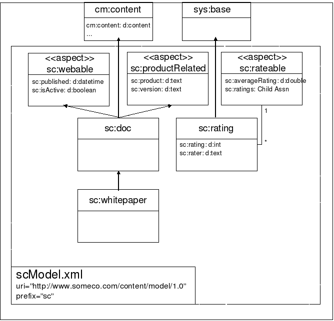
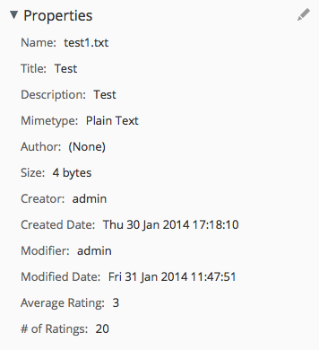

% Implementing Custom Behaviors in Alfresco
% Jeff Potts
% January, 2014

License
=======


This work is licensed under the Creative Commons Attribution-ShareAlike 3.0 Unported License. To view a copy of this license, visit http://creativecommons.org/licenses/by-sa/3.0/ or send a letter to Creative Commons, 444 Castro Street, Suite 900, Mountain View, California, 94041, USA.

Introduction 
============
This tutorial discusses how to write your own custom behavior code in
Java or JavaScript and then bind that code to node events or “policies”.

In previous tutorials I've discussed how to create [custom content models](http://ecmarchitect.com/alfresco-developer-series-tutorials/content/tutorial/tutorial.html)
and how to write [custom actions](http://ecmarchitect.com/alfresco-developer-series-tutorials/actions/tutorial/tutorial.html). In both cases, you've seen how to write
code that works with custom content types, properties, aspects, and
associations, but the code wasn't tightly coupled to the objects on
which it operated. For example, with an action, the business logic is triggered by
something—a rule, a clicked link in the user interface, a schedule, or a
workflow—rather than being *bound* to the content type or aspect.

Actions are very useful when the business logic the action carries out
is generic enough to be applied to many types of objects. The
out-of-the-box "copy", "move", or "add aspect" actions are obvious examples.

There are times, though, when you want code to be tightly-coupled to a
content type because you need to be sure it gets executed every time something happens to that object rather than
leaving it up to a rule on a folder or some other trigger. Fortunately, Alfresco provides just such a
mechanism—it's called *behavior*.

Behaviors are used throughout Alfresco. Auditing and versioning are
examples where behaviors are involved. Here are a couple of other real world examples where behaviors might be useful:

* You might need to default some metadata values using logic that can't be
expressed using Alfresco content model XML. An example might be that you want to generate a unique identifier for an object when it is added to the repository. You can write a custom behavior
that will set the property with the value of the identifier regardless of how the object is created.
* Suppose you have some metadata stored on a folder and you want some of that metadata to be copied to items that get placed in those folders. You could write a custom behavior to handle this kind of synchronization.

In this tutorial you'll see a simple example also based on a real-world
implementation: Using a custom behavior to compute the average user
rating (based on a five star scale) for a piece of content.

As a side-note, Alfresco has rating functionality built-in. Out-of-the-box it uses a simple "like" model but the underlying model supports other schemes. This tutorial completely ignores what's available out-of-the-box.

You should already be familiar with general Alfresco concepts. If you want to follow along, you should
also know how to write basic Java code. You may want to work through the [custom content models tutorial](http://ecmarchitect.com/alfresco-developer-series-tutorials/content/tutorial/tutorial.html) if you aren't already
familiar with how to extend Alfresco's content model.

All of the source code that accompanies this tutorial is available on [GitHub](https://github.com/jpotts/alfresco-developer-series).

Introducing the user ratings example
====================================
Recall that the custom content types tutorial created a custom
type called "whitepaper" for a fictitious company called SomeCo. The custom model also included
an aspect called “webable” that gets attached to content objects SomeCo
wants to show on the web. So, for example, SomeCo might use Alfresco to
manage all of its whitepapers, but show only a subset on the web.
Whitepapers that need to be shown on the web get the webable aspect attached and
the `sc:isActive` flag set to `true`. The front-end can then query for
whitepapers based on that flag.

Now let's extend that example further. Suppose that the Marketing folks
at SomeCo have decided to add user
ratings to their web site. They would like users to be able to assign a
rating to a whitepaper and to display the average of all ratings
received for a specific whitepaper.

Assuming SomeCo wants to store the ratings in Alfresco instead of some other repository, like a relational or NoSQL database, one way to do this is to create a custom
“rating” type that is related to a whitepaper through a child
association. A custom “rateable” aspect can be used to define the
association as well as a property to store the average rating for that
whitepaper. Any object in the repository will get all of the metadata it needs to become "rateable" simply by adding the aspect to the object.

The image below shows the original custom content model with these
enhancements.



That takes care of the data model, but what about the code that
computes the average? There are a few options to consider:

1. **Rule Action**. One way to handle it would be to write an action
that gets called by a rule. Any time a rating is added to a folder, the
rule would trigger the action to update the average. But this isn't the
best option because every time SomeCo wants to use user ratings functionality, they'd have
to make sure to set up a rule on the folder.
2. **Scheduled Action**. A scheduled action might not be bad—it could be written to find all objects with the rateable aspect and then compute the average. But if SomeCo wants the average rating
computed in real-time (and let's assume they do) a scheduled action isn't
a great option.
3. **Behavior**. The third (and best) option is to use a
behavior. The behavior will contain the logic needed to compute the average. It will be bound to the appropriate policies on the rating content type so that any time a rating gets created (or deleted), the behavior will find the rating's parent (the whitepaper) and recalculate the average rating.

What can trigger a behavior?
----------------------------
So the rating content type will contain business logic that knows
how to compute the overall average rating for a whitepaper. But what
will trigger that logic? The answer is that there are a bunch of
*policies* to which your behavior can be bound. To find out what's
available, you need only look as far as the source code (or the [Javadocs](http://dev.alfresco.com/resource/docs/java/repository/index.html?index-all.html)).
If you search for classes that end in "*Policies" you'll find several interfaces, including:

* CheckOutCheckInServicePolicies
* ContentServicePolicies
* CopyServicePolicies
* LockServicePolicies
* NodeServicePolicies
* TransferServicePolicies
* VersionServicePolicies

Each of those interfaces contains inner interfaces that represent the
policies you can hook into. Check the Javadocs or source code for
specifics—I'm listing the methods in the table below so you can see an example of what's available.

Note: To make it easier to read, I'm omitting the inner interface which
follows the pattern of `<method-name>Policy`. For example, the
`onContentUpdate` method is a method of the inner interface
`OnContentUpdatePolicy`.

| Interface | Method |
| --------- | ------ |
| org.alfresco.repo.content.ContentServicePolicies | onContentPropertyUpdate \
onContentRead \
onContentUpdate |
| org.alfresco.repo.copy.CopyServicePolicies | beforeCopy \
onCopyComplete \
onCopyNode |
| org.alfresco.repo.node.NodeServicePolicies | beforeAddAspect \
beforeArchiveNode \
beforeCreateNode \
beforeCreateStore \
beforeDeleteAssociation \
beforeDeleteChildAssociation \
beforeDeleteNode \
beforeMoveNode \
beforeRemoveAspect \
beforeSetNodeType \
beforeUpdateNode \
onAddAspect \
onCreateAssociation \
onCreateChildAssociation \
onCreateNode \
onCreateStore \
onDeleteAssociation \
onDeleteChildAssociation \
onDeleteNode \
onMoveNode \
onRemoveAspect \
onSetNodeType \
onUpdateNode \
onUpdateProperties |
| org.alfresco.repo.version.VersionServicePolicies | beforeCreateVersion \
afterCreateVersion \
onCreateVersion \
calculateVersionLabel |

Table: Policies available for behavior binding

The rating behavior needs to recalculate a whitepaper's rating
either when a new rating is created or when a rating is deleted. One
possibility would be to bind the behavior to the `NodeService` policy's
`onCreateChildAssociation` and `onDeleteChildAssociation` policy for the
whitepaper node. But that would mean constantly inspecting the
association type to see if the rating needed to be recalculated because there
could be other child associations added to the node besides ratings. Instead, the rating behavior will bind
to the rating node's `onCreateNode` and `onDeleteNode` policies.

Java or JavaScript?
-------------------
There are two options for writing the code for the behavior: Java or
JavaScript. Which one to use depends on the standards
you've settled on for the solution you are building. This tutorial will
implement the ratings example using Java first and then again in JavaScript so you can see how it is done.

Setup
=====
Before getting too far down the road, let me tell you about the tools you'll need and then give you a description of the project organization.

Tools
-----
Here is what I am using on my machine:

* Mac OS X 10.9.1
* Java 1.7.0_51
* Apache Maven 3.0.5 (installed using Macports)
* Alfresco Maven SDK, AMP Archetype 1.1.1 (No download necessary)
* Eclipse Java EE IDE for Web Developers, Kepler
* Alfresco Community Edition 4.2.e ([Download](http://www.alfresco.com/products/community))

By default, when you create an Alfresco project using version 1.1.1 of the Alfresco Maven SDK the project will be configured to depend on Alfresco Community Edition 4.2.e.

The Eclipse IDE is optional. Most people working with Alfresco use Eclipse or something similar, so this tutorial will assume that's what you are using.

Project Organization
--------------------
I am going to use the Alfresco Maven SDK to create two projects that will package up my customizations as AMPs (Alfresco Module Packages). One project will create an AMP for the "repo" tier and one project will create an AMP for the "share" tier. I will also create a third "common" project for a Java class that will be used by this and other tutorials.

I am not going to spend much time talking about how the Alfresco Maven SDK works. If you aren't already familiar with it, you may want to read the [Getting Started with the Alfresco Maven SDK](http://ecmarchitect.com/alfresco-developer-series) tutorial on ecmarchitect.com first and then come back to this one.

If you are planning on following along, go ahead and use the Alfresco Maven SDK to create the repo tier and share tier projects. Use a `groupId` of "com.someco" for everything. For the repo project, use an `artifactId` of "behavior-tutorial-repo". For the share tier project use an `artifactId` of "behavior-tutorial-share".

Implementing and deploying the custom behavior in Java
======================================================

Let's do the Java example first. Here are the steps:

1.  Create a new custom model specifically for ratings. The model will define the new
    rateable aspect and rating type.
2.  Write the custom behavior class and bind it to the appropriate
    policies. Configure a Spring bean to initialize the behavior class and pass in
    any dependencies.
3.  Write and execute a unit test for the behavior.

Let's get started.

Step 1: Create a ratings model
------------------------------

In this step you will implement a content model used to persist ratings, optionally configure the user interface so you can see the average rating and rating count in Alfresco Share, define a Java class to hold constants for the model, and write a unit test to test the new aspect.

### Implement the rating type and rateable aspect

As you learned in the content types tutorial, models are defined using XML and the XML file resides in:

    $TUTORIAL_HOME/behavior-tutorial-repo/src/main/amp/config/alfresco/module/behavior-tutorial-repo/model

The Alfresco Maven SDK should have created everything for you except the model directory. Go ahead and create that now.

Now, create a new model XML file called "[scRatingsModel.xml](https://github.com/jpotts/alfresco-developer-series/blob/master/behaviors/behavior-tutorial-repo/src/main/amp/config/alfresco/module/behavior-tutorial-repo/model/scRatingsModel.xml)" with the following content:

    <?xml version="1.0" encoding="UTF-8"?>
    <!-- Definition of new Model -->
    <model name="scr:somecoratingsmodel" xmlns="http://www.alfresco.org/model/dictionary/1.0">
    
        <!-- Optional meta-data about the model -->
        <description>Someco Ratings Model</description>
        <author>Jeff Potts</author>
        <version>1.0</version>
    
        <!-- Imports are required to allow references to definitions in other models -->
        <imports>
            <!-- Import Alfresco Dictionary Definitions -->
            <import uri="http://www.alfresco.org/model/dictionary/1.0" prefix="d" />
            <!-- Import Alfresco Content Domain Model Definitions -->
            <import uri="http://www.alfresco.org/model/content/1.0" prefix="cm" />
            <import uri="http://www.alfresco.org/model/system/1.0" prefix="sys" />
    	</imports>
    
        <!-- Introduction of new namespaces defined by this model -->
        <namespaces>
            <namespace uri="http://www.someco.com/model/ratings/1.0" prefix="scr" />
        </namespaces>
    </model>

The model needs a type and an aspect. The chunk of XML below does that. Insert it after the closing `namespaces` element:

    <types>
        <type name="scr:rating">
            <title>Someco Rating</title>
            <parent>sys:base</parent>
            <properties>
                <property name="scr:rating">
                    <type>d:int</type>
                    <mandatory>true</mandatory>
                </property>
                <property name="scr:rater">
                    <type>d:text</type>
                    <mandatory>true</mandatory>
                </property>
            </properties>
        </type>
    </types>

Note that `scr:rating` inherits from `sys:base`. That's because rating objects aren't going to store any content, they will only store properties.

Now add the `scr:rateable` aspect. The `aspects` element goes after the closing `types` element:

    <aspects>
        <aspect name="scr:rateable">
            <title>Someco Rateable</title>
            <properties>
                <property name="scr:averageRating">
                    <type>d:double</type>
                    <mandatory>false</mandatory>
                </property>
                <property name="scr:totalRating">
                    <type>d:int</type>
                    <mandatory>false</mandatory>
                </property>
                <property name="scr:ratingCount">
                    <type>d:int</type>
                    <mandatory>false</mandatory>
                </property>				
            </properties>
            <associations>
                <child-association name="scr:ratings">
                    <title>Rating</title>
                    <source>
                        <mandatory>false</mandatory>
                        <many>true</many>
                    </source>
                    <target>
                        <class>scr:rating</class>
                        <mandatory>false</mandatory>
                        <many>true</many>
                    </target>
                </child-association>
            </associations>
        </aspect>
    </aspects>

The `scr:rateable` aspect has three properties used to store the average
rating, total rating, and rating count. It also defines the child association between a piece of
content and its ratings.

Using an aspect means any piece of content in the repository can become "rateable" simply by adding the aspect to the object. SomeCo may start out using ratings only for whitepapers and then decide later to use them for other types of content. If so, it won't require any code changes. That's the beauty of aspects.

Alfresco needs to know about the new model. Models are registered through Spring. The Spring context file is called [service-context.xml](https://github.com/jpotts/alfresco-developer-series/blob/master/behaviors/behavior-tutorial-repo/src/main/amp/config/alfresco/module/behavior-tutorial-repo/context/service-context.xml) and it lives in:

    $TUTORIAL_HOME/behavior-tutorial-repo/src/main/amp/config/alfresco/module/behavior-tutorial-repo/context

The bean refers to the model XML file created earlier as well as a properties file that doesn't exist yet:

    <bean id="${project.artifactId}_dictionaryBootstrap" parent="dictionaryModelBootstrap" depends-on="dictionaryBootstrap">
        <property name="models">
            <list>                
                <value>alfresco/module/${project.artifactId}/model/scRatingsModel.xml</value>                
            </list>
        </property>
        <property name="labels">
            <list>
                <value>alfresco/module/${project.artifactId}/messages/scRatingsModel</value>
            </list>        
        </property>        
    </bean>

With that, the model is set up and ready to go.

### Optionally configure the user interface

Behaviors operate behind the scenes. So, really, there is no reason to configure the user interface at all. But I like to do it because it makes it easier to debug. And, SomeCo might want to use Alfresco Share to see the average rating and rating count for a piece of content that has the rateable aspect.

In the previous step you added a Spring bean that referred to a properties bundle used for the labels associated with the model. The labels go in a file called [scRatingsModel.properties](https://github.com/jpotts/alfresco-developer-series/blob/master/behaviors/behavior-tutorial-repo/src/main/amp/config/alfresco/module/behavior-tutorial-repo/messages/scRatingsModel.properties). That file lives in:

    $TUTORIAL_HOME/behavior-tutorial-repo/src/main/amp/config/alfresco/module/behavior-tutorial-repo/messages

The content of that file looks like this:

    #scr:rating
    scr_somecoratingsmodel.type.scr_rating.title=Rating
    scr_somecoratingsmodel.property.scr_rating.title=Rating
    scr_somecoratingsmodel.property.scr_rater.title=Rater
    
    #scr:rateable
    scr_somecoratingsmodel.aspect.scr_rateable.title=SomeCo Rateable
    scr_somecoratingsmodel.property.scr_averageRating=Average Rating
    scr_somecoratingsmodel.association.scr_ratings.title=Ratings

That's all that's needed in the behavior-tutorial-repo project. The rest of the user interface configuration takes place in the behavior-tutorial-share project.

Because these steps have already been covered in the custom content types tutorial, I'll just list the files here and you can either copy them into your project or do without them:

* $TUTORIAL_HOME/behavior-tutorial-share/src/main/resources/META-INF/[share-config-custom.xml](https://github.com/jpotts/alfresco-developer-series/blob/master/behaviors/behavior-tutorial-share/src/main/resources/META-INF/share-config-custom.xml). The configuration in this file adds the rateable aspect to the list of aspects users can manage. It also defines which properties should be displayed when showing the property list for a piece of content with the rateable aspect applied.
* $TUTORIAL_HOME/behavior-tutorial-share/src/main/amp/config/alfresco/web-extension/[behavior-tutorial-share-context.xml](https://github.com/jpotts/alfresco-developer-series/blob/master/behaviors/behavior-tutorial-share/src/main/amp/config/alfresco/web-extension/behavior-tutorial-share-context.xml). This is the Spring context file that tells Alfresco Share where to find the properties bundle.
* $TUTORIAL_HOME/behavior-tutorial-share/src/main/amp/config/alfresco/module/behavior-tutorial-share/messages/[scRatingsModel.properties](https://github.com/jpotts/alfresco-developer-series/blob/master/behaviors/behavior-tutorial-share/src/main/amp/config/alfresco/module/behavior-tutorial-share/messages/scRatingsModel.properties). This is the properties bundle for the module that Alfresco Share will use to localize the labels.

Now the Alfresco Share user interface will know how to show values for the average rating and rating count when a piece of content with the rateable aspect is displayed.

### Define a Java class to hold constants

I've created a project called behavior-tutorial-common. It will contain a Java class called [SomeCoRatingsModel](https://github.com/jpotts/alfresco-developer-series/blob/master/behaviors/behavior-tutorial-common/src/main/java/com/someco/model/SomeCoRatingsModel.java). The only reason I am breaking it out into its own project is that it makes it easier for other projects to use it as a dependency.

The class looks like this:

    public interface SomeCoRatingsModel {
    
        // Namespaces
        public static final String NAMESPACE_SOMECO_RATINGS_CONTENT_MODEL  = "http://www.someco.com/model/ratings/1.0";
        
        // Types
        public static final String TYPE_SCR_RATING = "rating";
            
        // Aspects
        public static final String ASPECT_SCR_RATEABLE = "rateable";
        
        // Properties
        public static final String PROP_RATING = "rating";
        public static final String PROP_RATER = "rater";
        public static final String PROP_AVERAGE_RATING= "averageRating";
        public static final String PROP_TOTAL_RATING= "totalRating";
        public static final String PROP_RATING_COUNT= "ratingCount";
        
        // Associations
        public static final String ASSN_SCR_RATINGS = "ratings";
    }

These are just constants that will be used by the behavior class and other classes in other tutorials when they need to refer to the rating type, rateable aspect, or any of the properties by name.

### Write unit tests

The Alfresco Maven SDK will automatically run unit tests when `mvn install` runs. If you're a TDD (Test-Driven Development) kind of person you could add a test for the to-be-developed behavior. For now, I'll just create a test to make sure I can successfully add the `scr:rateable` aspect to a piece of content. The rating type will get tested shortly.

The test class goes in:

    $TUTORIAL_HOME/behavior-tutorial-repo/src/test/java/com/someco/behavior/test

Here is the [RateableAspectTest](https://github.com/jpotts/alfresco-developer-series/blob/master/behaviors/behavior-tutorial-repo/src/test/java/com/someco/behavior/test/RateableAspectTest.java) test class:

    @RunWith(RemoteTestRunner.class)
    @Remote(runnerClass=SpringJUnit4ClassRunner.class)
    @ContextConfiguration("classpath:alfresco/application-context.xml")
    public class RateableAspectTest {
        
        private static final String ADMIN_USER_NAME = "admin";
    
        static Logger log = Logger.getLogger(RateableAspectTest.class);
    
        private final QName RATING = QName.createQName(
        		SomeCoRatingsModel.NAMESPACE_SOMECO_RATINGS_CONTENT_MODEL,
        		SomeCoRatingsModel.PROP_AVERAGE_RATING);
        private final QName TOTAL = QName.createQName(
        		SomeCoRatingsModel.NAMESPACE_SOMECO_RATINGS_CONTENT_MODEL,
        		SomeCoRatingsModel.PROP_TOTAL_RATING);
        private final QName COUNT = QName.createQName(
        		SomeCoRatingsModel.NAMESPACE_SOMECO_RATINGS_CONTENT_MODEL,
        		SomeCoRatingsModel.PROP_RATING_COUNT);
    
        @Autowired
        @Qualifier("NodeService")
        protected NodeService nodeService;
    
        @Autowired
        @Qualifier("nodeLocatorService")
        protected NodeLocatorService nodeLocatorService;
        
        @Test
        public void testAddRateableAspect() {
        	AuthenticationUtil.setFullyAuthenticatedUser(ADMIN_USER_NAME);

            NodeRef companyHome = nodeLocatorService.getNode(CompanyHomeNodeLocator.NAME, null, null);
            
            // assign name
            String name = "Add Rateable Aspect Test (" + System.currentTimeMillis() + ")";
            Map<QName, Serializable> contentProps = new HashMap<QName, Serializable>();
            contentProps.put(ContentModel.PROP_NAME, name);
    
            // create content node
            ChildAssociationRef association = nodeService.createNode(
            				companyHome,
                            ContentModel.ASSOC_CONTAINS,
                            QName.createQName(NamespaceService.CONTENT_MODEL_PREFIX, name),
                            ContentModel.TYPE_CONTENT,
                            contentProps
                            );
    
            NodeRef content = association.getChildRef();
    
            // set up some aspect-based properties
            Map<QName, Serializable> aspectProps = new HashMap<QName, Serializable>();
            aspectProps.put(RATING, 1.0);
            aspectProps.put(TOTAL, 1);
            aspectProps.put(COUNT, 1);
            
            // add the aspect and set the properties
            nodeService.addAspect(content, QName.createQName(SomeCoRatingsModel.NAMESPACE_SOMECO_RATINGS_CONTENT_MODEL, SomeCoRatingsModel.ASPECT_SCR_RATEABLE), aspectProps);
        	        
            assertEquals(1.0, nodeService.getProperty(content, RATING));
            assertEquals(1, nodeService.getProperty(content, TOTAL));
            assertEquals(1, nodeService.getProperty(content, COUNT));
            
        	nodeService.deleteNode(content);
        }
    
    }

The test creates a new content node in Company Home and then adds the `scr:rateable` aspect to it, simultaneously setting the aspect-based properties to test values. It then makes sure it can get those same test values back.

To run the test, just switch to the behavior-tutorial-repo project directory and run `mvn install`.

Assuming everything went okay, you now have your model in place and tested and you are ready to write the behavior.

Step 2: Implement the custom behavior
-------------------------------------

Implementing the behavior involves writing some Java, configuring a Spring Bean, and adding a unit test for the behavior.

### Write the behavior class

The custom behavior is implemented as a Java class called [Rating](https://github.com/jpotts/alfresco-developer-series/blob/master/behaviors/behavior-tutorial-repo/src/main/java/com/someco/behavior/Rating.java). The class implements the
interfaces that correspond to the policies the behavior needs to bind to. In
this example, the two policy interfaces are: `NodeServicePolicies.OnDeleteNodePolicy` and `NodeServicePolicies.OnCreateNodePolicy` so the class declaration is:

    public class Rating
    implements NodeServicePolicies.OnDeleteNodePolicy,
    NodeServicePolicies.OnCreateNodePolicy {
    
The class has two dependencies that Spring will handle for us. One is
the `NodeService` which will be used in the average calculation logic and
the other is the `PolicyComponent` which is used to bind the behavior to
the policies.
    
    // Dependencies
    private NodeService nodeService;
    private PolicyComponent policyComponent;
    
    // Behaviours
    private Behaviour onCreateNode;
    private Behaviour onDeleteNode;

At some point Alfresco has to know that the behavior needs to be bound
to a policy. A method called `init()` will handle the binding. It will get called when
Spring loads the bean.

    public void init() {
    
        // Create behaviours
        this.onCreateNode = new JavaBehaviour(this, "onCreateNode", NotificationFrequency.TRANSACTION_COMMIT);
        
        this.onDeleteNode = new JavaBehaviour(this, "onDeleteNode", NotificationFrequency.TRANSACTION_COMMIT);
        
        // Bind behaviours to node policies
        this.policyComponent.bindClassBehaviour(
            Qname.createQName(NamespaceService.ALFRESCO_URI, "onCreateNode"),
            Qname.createQName(SomeCoModel.NAMESPACE_SOMECO_CONTENT_MODEL, SomeCoModel.TYPE_SC_RATING),
            this.onCreateNode
        );
        
        this.policyComponent.bindClassBehaviour(
            QName.createQName(NamespaceService.ALFRESCO_URI, "onDeleteNode"),
            Qname.createQName(SomeCoModel.NAMESPACE_SOMECO_CONTENT_MODEL, SomeCoModel.TYPE_SC_RATING),
            this.onDeleteNode
        );

    }

The first thing to notice here is that you can decide when the behavior
should be invoked by specifying the appropriate `NotificationFrequency`.
Besides `TRANSACTION_COMMIT`, other choices include `FIRST_EVENT` and
`EVERY_EVENT`.

Also note that there are a few different overloaded methods for
`bindClassBehaviour`. In this case the code binds
the Qname of a behavior to the Qname of our type (“Rating”) and tells
Alfresco to call the `onCreateNode` and `onDeleteNode` behaviors that will be defined in this class.

There are also additional bind methods for associations
(`bindAssociationBehaviour`) and properties (`bindPropertyBehaviour`) that
you should use depending on the type of policy you are binding to.

Next are the methods required by the two policy interfaces.
Regardless of whether a ratings node is created or deleted, the average needs to be recalculated. So the `onCreateNode` and `onDeleteNode` methods call `computeAverage` and pass in the rating node reference.

    public void onCreateNode(ChildAssociationRef childAssocRef) {
    
        computeAverage(childAssocRef);
        
    }
        
    public void onDeleteNode(ChildAssociationRef childAssocRef, boolean isNodeArchived) {
        
        computeAverage(childAssocRef);
    
    }

The `computeAverage` method asks the child (the rating object) for its parent
node reference (the rateable object) and asks the parent for a
list of its children. It iterates over the children, computes an
average, and sets the average property on the content.

    public void computeAverage(ChildAssociationRef childAssocRef) {
    
        // get the parent node
        NodeRef parentRef = childAssocRef.getParentRef();
        
        // check the parent to make sure it has the right aspect
        if (nodeService.exists(parentRef) && nodeService.hasAspect(parentRef, Qname.createQName(SomeCoModel.NAMESPACE_SOMECO_CONTENT_MODEL, SomeCoModel.ASPECT_SC_RATEABLE))) {
        
            // continue, this is what we want
        
        } else {
        
            return;
        
        }
        
        // get the parent node's children
        List<ChildAssociationRef> children = nodeService.getChildAssocs(parentRef);
        
        // iterate through the children to compute the total
        Double average = 0d;
        int total = 0;
        for (ChildAssociationRef child : children) {
            int rating = (Integer)nodeService.getProperty(
            child.getChildRef(),
            Qname.createQName(SomeCoModel.NAMESPACE_SOMECO_CONTENT_MODEL, SomeCoModel.PROP_RATING));
            total += rating;
        }
        
        // compute the average
        average = total / (children.size() / 1.0d);
        
        // store the average, total, count on the parent node
        nodeService.setProperty(
            parentRef,
            QName.createQName(
                SomeCoRatingsModel.NAMESPACE_SOMECO_RATINGS_CONTENT_MODEL,
                SomeCoRatingsModel.PROP_AVERAGE_RATING),
            average);

        nodeService.setProperty(
            parentRef,
            QName.createQName(
                SomeCoRatingsModel.NAMESPACE_SOMECO_RATINGS_CONTENT_MODEL,
                SomeCoRatingsModel.PROP_TOTAL_RATING),
            total);

        nodeService.setProperty(
            parentRef,
            QName.createQName(
                SomeCoRatingsModel.NAMESPACE_SOMECO_RATINGS_CONTENT_MODEL,
                SomeCoRatingsModel.PROP_RATING_COUNT),
            count);		
        
        return;
    
    }

The class stores the total rating and rating count, so it could actually compute the average without iterating over the rating objects. All it really needs to know is the value of the new rating. For this example we'll only have a handful of associations anyway but in the real world, you need to think carefully about such performance considerations when you write your behaviors.

### Configure a Spring bean

The last step before testing is to configure the behavior class as a
Spring bean. The bean config goes in [service-context.xml](https://github.com/jpotts/alfresco-developer-series/blob/master/behaviors/behavior-tutorial-repo/src/main/amp/config/alfresco/module/behavior-tutorial-repo/context/service-context.xml), which, as a reminder, lives in:

    $TUTORIAL_HOME/behavior-tutorial-repo/src/main/amp/config/alfresco/module/behavior-tutorial-repo/context

Add the following before the closing `beans` element:

    <bean id="ratingBehavior" class="com.someco.behavior.Rating"
    init-method="init">
        <property name="nodeService">
            <ref bean="NodeService" />
        </property>
        <property name="policyComponent">
            <ref bean="policyComponent" />
        </property>
    </bean>

This bean declares the `init` method and injects the dependencies the behavior needs.

Step 3: Create a unit test for the behavior
-------------------------------------------

The behavior should be able to calculate the average rating when rating objects are created or deleted from any piece of content that has the `scr:rateable` aspect. It's easy to test that with a unit test.

I'll add a class called [RatingTest](https://github.com/jpotts/alfresco-developer-series/blob/master/behaviors/behavior-tutorial-repo/src/test/java/com/someco/behavior/test/RatingTest.java) to the same test package that `RateableAspectTest` is in. The test will:

1. Create a piece of content and add the `scr:rateable` aspect to it.
2. Add three test ratings, checking the values for the average rating, total rating and rating count.
3. Delete one of the test ratings, checking the values again to make sure the delete was handled appropriately.

Here's the code:

    @RunWith(RemoteTestRunner.class)
    @Remote(runnerClass=SpringJUnit4ClassRunner.class)
    @ContextConfiguration("classpath:alfresco/application-context.xml")
    public class RatingTest {
        
        private static final String ADMIN_USER_NAME = "admin";
    
        static Logger log = Logger.getLogger(RatingTest.class);
    
        private final QName RATING = QName.createQName(
        		SomeCoRatingsModel.NAMESPACE_SOMECO_RATINGS_CONTENT_MODEL,
        		SomeCoRatingsModel.PROP_RATING);
        private final QName RATER = QName.createQName(
        		SomeCoRatingsModel.NAMESPACE_SOMECO_RATINGS_CONTENT_MODEL,
        		SomeCoRatingsModel.PROP_RATER);
        private final QName AVERAGE = QName.createQName(
        		SomeCoRatingsModel.NAMESPACE_SOMECO_RATINGS_CONTENT_MODEL,
        		SomeCoRatingsModel.PROP_AVERAGE_RATING);
        private final QName TOTAL = QName.createQName(
        		SomeCoRatingsModel.NAMESPACE_SOMECO_RATINGS_CONTENT_MODEL,
        		SomeCoRatingsModel.PROP_TOTAL_RATING);
        private final QName COUNT = QName.createQName(
        		SomeCoRatingsModel.NAMESPACE_SOMECO_RATINGS_CONTENT_MODEL,
        		SomeCoRatingsModel.PROP_RATING_COUNT);
        
        private final String RATER_STRING = "jpotts";
        
        @Autowired
        @Qualifier("NodeService")
        protected NodeService nodeService;
    
        @Autowired
        @Qualifier("nodeLocatorService")
        protected NodeLocatorService nodeLocatorService;
    
        @Test
        public void ratingTypeTest() {
        	
        	AuthenticationUtil.setFullyAuthenticatedUser(ADMIN_USER_NAME);
            NodeRef companyHome = nodeLocatorService.getNode(CompanyHomeNodeLocator.NAME, null, null);
            
            // assign name
            String name = "Add Rateable Aspect Test (" + System.currentTimeMillis() + ")";
            Map<QName, Serializable> contentProps = new HashMap<QName, Serializable>();
            contentProps.put(ContentModel.PROP_NAME, name);
    
            // create content node
            ChildAssociationRef association = nodeService.createNode(
            				companyHome,
                            ContentModel.ASSOC_CONTAINS,
                            QName.createQName(NamespaceService.CONTENT_MODEL_PREFIX, name),
                            ContentModel.TYPE_CONTENT,
                            contentProps
                            );
    
            NodeRef content = association.getChildRef();    	
    
            // add the aspect
            nodeService.addAspect(
                content,
                QName.createQName(
                    SomeCoRatingsModel.NAMESPACE_SOMECO_RATINGS_CONTENT_MODEL,
                    SomeCoRatingsModel.ASPECT_SCR_RATEABLE
                ),
                null);
        	
            createRating(content, 1, RATER_STRING);
            
            assertEquals(1.0, nodeService.getProperty(content, AVERAGE));
            assertEquals(1, nodeService.getProperty(content, TOTAL));
            assertEquals(1, nodeService.getProperty(content, COUNT));
            
            NodeRef rating2 = createRating(content, 2, RATER_STRING);
    
            assertEquals(1.5, nodeService.getProperty(content, AVERAGE));
            assertEquals(3, nodeService.getProperty(content, TOTAL));
            assertEquals(2, nodeService.getProperty(content, COUNT));
    
            createRating(content, 3, RATER_STRING);
            
            assertEquals(2.0, nodeService.getProperty(content, AVERAGE));
            assertEquals(6, nodeService.getProperty(content, TOTAL));
            assertEquals(3, nodeService.getProperty(content, COUNT));
            
            nodeService.deleteNode(rating2);
            
            assertEquals(nodeService.getProperty(content, AVERAGE), 2.0);
            assertEquals(nodeService.getProperty(content, TOTAL), 4);
            assertEquals(nodeService.getProperty(content, COUNT), 2);
            
            nodeService.deleteNode(content);
            
        }
    
        public NodeRef createRating(NodeRef content, int rating, String rater) {
    	    // assign name
    	    String name = "Rating (" + System.currentTimeMillis() + ")";
    	    Map<QName, Serializable> contentProps = new HashMap<QName, Serializable>();
    	    contentProps.put(ContentModel.PROP_NAME, name);
    	    contentProps.put(RATING, rating);
    	    contentProps.put(RATER, rater);
    
    	    // create rating as a child of the content node using the scr:ratings child association
    	    ChildAssociationRef association = nodeService.createNode(
                content,
    	        QName.createQName(
                    SomeCoRatingsModel.NAMESPACE_SOMECO_RATINGS_CONTENT_MODEL,
                    SomeCoRatingsModel.ASSN_SCR_RATINGS),
                QName.createQName(NamespaceService.CONTENT_MODEL_PREFIX, name),
                QName.createQName(
                    SomeCoRatingsModel.NAMESPACE_SOMECO_RATINGS_CONTENT_MODEL,
                    SomeCoRatingsModel.TYPE_SCR_RATING),
                contentProps);
    
    	    return association.getChildRef();
        }
    }

To run the test, switch to the $TUTORIAL_HOME/behavior-tutorial-repo directory and run `mvn install`. Apache Maven will start up an embedded instance of Alfresco with your repo AMP deployed and will then run the unit tests. If you see something like this:

    [INFO] ------------------------------------------------------------------------
    [INFO] BUILD SUCCESS
    [INFO] ------------------------------------------------------------------------
    [INFO] Total time: 48.090s
    [INFO] Finished at: Wed Jan 29 18:19:01 CST 2014
    [INFO] Final Memory: 13M/122M
    [INFO] ------------------------------------------------------------------------

...it means your behavior is working.

If something is broken, try changing [log4j.properties](https://github.com/jpotts/alfresco-developer-series/blob/master/behaviors/behavior-tutorial-repo/src/main/amp/config/alfresco/module/behavior-tutorial-repo/log4j.properties) in:

    $TUTORIAL_HOME/behavior-tutorial-repo/src/main/amp/config/alfresco/module

To:

    log4j.logger.com.someco=${module.log.level}

And then run:

    mvn install -Dmodule.log.level=DEBUG

You can then look for the debug messages in the log.


Re-implementing the behavior in JavaScript
==========================================

You've seen how to implement the average rating calculation behavior in
Java, but what if you wanted to implement the behavior using JavaScript
instead? Behaviors can be implemented in server-side JavaScript and bound to
policies through Spring. Let's re-implement the Rating bean using
JavaScript.

The high-level steps are:

1.  Write the custom behavior as one or more server-side JavaScript files.
2.  Configure a Spring bean to bind the JavaScript to the appropriate policies.
3.  Test the behavior.

Step 1: Write the custom behavior as server-side JavaScript
-----------------------------------------------------------

For this example I'm going to shamelessly steal a JavaScript file that
is part of the Alfresco source and then tweak it. The original script is
used by Alfresco to test `Policy` functionality. (As a side note, the test
code that is buried in the Alfresco source tree is a great resource for
example code).

I am going to write three scripts for this:

1. onCreateRating.js will be bound to the `onCreateNode` policy.
2. onDeleteRating.js will be bound to the `onDeleteNode` policy.
3. rating.js will contain the average rating calculation logic and will be imported by the other
two scripts using the `import` tag.

In this example, the scripts are going to reside as part of the web
application rather than being uploaded to the repository. I'll place them in:

    $TUTORIAL_HOME/behavior-tutorial-repo/src/main/amp/config/alfresco/module/behavior-tutorial-repo/scripts

If you are following along, you'll need to create the scripts directory.

The [onCreateRating.js](https://github.com/jpotts/alfresco-developer-series/blob/master/behaviors/behavior-tutorial-repo/src/main/amp/config/alfresco/module/behavior-tutorial-repo/scripts/onCreateRating.js) and [onDeleteRating.js](https://github.com/jpotts/alfresco-developer-series/blob/master/behaviors/behavior-tutorial-repo/src/main/amp/config/alfresco/module/behavior-tutorial-repo/scripts/onDeleteRating.js) files are virtually identical. They just need to do some basic error checking and then call the `computeAverage()` function. Here is what onCreateRating.js looks like:

    <import resource="classpath:alfresco/extension/scripts/rating.js">
    var scriptFailed = false;
    
    // Have a look at the behaviour object that should have been passed
    if (behaviour == null) {
        logger.log("The behaviour object has not been set.");
        scriptFailed = true;
    }
    
    // Check the name of the behaviour
    if (behaviour.name == null && behaviour.name != "onCreateNode") {
        logger.log("The behaviour name has not been set correctly.");
        scriptFailed = true;
    } else {
        logger.log("Behaviour name: " + behaviour.name);
    }
    
    // Check the arguments
    if (behaviour.args == null) {
        logger.log("The args have not been set.");
        scriptFailed = true;
    } else {
        if (behaviour.args.length == 1) {
            var childAssoc = behaviour.args[0];
            logger.log("Calling compute average");
            computeAverage(childAssoc);
        } else {
            logger.log("The number of arguments is incorrect.");
            scriptFailed = true;
        }    
    }

The code for onDeleteRating.js is identical with the exception of the
behavior name and the number of arguments expected (2 instead of 1) so I
won't duplicate the listing here.

The `computeAverage()` function lives in [rating.js](https://github.com/jpotts/alfresco-developer-series/blob/master/behaviors/behavior-tutorial-repo/src/main/amp/config/alfresco/module/behavior-tutorial-repo/scripts/rating.js). It does pretty much the same thing as the `computeAverage()` method in the Java example, but obviously in JavaScript:

    //calculate rating
    function computeAverage(childAssocRef) {
        
        var parentRef = childAssocRef.parent;
        
        // check the parent to make sure it has the right aspect
        if (parentRef.hasAspect("{http://www.someco.com/model/ratings/1.0}rateable")) {
            // continue, this is what we want
        } else {
            logger.log("Rating's parent ref did not have rateable aspect.");
            return;
        }
        
        // get the parent node's children
        var children = parentRef.children;
        
        // iterate through the children to compute the total
        var average = 0.0;
        var total = 0;
        
        if (children != null && children.length > 0) {
            for (i in children) {
                var child = children[i];
                var rating = child.properties["{http://www.someco.com/model/content/1.0}rating"];
                total += rating;
            }
            
            // compute the average
            average = total / children.length;
        }
        
        logger.log("Computed average:" + average);
		
        // store the average, total, count on the parent node
        parentRef.properties["{http://www.someco.com/model/ratings/1.0}averageRating"] = average;
        parentRef.properties["{http://www.someco.com/model/ratings/1.0}totalRating"] = total;
        parentRef.properties["{http://www.someco.com/model/ratings/1.0}ratingCount"] = children.length;
        parentRef.save();
        		
        logger.log("Property set");
        		
        return;
    
    }

As you can see, this is the same logic used in the Java example
modified to follow the Alfresco JavaScript API syntax.

Step 2: Configure a Spring bean to bind the script to the appropriate policies
------------------------------------------------------------------------------

The Java example used an `init()` method on the `Rating` bean to make
calls to the `bindClassBehaviour()` method of `PolicyComponent`. The JavaScript
example doesn't do that. Instead, it uses Spring to associate the
JavaScript files with the `onCreateNode` and `onDeleteNode` policies.

As you've seen, the Spring context, [service-context.xml](https://github.com/jpotts/alfresco-developer-series/blob/master/behaviors/behavior-tutorial-repo/src/main/amp/config/alfresco/module/behavior-tutorial-repo/context/service-context.xml) file resides in:

    $TUTORIAL_HOME/behavior-tutorial-repo/src/main/amp/config/alfresco/module/behavior-tutorial-repo/context

Edit the file. Comment out the `ratingBehavior` bean element used for the Java example and add two new bean configs below it for the JavaScript behavior code—one for the create and one for the delete:

    <bean id="onCreateRatingNode"
    class="org.alfresco.repo.policy.registration.ClassPolicyRegistration"
    parent="policyRegistration">
        <property name="policyName">
            <value>{http://www.alfresco.org}onCreateNode</value>
        </property>
        <property name="className">
            <value>{http://www.someco.com/model/ratings/1.0}rating</value>
        </property>
        <property name="behaviour">
            <bean class="org.alfresco.repo.jscript.ScriptBehaviour" parent="scriptBehaviour">
                <property name="location">
                    <bean class="org.alfresco.repo.jscript.ClasspathScriptLocation">
                        <constructor-arg>
                            <value>alfresco/module/${project.artifactId}/scripts/onCreateRating.js</value>
                        </constructor-arg>
                    </bean>
                </property>
            </bean>
        </property>
    </bean>
    <bean id="onDeleteRatingNode"
    class="org.alfresco.repo.policy.registration.ClassPolicyRegistration"
    parent="policyRegistration">
        <property name="policyName">
            <value>{http://www.alfresco.org}onDeleteNode</value>
        </property>
        <property name="className">
            <value>{http://www.someco.com/model/ratings/1.0}rating</value>
        </property>
        <property name="behaviour">
            <bean class="org.alfresco.repo.jscript.ScriptBehaviour" parent="scriptBehaviour">
                <property name="location">
                    <bean class="org.alfresco.repo.jscript.ClasspathScriptLocation">
                        <constructor-arg>
                            <value>alfresco/module/${project.artifactId}/scripts/onDeleteRating.js</value>
                        </constructor-arg>
                    </bean>
                </property>
            </bean>
        </property>
    </bean>

Now Alfresco will use the two server-side JavaScript files as the behavior implementation instead of the Java-based behavior created earlier.

Step 3: Test the JavaScript-based behavior
------------------------------------------

If you are following along and you already did the Java-based behavior, this step is easy. The unit test doesn't have to change at all because all that is different is that the underlying behavior logic is written in JavaScript instead of Java.

So, switch to the $TUTORIAL_HOME/behavior-tutorial-repo directory and run `mvn install`. Just like the Java example, you should see something like this:

    [INFO] ------------------------------------------------------------------------
    [INFO] BUILD SUCCESS
    [INFO] ------------------------------------------------------------------------
    [INFO] Total time: 55.326s
    [INFO] Finished at: Thu Jan 30 17:04:55 CST 2014
    [INFO] Final Memory: 14M/122M
    [INFO] ------------------------------------------------------------------------

Successful unit tests are certainly comforting, but they are not very satisfying. Wouldn't you like to actually see this behavior working in the user interface? In the web scripts tutorial I'll show you how to create a little web page that lets you click on stars and post ratings for whitepapers. For now, if you'd like to run a little web script that creates test rating objects on specified content, follow these steps:

1. If you are using the source code checked out from GitHub instead of creating your own project you can move on to step 2. Otherwise, if you are following along in your own project directories, copy the following directory and its descendents from the source code that accompanies this tutorial into your behavior-tutorial-repo project. Copy:

    ```
    $TUTORIAL_SOURCE/behavior-tutorial-repo/src/main/amp/config/alfresco/extension
    ```

    to:

    ```
    $TUTORIAL_HOME/behavior-tutorial-repo/src/main/amp/config/alfresco/extension
    ```

    The directory contains the files that make up a quick-and-dirty web script that will create random ratings on a specified piece of content.

2. Switch to $TUTORIAL_HOME/behavior-tutorial-repo and run:

    ```
    mvn integration-test -Pamp-to-war
    ```

3. In a new terminal window, switch to $TUTORIAL_HOME/behavior-tutorial-share and run:

    ```
    mvn integration-test -Pamp-to-war -Dmaven.tomcat.port=8081
    ```

    You now have an Alfresco repository running on port 8080 and a Share web application running on port 8081, both with your repo and share AMPs installed.

4. Once both servers come up, log in to http://localhost:8081/share as admin, password admin.

5. Create a piece of test content somewhere in the repository. It doesn't matter what it is or what it is named.

6. Grab the test content's nodeRef. The easiest way to do this is to copy it from the URL that is displayed when you view the content's details page. For example, when you look at the details for your test content, the URL should look something like this:

    ```
    http://localhost:8081/share/page/document-details?nodeRef=workspace://SpacesStore/00408a65-1e9e-42ad-b02c-aa3546624d07
    ```

    Copy everything after "nodeRef=".

7. Now invoke the test web script, passing in the nodeRef you just copied, like this:

    ```
    http://localhost:8080/alfresco/s/someco/rating-test?nodeRef=workspace://SpacesStore/00408a65-1e9e-42ad-b02c-aa3546624d07
    ```

    Every time you invoke the web script, the script generates a random rating value and creates a new rating object for your piece of test content.

8. Go back into Share and look at the test document's details. You should see its average rating and the total number of ratings displayed in the property list, like this:

   

This shouldn't be too surprising--you are using a web script to exercise the same behavior as the unit test, but at least this way you can log in to Share and see for yourself that the behavior works. 

Deploying the AMPs to your Alfresco server
==========================================

When you are ready, you can deploy these AMPs to any Alfresco server. Both the repo project and the share project directories should have a directory called target. Maven puts the AMP there when you run `mvn install`. You can install those AMPs as you normally would. For example, if you installed Alfresco with the binary installer, you would:

1. Copy the repo tier AMP to $ALFRESCO_HOME/amps
2. Copy the share tier AMP to $ALFRESCO_HOME/amps_share
3. Install the AMPs by running $ALFRESCO_HOME/bin/apply_amps.sh

Alternatively, you can use the Alfresco Maven SDK to install the AMPs by changing into each of the two project directories and doing:

    ```
    mvn install
    mvn alfresco:install -Dmaven.alfresco.warLocation=$TOMCAT_HOME/webapps/[alfresco or share]
    ```

In my case, I run the alfresco.war and share.war files exploded under \$TOMCAT\_HOME/webapps, so I would specify \$TOMCAT\_HOME/webapps/alfresco or \$TOMCAT\_HOME/webapps/share for my `warLocation` depending on which AMPs I am installing. If you are running the WAR files unexploded you can specify the file path of each WAR.


Conclusion 
==========
This tutorial has shown how to bind custom behavior to Alfresco policies.
Specifically, the tutorial showed how to implement a custom "rateable" aspect and a custom
"rating" type that can be used to persist user ratings of content stored
in the repository. The custom behavior is responsible for calculating
the average rating for a piece of content any time a rating is created
or deleted. The tutorial showed how to implement the average rating
calculation behavior in Java as well as JavaScript.

Where to Find More Information 
==============================

* The complete source code for these examples is available on [GitHub](https://github.com/jpotts/alfresco-developer-series).
* Official documentation for both Enterprise Edition and Community Edition is available at [docs.alfresco.com](http://docs.alfresco.com/).
* For deployment help, see [Packaging and Deploying Extensions](http://wiki.alfresco.com/wiki/Packaging_And_Deploying_Extensions) in the Alfresco wiki.
* For general development help, see the [Developer Guide](http://wiki.alfresco.com/wiki/Developer_Guide).
* For help customizing the data dictionary, see the [Data Dictionary](http://wiki.alfresco.com/wiki/Data_Dictionary_Guide) wiki page.
* If you are ready to cover new ground, try another [ecmarchitect.com](http://ecmarchitect.com) tutorial in the [Alfresco Developer Series](http://ecmarchitect.com/alfresco-developer-series).
