% Working With Custom Content Types in Alfresco
% Jeff Potts
% January, 2014

License
=======


This work is licensed under the Creative Commons Attribution-ShareAlike 3.0 Unported License. To view a copy of this license, visit http://creativecommons.org/licenses/by-sa/3.0/ or send a letter to Creative Commons, 444 Castro Street, Suite 900, Mountain View, California, 94041, USA.

Introduction
============
Alfresco is a flexible platform for developing content management applications. The first step in the process of designing a custom content management application is creating the content model.

The content model Alfresco provides out-of-the-box is fairly comprehensive. In fact, for basic document management needs, you could probably get by with the out-of-the-box model. Of course, you'd be missing out on a lot of the power and functionality that having a model customized for your business needs provides.

Part 1 of this document discusses how to create your own custom content model, but you won’t want to stop there. What good would a custom content model be if you did nothing exciting with the content? After an example content model is in place, Part 2 shows how to configure Alfresco Share to expose the custom model in the user interface, then Part 3 shows how to use OpenCMIS, a standard Java API, to create, search for, and delete content. You can safely swap the order of Parts 2 and 3 according to your interest.

You should already be familiar with general document management and Alfresco functionality from an end-user perspective. If you want to follow along with Part 3, you should also know how to write basic Java code. See “[Where to find more information](#where-to-find-more-information)” at the end of this document for a link to the code samples that accompany this article.

Part 1: Implementing a Custom Content Model
===========================================
Out-of-the-box, Alfresco gives you folders and content and a few other content types. But you’ll probably want to create your own business-specific types. This section discusses how that works.

Modeling Basics
---------------
A content model describes the data being stored in the repository. The content model is critical--without it, Alfresco would be little more than a file system. Here is a list of key information the content model provides Alfresco:

* Fundamental data types and how those data types should be persisted to the database. For example, without a content model, Alfresco wouldn't know the difference between a `String` and a `Date`.

* Higher order data types like “content” and “folder” as well as custom content types like “Standard Operating Procedure” or “Contract”.

* Out-of-the-box aspects like “auditable” and “classifiable” as well as custom aspects like “rateable” or “commentable”.

* Properties (or metadata) specific to each content type.

* Constraints placed on properties (such as property values that must match a certain pattern or property values that must come from a specific list of possible values).

* How to index content for searching.

* Relationships between content types.

Alfresco content models are built using a small set of building blocks: Types, Properties, Property types, Constraints, Associations, and Aspects.

### Types

*Types* are like types or classes in the object-oriented world. They can be used to model business objects, they have properties, and they can inherit from a parent type. “Content”, “Person”, and “Folder” are three important types defined out-of-the-box. Custom types are limited only by your imagination and business requirements. Examples include things like “Expense Report”, “Medical Record”, “Movie”, “Song”, and “Comment”.

Note that types, properties, constraints, associations, and aspects have names. Names are made unique across the repository by using a namespace specific to the model. The namespace has an abbreviation. Rather than use “Example” or “Foo”, this tutorial assumes Alfresco is being implemented for a fictitious company called SomeCo. So, for example, SomeCo might define a custom model which declares a namespace with the URI of “http://www.someco.com/model/content/1.0” and a prefix of “sc”. Any type defined as part of that model would have a name prefixed with “sc:”. You'll see how models are actually defined using XML shortly, but I wanted to introduce the concept of namespaces and prefixes so you would know what they are when you see them. Using namespaces in this way helps prevent name collisions when content models are shared across repositories. In your project it is definitely important that you use your own namespace.

### Properties

*Properties* are pieces of metadata associated with a particular type. For example, the properties of an Expense Report might include things like “Employee Name”, “Date submitted”, “Project”, “Client”, “Expense Report Number”, “Total amount”, and “Currency”. The Expense Report might also include a “content” property to hold the actual expense report file (maybe it is a PDF or an Excel spreadsheet, for example).

### Property Types

*Property types* (or data types) describe the fundamental types of data the repository will use to store properties. Examples include things like strings, dates, floats, and booleans. Because these data types literally are fundamental, they are pretty much the same for everyone so they are defined for us out-of-the-box. (If you wanted to change the fact that the Alfresco data-type “text” maps to your own custom class rather than `java.lang.String`, you could, but let's not get ahead of ourselves).

### Constraints

*Constraints* can optionally be used to restrict the value that Alfresco will store in a property. There are four types of constraints available: `REGEX`, `LIST`, `MINMAX`, and `LENGTH`. `REGEX` is used to make sure that a property value matches a regular expression pattern. `LIST` is used to define a list of possible values for a property. `MINMAX` provides a numeric range for a property value. `LENGTH` sets a restriction on the length of a string.

Constraints can be defined once and reused across a model. For example, out-of-the-box, Alfresco makes available a constraint named `cm:filename` that defines a regular expression constraint for file names. If a property in a custom type needs to restrict values to those matching the filename pattern, the custom model doesn't have to define the constraint again, it simply refers to the `cm:filename` constraint.

### Associations

*Associations* define relationships between types. Without associations, models would be full of types with properties that store “pointers” to other pieces of content. Going back to the expense report example, each expense report might be stored as an individual object. In addition to an Expense Report type there could also be an Expense type. Associations tell Alfresco about the relationship between an Expense Report and one or more Expenses.

Associations come in two flavors: Peer Associations and Child Associations. (Note that Alfresco refers to Peer Associations simply as “Associations” but I think that's confusing so I'll refer to them with the “Peer” distinction). Peer Associations are just that—-they define a relationship between two objects but neither is subordinate to the other. Child Associations, on the other hand, are used when the target of the association (or child) should not exist when the source (or parent) goes away. This works like a cascaded delete in a relational database: Delete the parent and the child goes away.

An out-of-the-box association that's easy to relate to is `cm:contains`. The `cm:contains` association defines a Child Association between folders (`cm:folder`) and all other objects (instances of `sys:base` or its child types). So, for example, a folder named “Human Resources” (an instance of `cm:folder`) would have a `cm:contains` association between itself and all of its immediate children. The children could be instances of custom types like Resume, Policy, or Performance Review.

Another example might be a “Whitepaper” and its “Related Documents”. Suppose that a company publishes whitepapers on their web site. The whitepaper might be related to other documents such as product marketing materials or other research. If the relationship between the whitepaper and its related documents is formalized it can be shown in the user interface. To implement this, as part of the Whitepaper content type, you'd define a Peer Association. You could use `sys:base` as the target type to allow any piece of content in the repository to be associated with a Whitepaper or you could restrict the association to a specific type like `cm:content` or `sc:whitepaper`. 

### Aspects

Before discussing *Aspects*, let's first consider how inheritance works and the implications on the content model. Suppose Alfresco will be used to manage content to be displayed in a portal (quite a common requirement, by the way). Suppose further that only a subset of the content in the repository is content that should be shown in the portal. And, when content is to be displayed in the portal, there are some additional pieces of metadata that need to be captured. A simple example might be a requirement to show the date and time a piece of content was approved.

Using the content modeling concepts discussed so far, there are only two options. The first option is to define a root content type with the “publish date” property. All subsequent content types would inherit from this root type thus making the publish date available everywhere. The second option is to individually define the publish date property only in the content types that are going to be published to the portal.

Neither of these are great options. In the first option, there would be a property in each-and-every piece of content in the repository that may or may not ultimately be used which can lead to performance and maintenance problems. The second option isn't much better for a few reasons. First, it assumes the content types to be published in the portal are known ahead of time. Second, it opens up the possibility that the same type of metadata might get defined differently across content types. Last, it doesn't provide an easy way to encapsulate behavior or business logic that might be tied to the publish date.

As you have probably figured out by now, there is a third option that addresses these issues: Aspects. Aspects “cross-cut” the content model with properties and associations by attaching them to content types (or even specific instances of content) when and where they are needed.

Going back to the portal example, a “Portal Displayable” aspect could be defined with a publish date property. The aspect would then be added to any piece of content, regardless of type, that needed to be displayed in the portal. 

### Custom Behavior

You may find that your custom aspect or custom type needs to have behavior or business logic associated with it. For example, every time an Expense Report is checked in you want to recalculate the total by iterating through the associated Expenses. One option would be to incorporate this logic into rules or actions in the Alfresco web client or your custom web application. But some behavior is so fundamental to the aspect or type that it should really be “bound” to the aspect or type and invoked any time Alfresco works with those objects. If you are curious how this works, read the [Custom Behaviors tutorial](http://ecmarchitect.com/alfresco-developer-series) on ecmarchitect.com. For now, just know that associating business logic with your custom aspects and types (or overriding out-of-the-box behavior) is possible.

### Content Modeling Best Practices

Now that you know the building blocks of a content model, it makes sense to consider some best practices. Here are the top ten:

1. *Don't change Alfresco's out-of-the-box content model*. If you can possibly avoid it, do not change Alfresco's out-of-the-box content model. Instead, extend it with your own custom content model. If requirements call for several different types of content to be stored in the repository, create a content type for each one that extends from `cm:content` or from an enterprise-wide root content type.

2. *Consider implementing an enterprise-wide root type*. Although the need for a common ancestor type is lessened through the use of aspects, it still might be a good idea to define an enterprise-wide root content type from which all other content types in the repository inherit if for no other reason than it gives content managers a “catch-all” type to use when no other type will do.

3. *Be conservative early on by adding only what you know you need*. A corollary to that is *prepare yourself to blow away the repository multiple times until the content model stabilizes*. Once you get content in the repository that implements the types in your model, making model additions is easy, but subtractions aren't. Alfresco will complain about “integrity errors” and may make content inaccessible when the content's type or properties don't match the content model definition. When this happens to you (and it will happen) your options are to either (1) leave the old model in place, (2) attempt to export the content, modify the ACP XML file, and re-import, or (3) drop the Alfresco tables, clear the data directory, and start fresh. As long as everyone on the team is aware of this, option three is not a big deal in development, but make sure expectations are set appropriately and have a plan for handling model changes once you get to production. This might be an area where Alfresco will improve in future releases, but for now it is something you have to watch out for.

4. *Avoid unnecessary content model depth*. I am not aware of any Alfresco Content Modeling Commandments that say, “Thou shall not exceed X levels of depth in thine content model lest thou suffer the wrath of poor performance” but it seems logical that degradation would occur at some point. If your model has several levels of depth beyond `cm:content`, you should at least do a proof-of-concept with a realistic amount of data, software, and hardware to make sure you aren't creating a problem for yourself that might be very difficult to reverse down the road.

5. *Take advantage of aspects*. In addition to the potential performance and overhead savings through the use of aspects, aspects promote reuse across the model, the business logic, and the presentation layer. When working on your model you find that two or more content types have properties in common, ask yourself if those properties are being used to describe some higher-level characteristic common across the types that might better be modeled as an aspect.

6. *It may make sense to define types that have no properties or associations*. You may find yourself defining a type that gets everything it needs through either inheritance from a parent type or from an aspect (or both). In those cases you might ask yourself if the “empty” type is really necessary. In my opinion, it should at least be considered. It might be worth it just to distinguish the content from other types of content for search purposes, for example. Or, while you might not have any specialized properties or associations for the content type you could have specialized behavior that's only applicable to instances of the content type.

7. *Remember that folders are types too*. Like everything else in the model, folders are types which means they can be extended. Content that “contains” other content is common. In the earlier expense report example, one way to keep track of the expenses associated with an expense report would be to model the expense report as a sub-type of `cm:folder`.

8. *Don't be afraid to have more than one content model XML file*. You’ll see how content models are defined shortly, but when it is time to implement your model, keep this in mind: It might make sense to segment your models into multiple namespaces and multiple XML files. Names should be descriptive. Don't deploy a model file called “customModel.xml” or “myModel.xml”.

9. *Implement a Java class that corresponds to each custom content model you define*. Within each content model Java class, define constants that correspond to model namespaces, type names, property names, aspect names, etc. You'll find yourself referring to the “Qname” of types, properties, and aspects quite often so it helps to have constants defined in an intuitive way.

10. *Use the source*! The out-of-the-box content model is a great example of what's possible. The forumModel and recordsModel have some particularly useful examples. In the next section I'll tell you where the model files live and what's in each so you'll know where to look later when you say to yourself, “Surely, the folks at Alfresco have done this before”.

### Out-of-the-Box Models

The Alfresco source code is an indispensable reference tool which you should always have at the ready, along with the documentation, wiki, forums, and Jira. With that said, if you are following along with this article but have not yet downloaded the source, you are in luck. The out-of-the-box content model files are written in XML and get deployed with the web client. They can be found in the alfresco.war file in /WEB-INF/classes/alfresco/model. The table below describes several of the model files that can be found in the directory.

| File | Namespaces | Prefix | Imports | Description |
| --------------- | ------------ | --------------- | ------------------------ |
| dictionaryModel.xml | model/dictionary/1.0 | d | None | Fundamental data types used in all other models. |
| systemModel.xml | model/system/1.0 | sys | d | System-level objects like base, store root, and reference. |
|                 | system/registry/1.0 | reg |  |  |
|                 | system/modules/1.0 | module |  |  |
| contentModel.xml | model/content/1.0 | cm | d, sys | Types and aspects extended most often by your models like Content, Folder, Versionable, and Auditable. |
|                 | model/rendition/1.0 | rn | | |
|                 | model/exif/1.0 | exif | | |
|                 | model/audio/1.0 | audio | | |
|                 | model/webdav/1.0 | webdav | | |
| bpmModel.xml | model/bpm/1.0 | bpm | d, sys, cm, usr | Advanced workflow types. Extend these when writing your own custom advanced workflows.|
| forumModel.xml | model/forum/1.0 | fm | d, cm | Types and aspects related to adding discussion threads to objects. |

Table: Some Out-of-the-Box Content Models

In the interest of brevity, I've left off about 25 other model files. Depending on what you are trying to do with your model, or just to see further examples, you might want to take a look at those at some point.

In addition to the model files the modelSchema.xsd file can be a good reference. As the name suggests, it defines the XML vocabulary Alfresco content model XML files must adhere to.

Creating a Custom Content Model
-------------------------------
Time for a detailed example. As mentioned earlier, suppose Alfresco is being implemented for a fictional company called “SomeCo”. Pretend that SomeCo is a commercial open source company behind the ever-popular open source project, “SomeSoftware”. SomeCo has decided to re-vamp its web presence by adding new types of content and social functionality to their web site. For this example, let’s focus on the white papers SomeCo wants to make available.

SomeCo has selected Alfresco as their Enterprise Content Management solution. In addition to managing the content on the new site, SomeCo wants to use Alfresco to manage all of its rich content. So everything will live in the Alfresco repository and some subset of the company’s content will be served up to the external portal.

The first step is to consider the types and properties needed. There are some pieces of metadata SomeCo wants to track about all content, regardless of whether or not it will be shown on the web site. All documents will have an audience property that identifies who will be most interested in the content. Documents related to SomeCo's software will have properties identifying the Software Product and Software Version.

Content that needs to be shown on the web site needs to have a flag that indicates the content is “active” and a date when the content was set to active.

Now let's think about associations. For some documents, SomeCo would like to explicitly define one or more “related documents”. On the web site, SomeCo might choose to show a list of related documents at the bottom of a white paper, for example.

Taking these requirements into consideration, the team comes up with the content model depicted below:

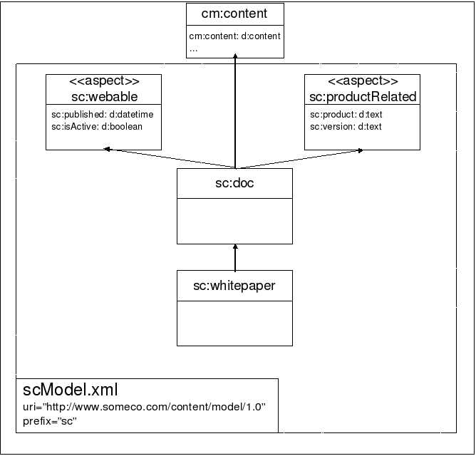

As the drawing shows, there is a common root type called `sc:doc` with one child, `sc:whitepaper`. Neither type currently has any properties of their own.

It's not shown on the model diagram, but there is a Peer Association defined as part of `sc:doc` to keep track of related documents. The target class of the association will be `sc:doc` because the requirement is to be able to associate any instance of `sc:doc` or its children with one or more instances of `sc:doc` or its children.

In addition, there are two aspects. One, the `sc:webable` aspect, is used for content that is to be shown on the web site. It contains the `sc:isActive` flag and `sc:published` date. The `sc:productRelated` aspect is used only for content that relates to a SomeCo product. It captures the specific product name the content is related to as well as the product version.
 
It should be easy to see how the model might be extended over time. The requirements mentioned social features being needed at some point. A rateable aspect could be added along with a rating type. Comments could work the same way. Or you could choose to use the rating and commenting features available out-of-the-box.

As new content types are identified they will be added under `sc:doc`.

Using the aspect to determine whether or not to show the content on the portal is handy, particularly in light of the SomeCo decision to use Alfresco for all of its content management needs. The repository will contain content that may or may not be on the portal. Portal content will be easily-distinguishable from non-portal content by the presence of the `sc:webable` aspect.

### Setting Up

Before starting, let's get a local development environment set up. First I'll give you a list of the tools you'll need, then I'll explain the project organization.

#### Tools

Here is what I am using on my machine:

* Mac OS X 10.9.1
* Java 1.7.0_51
* Apache Maven 3.0.5 (installed using Macports)
* Alfresco Maven SDK, AMP Archetype 1.1.1 (No download necessary)
* Eclipse Java EE IDE for Web Developers, Kepler

By default, when you create an Alfresco project using version 1.1.1 of the Alfresco Maven SDK the project will be configured to depend on Alfresco Community Edition 4.2.e.

Projects created using the Alfresco Maven SDK have the ability to run Alfresco on an embedded Tomcat server. This makes [downloading](http://www.alfresco.com/products/community) and installing Alfresco optional. But if you want to run a full Alfresco server locally, you are welcome to do that.

The Eclipse IDE is also optional. Most people working with Alfresco use Eclipse or something similar, so this tutorial will assume that's what you are using.

#### Project Organization

I am going to use the Alfresco Maven SDK to create projects that will package up my customizations as AMPs (Alfresco Module Packages). I will ultimately create two AMPs. One AMP is for the Alfresco web application (the "repo" tier) and the other is for the Alfresco Share web application (the "Share" tier). Unless you have a good reason to do otherwise, this should be your default approach to packaging and deploying your customizations.

Normally, your custom content model would use two projects--one for the repo tier AMP and one for the Share tier AMP. But, because of how I am structuring this and other tutorials, I'm going to use some extra projects. If you follow the entire tutorial you will end up creating four:

* **content-tutorial-repo**: This project creates the repo tier AMP. It contains the custom content model declaration. You'll create this project in Part 1 of this tutorial.
* **content-tutorial-share**: This project creates the Share tier AMP. It contains the Alfresco Share user interface configuration. You'll create this project in Part 2 of this tutorial.
* **content-tutorial-cmis**: This project contains runnable Java classes that show how to use the CMIS API to perform CRUD functions against content that leverages your custom content model. You'll create this project in Part 3 of this tutorial.
* **content-tutorial-common**: This project contains some utility classes that are leveraged by the rest of the projects in this (and other) tutorials. You'll also create this project in Part 3.

From an Apache Maven perspective, each of the four projects will have their own pom.xml. Then I'll use a single pom.xml in the root that builds all four projects.

Speaking of Apache Maven, I am not going to spend much time talking about how the Alfresco Maven SDK works. If you aren't already familiar with it, you may want to read the [Getting Started with the Alfresco Maven SDK](http://ecmarchitect.com/alfresco-developer-series) tutorial on ecmarchitect.com first and then come back to this one.

### Implementing and Deploying the Model

Here are the steps to follow when configuring a custom content model:

1. Create a new AMP project using the Alfresco Maven SDK
2. Create a custom content model XML file
3. Register the new model XML file using a Spring bean
4. Test your changes

Let's go through each of these.

#### Step 1: Create a new AMP Project

The first step is to **create a new AMP project** using the Alfresco Maven SDK. Follow these steps:

1. If you have not already done so, create an empty directory that can hold the new projects associated with this tutorial. I'll refer to that as $TUTORIAL_HOME.
2. Now use the Alfresco Maven SDK to create a project for the repo tier AMP. Using the command line, change directories to $TUTORIAL_HOME, then run:

    ```    
    mvn archetype:generate \
    -DarchetypeCatalog=https://artifacts.alfresco.com/nexus/content/groups/public/archetype-catalog.xml \
    -Dfilter=org.alfresco.maven.archetype:
    ```

3. Choose the AMP archetype (option 1).
4. Choose version 1.1.1 of the archetype (option 5).
5. Specify "com.someco" for the `groupId`.
6. Specify "content-tutorial-repo" for the `artifactId`.
7. If Eclipse isn't running, start it up. Use File, Import, Maven, Existing Maven Projects to import the content-tutorial-repo project you just created.

If you have problems after the import, go ahead and resolve those. Consult the Alfresco Maven SDK tutorial if you need help with that.

Now you are ready to create your custom content model XML.

#### Step 2: Create a custom content model XML file

Now that you have a project that is ready to produce a repo tier AMP you can create your content model XML file. To do that, follow these steps:

1. Models belong in a directory called “model” in your project's module directory, which is:

    ```
    $TUTORIAL_HOME/content-tutorial-repo/src/main/amp/config/alfresco/module/content-tutorial-repo
    ```

    The "model" directory does not exist when the project is initially created by the Alfresco Maven SDK, so go ahead and create it now.
2. Custom models live in the model directory as XML. Create a new XML file in the model directory called "scModel.xml". The name of the file isn't important but you should choose a name that will help you and your team distinguish it from other model files you might add to this directory over time.
3. Copy the following XML into the scModel.xml file and save.

    ```
    <?xml version="1.0" encoding="UTF-8"?>
    <!-- Definition of new Model -->
    <model name="sc:somecomodel" xmlns="http://www.alfresco.org/model/dictionary/1.0">
        <!-- Optional meta-data about the model -->
        <description>Someco Model</description>
        <author>Jeff Potts</author>
        <version>1.0</version>

        <!-- Imports are required to allow references to definitions in other models -->
        <imports>
            <!-- Import Alfresco Dictionary Definitions -->
            <import uri="http://www.alfresco.org/model/dictionary/1.0" prefix="d" />
            <!-- Import Alfresco Content Domain Model Definitions -->
            <import uri="http://www.alfresco.org/model/content/1.0" prefix="cm" />
        </imports>

        <!-- Introduction of new namespaces defined by this model -->
        <namespaces>
            <namespace uri="http://www.someco.com/model/content/1.0" prefix="sc" />
        </namespaces>
        <constraints>
      	    <constraint name="sc:campaignList" type="LIST">
                <parameter name="allowedValues">
                    <list>
                        <value>Application Syndication</value>
                        <value>Private Event Retailing</value>
                        <value>Social Shopping</value>
                    </list>
                </parameter>
            </constraint>
        </constraints>

        <types>
            <!-- Enterprise-wide generic document type -->
            <type name="sc:doc">
                <title>Someco Document</title>
                <parent>cm:content</parent>
                <associations>
                    <association name="sc:relatedDocuments">
                        <title>Related Documents</title>
                        <source>
                            <mandatory>false</mandatory>
                            <many>true</many>
                        </source>
                        <target>
                            <class>sc:doc</class>
                            <mandatory>false</mandatory>
                            <many>true</many>
                        </target>
                    </association>
                </associations>
                <mandatory-aspects>
                    <aspect>cm:generalclassifiable</aspect>
                </mandatory-aspects>
            </type>

            <type name="sc:whitepaper">
                <title>Someco Whitepaper</title>
                <parent>sc:doc</parent>
            </type>

            <type name="sc:marketingDoc">
                <title>Someco Marketing Document</title>
                <parent>sc:doc</parent>
                <properties>
                    <property name="sc:campaign">
                        <type>d:text</type>
                        <multiple>true</multiple>
                        <constraints>
                            <constraint ref="sc:campaignList" />
                        </constraints>
                    </property>
                </properties>
            </type>

        </types>

        <aspects>
            <aspect name="sc:webable">
                <title>Someco Webable</title>
                <properties>
                    <property name="sc:published">
                        <type>d:date</type>
                    </property>
                    <property name="sc:isActive">
                        <type>d:boolean</type>
                        <default>false</default>
                    </property>
                </properties>
            </aspect>
		
            <aspect name="sc:productRelated">
                <title>Someco Product Metadata</title>
                <properties>
                    <property name="sc:product">
                        <type>d:text</type>
                        <mandatory>true</mandatory>
                        <multiple>true</multiple>
                    </property>				
                    <property name="sc:version">
                        <type>d:text</type>
                        <mandatory>true</mandatory>
                        <multiple>true</multiple>
                    </property>
                </properties>
            </aspect>	
        </aspects>
    </model>
    ```

Referring back to the earlier drawing of SomeCo's initial content model, you'll see that it matches up with the XML above with a small exception. As shown in the diagram, there are two aspects, each with two properties, the enterprise-wide ancestor type called `sc:doc`, a type for whitepapers called `sc:whitepaper`, and a third type, `sc:marketingDoc`, which I added so you could see an example of how constraints work.

When building your own custom content models, you may want to use the out-of-the-box contentModel.xml, discussed earlier, as a reference.

Here's an important note about the content model schema that may save you some time: Order matters. For example, if you move the `associations` element after `mandatory-aspects` Alfresco won't be able to parse your model. Refer to the modelSchema.xsd referenced earlier to determine the expected order.

#### Step 3: Register the new model with a Spring bean

The next step is to **register the new model with a Spring bean** in a Spring context file. You'll find that the Alfresco Maven SDK has already created a Spring context file for your module in:

    $TUTORIAL_HOME/content-tutorial-repo/src/main/amp/config/alfresco/module/content-tutorial-repo/context

The file is named service-context.xml. If you open that file you'll see that two Spring beans are already there. They were created by the Alfresco Maven SDK and they are used to wire in some example classes.

To register the custom content model with Spring, all we have to do is add a new `bean` element to the list of `beans`. The new `bean` element looks like this:

    <!-- Registration of new models -->
    <bean id="${project.artifactId}_dictionaryBootstrap" parent="dictionaryModelBootstrap" depends-on="dictionaryBootstrap">
        <property name="models">
            <list>
                <value>alfresco/module/${project.artifactId}/model/scModel.xml</value>
            </list>
        </property>
    </bean>

Notice the `${project.artifactId}` placeholder. That will be automatically replaced by the Alfresco Maven SDK using the `artifactId` specified in the pom.xml file when Maven generates the AMP.

#### Step 4: Test Your Changes

The last step is to test your changes. The Alfresco Maven SDK makes that easy. Do this:

1. From the command line, change directories to $TUTORIAL_HOME/content-tutorial-repo.
2. Run:

    ```
    mvn install
    ```

The first time you do this it may take quite a while. Maven is downloading everything it needs to run Alfresco in an embedded Tomcat server along with your custom content model.

If everything goes as expected you should see:

    [INFO] ------------------------------------------------------------------------
    [INFO] BUILD SUCCESS
    [INFO] ------------------------------------------------------------------------
    [INFO] Total time: 1:38.455s
    [INFO] Finished at: Wed Jan 22 12:55:48 CST 2014
    [INFO] Final Memory: 38M/203M
    [INFO] ------------------------------------------------------------------------

If you get a build failure, it is time to debug. Make sure that:

* The bean in service-context.xml refers to the proper path and file name of your custom content model XML file.
* Your custom content model XML file is well-formed and valid.

If you still have problems, post as much detail as you can in the [Alfresco Forums](http://forums.alfresco.com).

#### Success

You have now created an AMP that contains a custom content model. If you go look in:

    $TUTORIAL_HOME/content-tutorial-repo/target

you'll see a file named content-tutorial-repo.amp. That AMP can be installed in an Alfresco installation. For example, if you are running Alfresco using the binary installer, you can copy the AMP to `$ALFRESCO_HOME/amps` and then run `$ALFRESCO_HOME/bin/apply_amps.sh` to install the AMP into your Alfresco web application.

For the purpose of this tutorial, though, let's keep moving. You've got your content model defined but the Alfresco Share user interface doesn't know anything about it yet. You'll learn how to do that next.

Part 2: Configuring Alfresco Share
==================================
Now that the model is defined, you could begin using it right away by writing code against one of Alfresco's API's that creates instances of your custom types, adds aspects, etc. In practice it is usually a good idea to do just that to make sure the model behaves like you expect. In fact, if you just can’t wait to see some code to create, query, and update content, skip to [Part 3](#part-3-working-with-content-programmatically). For everyone else, let's talk about how to configure Alfresco Share so that end-users can work with the custom content model you just created.

Configuring the Custom Model in Alfresco Share
----------------------------------------------
Let’s continue by configuring Alfresco Share to work with our custom content model.

First, think about the Alfresco Share client and all of the places the content model customizations need to show up:

* **“Is sub-type” criteria**. When a user configures a rule on a space and uses content types as a criteria, the custom types should be a choice in the list of possible content types.

* **“Has aspect” criteria**. When a user configures a rule on a space and uses the presence of an aspect as a criteria, the custom aspects should be a choice in the list of possible aspects.

* **Change type action**. When a user runs the “specialize type” action, either as part of a rule configuration or through the “Change Type” UI action, the custom types should be available.

* **Add aspect**. When a user runs the “add aspect” action, either as part of a rule configuration or through the “Manage Aspects” UI action, the custom aspects should be available.

* **Document Details**. When a user looks at the document details page for a piece of content stored as one of the custom types or with one of the custom aspects attached, the properties section should show the custom properties.

* **Edit Properties**. When a user edits the properties of a piece of content, either with the “full” form or the abbreviated form, the appropriate properties should be shown.

* **Advanced search**. When a user runs an advanced search, they should be able to restrict search results to instances of our custom types and/or content with specific values for the properties of our custom types.

Let's configure Alfresco Share to make each of the areas mentioned above work with our custom content model. To do that, we're going to:

1. Use the Alfresco Maven SDK to create a new project that will produce a Share tier AMP.
2. Create a custom Share configuration file.
3. Test our changes.

Let's do it.

### Step 1: Create a project for the Share tier AMP

The first step is to create a new project to hold the files that will make up the Share tier AMP. That works exactly as it did for the repo tier AMP. Do this:

1. In $TUTORIAL_HOME, create a new project using the AMP archetype.
2. Specify "com.someco" as the `groupId`.
3. Specify "content-tutorial-share" as the `artifactId`.
4. Specify "share" as the `alfresco_target_amp_client_war`. This is a step you didn't have to do for the repo tier project because it defaulted to "alfresco".

In this case, there are several things the archetype defaults that aren't necessary for our Share tier project. To clean that up:

1. Delete the org.alfresco.demoamp package.
2. Delete the context directory that contains service-context.xml.
3. Delete the org.alfresco.demoamp.test package from src/test/java.
4. Remove the "alfresco-repository" dependency from pom.xml.

Now you are ready to create a custom Share configuration file.

### Step 2: Create a custom Share configuration file

Alfresco Share uses a configuration file called "share-config-custom.xml". The share-config-custom.xml file is a proprietary file composed of numerous “config” elements. Each config element has an “evaluator” and a “condition”. Extending the out-of-the-box Share configuration is a matter of knowing which evaluator/condition to use.

The location of the share-config-custom.xml file is a little counter-intuitive. Ultimately, we want that file to be placed under META-INF in a JAR file that will go into the Share web application's WEB-INF/lib. Putting the file in a JAR keeps it from overwriting other modules that may also be providing their own share-config-custom.xml.

Create an empty XML file called "share-config-custom.xml" in:

    $TUTORIAL_HOME/content-tutorial-share/src/main/resources/META-INF

We'll add to that file in the next sections.

#### Add Custom Types and Aspects to Lists

The first four items in our configuration wish list have to do with telling the Share user interface about custom types and aspects. A single set of configuration will take care of all four items.

1. Edit the share-config-custom.xml file you just created and add the following:

    ```
    <alfresco-config>
        <!-- Document Library config section -->
        <config evaluator="string-compare" condition="DocumentLibrary">
        </config>
    </alfresco-config>
    ```
2. Now add an `aspects` element as a child of the `config` element to identify the aspects that are visible, addable, and removeable:

    ```
    <aspects>
        <!-- Aspects that a user can see -->
        <visible>
            <aspect name="sc:webable" />
            <aspect name="sc:productRelated" />            
        </visible>

        <!-- Aspects that a user can add. Same as "visible" if left empty -->
        <addable>
        </addable>

        <!-- Aspects that a user can remove. Same as "visible" if left empty -->
        <removeable>
        </removeable>
    </aspects>
    ```

    As the comments suggest, the `addable` and `removeable` elements can remain empty if the list is the same.
3. That takes care of aspects. Let’s configure the types. Add a `types` element as a sibling to the `aspects` element you just added with the following content:

    ```
    <types>
        <type name="cm:content">
            <subtype name="sc:doc" />
            <subtype name="sc:whitepaper" />
        </type>
        <type name="sc:doc">
            <subtype name="sc:whitepaper" />
        </type>
    </types>
    ```

Notice how `sc:whitepaper` appears in the list twice—once as a subtype of `cm:content` and once as a subtype of `sc:doc`. This allows a user to specialize directly to the `sc:whitepaper` type regardless of whether the original type is `cm:content` or `sc:doc`.

### Step 3: Test Your Changes

You need two things to test this: An Alfresco repository that is running the repo tier AMP you created in Part 1 and an Alfresco Share web application running the Share tier AMP you just started working on. One way to do this is to leverage the embedded Tomcat server present in both projects. Do this:

1. Open two command line windows.
2. In the first window, switch to $TUTORIAL_HOME/content-tutorial-repo.
3. Run:

    ```
    mvn integration-test -Pamp-to-war
    ```

    This will start up an Alfresco server with your repo tier AMP and it will leave it running.
4. In the second window, switch to $TUTORIAL_HOME/content-tutorial-share.
5. Run:

    ```
    mvn integration-test -Pamp-to-war -Dmaven.tomcat.port=8081
    ```

    This will start up Alfresco Share running on port 8081. It will automatically connect to the Alfresco server you just started, which is running on port 8080.

Now open your browser and point it to http://localhost:8081/share. Log in using admin/admin and let’s see what’s different.

What’s different is that the “is sub-type” dropdown in the rule configuration panel now has our custom types and the “has aspect” dropdown now has our custom aspects.

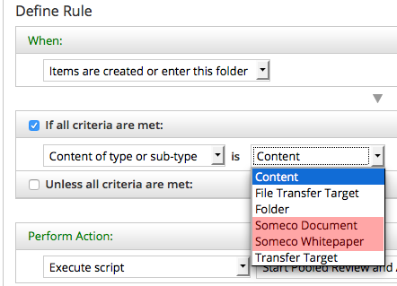

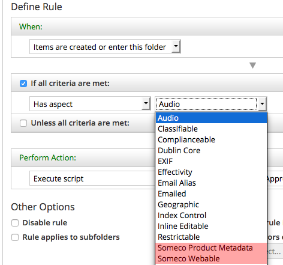

The “change type” dropdown, in both the rule configuration and UI action, lists our custom types:

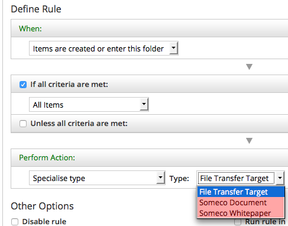


And the “add aspect” list, in both the rule configuration and UI action, lists our custom aspects:

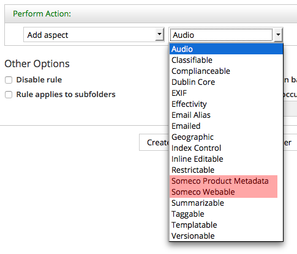

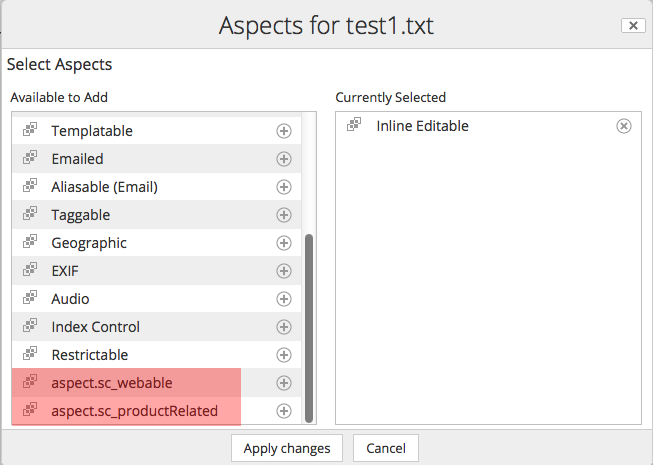

You’ll notice that in the rule configuration the types and aspects are shown with their localized names while in the dialogs the strings are shown as not yet localized (their ID is displayed instead of their localized string). That’s because the strings for Share haven’t yet been localized and some services, like the rule configuration, will pull those strings from the content model XML. If it is annoying you, jump to the [localization](#localizing-strings-for-custom-content-models) section and come back.

Configuring Forms for Custom Properties
---------------------------------------

Try this: Create a piece of test content. Change its type to `sc:whitepaper` and add both of our custom aspects to it. Then, from the Document Library, click the "Edit Properties" link for that piece of test content. You'll see a form that looks something like this:

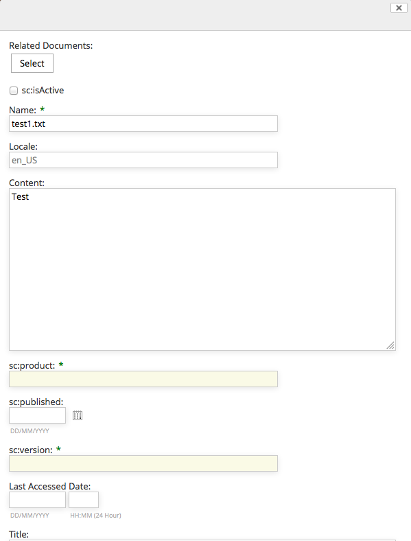

When you compare this to the pop-up that is displayed for an instance of `cm:content` you will see a big difference. The edit properties dialog for `sc:whitepaper` is a jumbled mess. The locale is showing up for some reason. The title field is halfway down the form, which has grown extremely long with all sorts of fields.

What’s going on here is that Share is looking for a form configuration for `sc:whitepaper`. Finding none, it is just listing all of the properties of the object.

Content properties can be edited two ways:

1. Using the edit metadata popup dialog, which is what you get when you click “Edit Properties” from the document library page
2. Using the default form, which is what you get when you click “Edit Properties” from the document details page.

Clearly something prettier is needed for both the default form and the edit metadata form, so let’s fix that.

### Configuring the form service for a custom type

Alfresco Share uses the Form Service to decide which properties to show for a given form, how to lay out forms, and the control to use for each property. Let’s take a look at the out-of-the-box form configuration for `cm:content`. Because you've already launched Alfresco Share on your embedded Tomcat server, the exploded Share web application exists in your project's target directory. The out-of-the-box share-form-config.xml file resides in target/content-tutorial-share-war/WEB-INF/classes/alfresco/share-form-config.xml.

If you open that file and search for ‘condition=”cm:content”’ you’ll find two config elements that contain a total of six form configurations. One config element, identified by the `node-type` evaluator, is for forms dealing with existing nodes. The config element with the `model-type` evaluator is for forms used to create new nodes.

Let’s focus on existing nodes for now. The three forms in that config element are:

* Default (`form` element with no `id` attribute). This is the form displayed when you open the document details.
* A form called `doclib-simple-metadata`. This is used when you edit properties from the document library.
* A form called `doclib-inline-edit`. This is used when you click the “Inline Edit” UI action.

Suppose whitepapers need to have the same metadata displayed as instances of `cm:content`. To do that:

1. Copy the entire config element and all of its children into share-config-custom.xml as a sibling of the Document Library config element you added to that file earlier.
2. Then, change the condition from `cm:content` to `sc:whitepaper`.

To test this change:

1. Go to the terminal window currently running your embedded Alfresco Share web application.
2. Click ctrl+c to stop the Alfresco Share server.
3. Re-run the server using:

    ```
    mvn integration-test -Pamp-to-war -Dmaven.tomcat.port=8081
    ```

There is no need to restart the Alfresco repository web application because nothing has changed in that AMP.

Now when you log in to Alfresco Share, you’ll see that the property sets match for `sc:whitepaper` and `cm:content` across all forms, as shown below:


Let's build on the form definition for `sc:whitepaper` to include properties and associations from the custom content model.

### Configuring the form service for custom properties

The document details for a whitepaper looks better, but the form isn’t showing the custom metadata. In this particular example, our model defines an association called `sc:relatedDocuments` which `sc:whitepaper` inherits from `sc:doc` and four properties across two custom aspects.

For the properties defined in aspects, you have a choice. You can either add the properties to every form definition you want them to appear in. Or, you can add an aspect configuration so that they’ll automatically be displayed for any object that includes that aspect. The advantage of the former is that you can have fine-grained control over where those fields appear whereas if you choose the latter route, the form service will decide where to include your fields.

This example takes the latter route. Edit the share-config-custom.xml file and add the following aspect configuration for `sc:webable`:

    <config evaluator="aspect" condition="sc:webable">
        <forms>
            <form>
                <field-visibility>
                    <show id="sc:published" />
                    <show id="sc:isActive" />
                </field-visibility>
                <appearance> 				    
                    <field id="sc:published" label-id="prop.sc_published" />
                    <field id="sc:isActive" label-id="prop.sc_isActive" />
                </appearance>
            </form>
        </forms>
    </config>

You can add the aspect configuration for `sc:productRelated` following the same pattern.

Notice that there are two elements you have to worry about—the `field-visibility` element defines which properties are on the form while the `appearance` element defines how those properties are rendered. In this example I’m showing only a `label-id`, but there are a lot of options here. For example, if you wanted to override the component used to display the property, this is where you’d do it.

Let’s take care of the `sc:relatedDocuments` association. It’s not defined in an aspect, so it is added directly to the form configuration for `sc:whitepaper`. It probably makes sense for the related documents property to be shown on both the default form and the edit metadata popup dialog. To do that, you’re going to modify the default form configuration element for `sc:whitepaper` that you created earlier. First add a `show` element just before the closing `field-visibility` tag:

        <!-- surf:widget aspect -->
        <show id="surf:widgetType"/>
        <show id="surf:mid"/>
        <show id="surf:label"/>
                   
        <!-- sc:doc -->
        <show id="sc:relatedDocuments" />
    </field-visibility>

Then, add a new `field` element just before the closing `appearance` tag:

        <field id="cm:addressees" read-only="true" />
        <field id="cm:sentdate" read-only="true" />
        <field id="cm:subjectline" read-only="true" />
        <field id="sc:relatedDocuments" label-id="assoc.sc_relatedDocuments" />
    </appearance>

Now do the same thing for the `doclib-simple-metadata` form.

After restarting the embedded Tomcat for your Alfresco Share project, you should see all four custom properties and the related documents association in the document details page, like this:

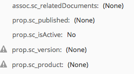

Similarly, when you click "Edit Properties" from the document details page you should see the association and the properties:

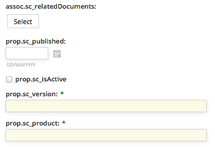

On the edit metadata pop-up dialog you should see the related documents association, like this:

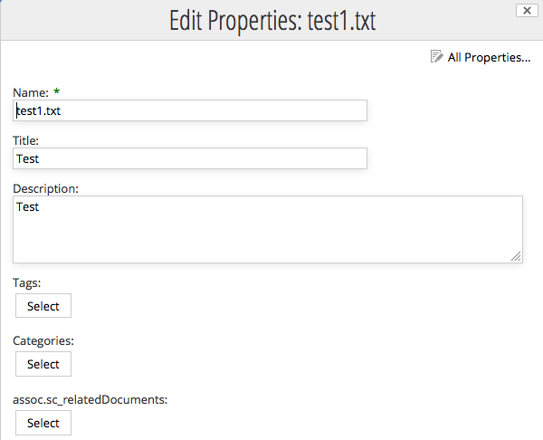

Now let's turn our attention to search.

### Configuring Advanced Search in Alfresco Share

The advanced search form in Alfresco Share allows end-users to first select what they are looking for and then specify both full-text and specific property values to search for depending on the content type selected. Out-of-the-box, the search form includes two types: `cm:content` and `cm:folder`.

Users need to be able to search specifically for SomeCo Whitepapers, so the first step is to add the `sc:whitepaper` type to the list. Like the other Share form configuration covered thus far, the configuration goes in share-config-custom.xml. In this case, the condition is `AdvancedSearch`.

    <config replace="true" evaluator="string-compare" condition="AdvancedSearch">
        <advanced-search>
            <!-- Forms for the advanced search type list -->
            <forms>
                <form labelId="search.form.label.cm_content" descriptionId="search.form.desc.cm_content">cm:content</form>
                <form labelId="search.form.label.cm_folder" descriptionId="search.form.desc.cm_folder">cm:folder</form>            
                <form labelId="type.sc_whitepaper" descriptionId="search.form.desc.sc_whitepaper">sc:whitepaper</form>
            </forms>
        </advanced-search>
    </config>

Notice that the list of advanced search forms replaces the out-of-the-box list. If the list only had `sc:whitepaper` and left out `cm:content` and `cm:folder`, Share users would not be able to search for plain content or folders.

The next step is to tell Share which form to use when a given type is selected. Recall earlier that there are two sets of form configuration—one for existing nodes (evaluator of `node-type`) and one for new nodes (evaluator of `model-type`). Search forms go in the `model-type` evaluator.

The search form for whitepapers should be the same as the one for plain content, but should include the four properties defined in the custom aspects. The easiest way to do this is to copy the `cm:content` search form from the out-of-the-box form configuration into share-config-custom.xml and then modify it to suit our needs. The code listing below shows this:

    <!-- sc:whitepaper type (new nodes) -->
    <config evaluator="model-type" condition="sc:whitepaper">
        <forms>
            <!-- Search form -->
            <form id="search">
                <field-visibility>
                    <show id="cm:name" />
                    <show id="cm:title" force="true" />
                    <show id="cm:description" force="true" />
                    <show id="mimetype" />
                    <show id="cm:modified" />
                    <show id="cm:modifier" />
                    <!-- sc:productRelated -->
                    <show id="sc:product" />
                    <show id="sc:version" />
                    <!-- sc:webable -->
                    <show id="sc:isActive" />
                    <show id="sc:published" />
                </field-visibility>
                <appearance>
                    <field id="mimetype">
                        <control template="/org/alfresco/components/form/controls/mimetype.ftl" />
                    </field>
                    <field id="cm:modifier">
                        <control>
                            <control-param name="forceEditable">true</control-param>
                        </control>
                    </field>
                    <field id="cm:modified">
                        <control template="/org/alfresco/components/form/controls/daterange.ftl" />
                    </field>
                    <!-- sc:productRelated -->
                    <field id="sc:product" label-id="prop.sc_product">
                        <control template="/org/alfresco/components/form/controls/textfield.ftl" />
                    </field>
                    <field id="sc:version" label-id="prop.sc_version">
                        <control template="/org/alfresco/components/form/controls/textfield.ftl" />
                    </field>               
                    <!-- sc:webable -->
                    <field id="sc:isActive" label-id="prop.sc_isActive">
                        <control template="/org/alfresco/components/form/controls/checkbox.ftl" />
                    </field>
                    <field id="sc:published" label-id="prop.sc_published">
                        <control template="/org/alfresco/components/form/controls/daterange.ftl" />
                    </field>
                </appearance>
            </form>
        </forms>
    </config>

It is important to note that the field elements in the appearance section require the form control to be specified. If it is not specified, the field will not show up on the search form.

After deploying this configuration and restarting the embedded Tomcat for your Alfresco Share project, the SomeCo Whitepaper type is included in the advanced search dropdown, and four fields for the aspect properties are shown in the search form.

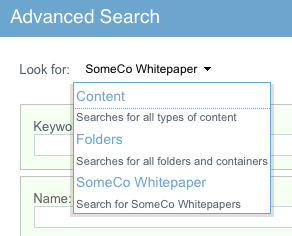

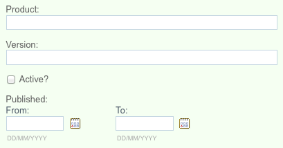

Localizing Strings for Custom Content Models
--------------------------------------------

We’ve put off localizing the form labels until now. To fix this, first create a messages bundle, then register it with a Spring bean. Here are the steps:

1. Create a new folder called "messages" in $TUTORIAL_HOME/content-tutorial-share/src/main/amp/config/alfresco/module/content-tutorial-share.
2. In the messages folder, create a new file called "scModel.properties" with the following content:

    ```
    #sc:doc
    type.sc_doc=SomeCo Doc
    assoc.sc_relatedDocuments=Related Documents
    
    #sc:whitepaper
    type.sc_whitepaper=SomeCo Whitepaper
    search.form.desc.sc_whitepaper=Search for SomeCo Whitepapers
    
    #sc:webable
    aspect.sc_webable=SomeCo Webable
    prop.sc_published=Published
    prop.sc_isActive=Active?
    
    #sc:productRelated
    aspect.sc_productRelated=SomeCo Product Related
    prop.sc_product=Product
    prop.sc_version=Version
    ```

3. We need to register this properties bundle with Spring. Share does not look in module directories for Spring context files. Instead, it uses the web-extension folder. Create a new folder called "web-extension" in $TUTORIAL_HOME/content-tutorial-share/src/main/amp/config/alfresco.
4. In the web-extension folder, create a new file called "content-tutorial-share-context.xml". I am using the `artifactId` as part of the file name because this file will ultimately end up in a folder that may contain other Spring configuration files and I don't want this one to collide with any of those.
5. Add the following content to the file, then save:

    ```
    <?xml version='1.0' encoding='UTF-8'?><!DOCTYPE beans PUBLIC '-//SPRING//DTD BEAN//EN' 'http://www.springframework.org/dtd/spring-beans.dtd'>

    <beans>
        <!-- Add Someco messages -->
        <bean id="${project.artifactId}_resources" class="org.springframework.extensions.surf.util.ResourceBundleBootstrapComponent">
            <property name="resourceBundles">
                <list>
                    <value>alfresco.module.${project.artifactId}.messages.scModel</value>
                </list>
            </property>
        </bean>
    </beans>
    ```

Now restart the embedded Tomcat for your Alfresco Share project and you should see that the types, aspects, and properties have the localized labels.

Share Configuration Summary
---------------------------

You’ve seen that configuring Alfresco Share for your custom content model essentially involves adding XML to the share-config-custom.xml file and creating a properties file for your localized strings. All of this lives in a project created by the Alfresco Maven SDK and is packaged and deployed as an AMP.

There are other things you might like to do to the Share user interface, but these are beyond the scope of this document:

* Add custom content types to the Create menu
* Add custom properties to the document library sort criteria
* Add custom properties to the document library data grid

Now let’s turn our attention from the front-end to the back-end to understand how to create, query, update, and delete content using code running remotely from the Alfresco server.

Part 3: Working with Content Programmatically
=============================================
So far we've created a custom model and we've configured Alfresco Share to let end users work with the types, aspects, and properties defined in the custom model. For simple document management solutions, this may be enough. Often, code will also required. It could be code in a web application that needs to work with the repository, code that implements custom behavior for custom content types, or code that implements Alfresco web client customizations.

There are several API's available depending on what you want to do. The table below outlines the choices:

| Solution type | Language | Alfresco API |
| ------------- | -------- |------------- |
| Alfresco Share user interface customizations | Freemarker Templating Language, Java/JSP, JavaScript | Alfresco Freemarker API, Alfresco JavaScript API |
| Custom applications with an embedded Alfresco repository (Repository runs in the same process as the application) | Java | Alfresco Foundation API |
| Custom applications using a remote Alfresco repository | Java, Python, PHP, .NET, or any language that can make calls via HTTP | CMIS, Web Scripts |

Table: Alfresco API Options

The best way to make remote calls to the Alfresco repository is to leverage Alfresco’s support for the Content Management Interoperability Services (CMIS) [standard](https://www.oasis-open.org/committees/cmis). So let’s look at CMIS examples for creating, updating, querying, and deleting content. The client API’s available from the [Apache Chemistry](http://chemistry.apache.org) project offer a variety of languages to choose from. This tutorial focuses on Java.

If you need to learn how to make these other styles of customizations, consult [ecmarchitect.com](http://ecmarchitect.com) and the [Alfresco Documentation](http://docs.alfresco.com).

Setup
-----

Let's run through some examples that leverage OpenCMIS to work with instances of the custom types defined in the model. To facilitate this, I'm going to create two new Maven projects, but because they don't produce AMPs there is no reason to use the Alfresco Maven SDK to create them.

To create the projects we need for this part, do this:

1. Create a new project called "content-tutorial-common".
2. Create a source directory called "java" in "src/main".
3. If you are using Eclipse, convert the project to a Maven project using Configure, Convert to Maven Project. This will create a default pom.xml in the root of your project folder. I am using "com.someco" for the `groupId` and "content-tutorial-common" for the `artifactId`.
4. Repeat the steps above for a new project called "content-tutorial-cmis".
5. Edit the pom.xml file that belongs to "content-tutorial-cmis".
6. This project uses the OpenCMIS library from Apache Chemistry, the Alfresco OpenCMIS Extension Library, and the content-tutorial-common project, so add those as dependencies:

    ```
    <dependency>
        <groupId>org.apache.chemistry.opencmis</groupId>
        <artifactId>chemistry-opencmis-client-impl</artifactId>
        <version>0.10.0</version>
    </dependency>
    <dependency>
        <groupId>org.alfresco.cmis.client</groupId>
        <artifactId>alfresco-opencmis-extension</artifactId>
        <version>0.7</version>
    </dependency>
    <dependency>
        <groupId>com.someco</groupId>
        <artifactId>content-tutorial-common</artifactId>
        <version>1.0-SNAPSHOT</version>
    </dependency>
    ```

8. The alfresco-opencmis-extension artifact resides in the Alfresco artifacts repository, so add that repository to your pom.xml:

    ```
    <repositories>
        <repository>
            <id>artifacts.alfresco.com</id>
            <name>Alfresco Maven Repository</name>
            <url>https://artifacts.alfresco.com/nexus/content/groups/public/</url>
        </repository> 
    </repositories>
    ```

9. The content-tutorial-common project will contain code common the CMIS project will use as well as projects in later tutorials. For this tutorial, all we need is the com.someco.model.SomeCoModel.java class which contains constants that map to the custom content model. These constants are used for convenience by Java classes that need to know things like namespaces, names of content types, etc. If you are building your own project just copy it from the source.

To run the examples in Part 3 you need to have an Alfresco repository running with the repo tier AMP you created in Part 1. Using the embedded Tomcat server as shown in that part of the tutorial works fine.

Now you are ready to write some code.

Creating Content with OpenCMIS
------------------------------
The code we're going to use for creating content is almost exactly the same code that comes with the old non-CMIS Alfresco SDK Samples.

The goal here is to create a runnable class called `SomeCoCMISDataCreator` that accepts arguments for the username, password, folder in which to create the content, type of content we're creating, and a name for the new content. I've left out the main method as well as the code that establishes the session, but you can see the full class [here](https://github.com/jpotts/alfresco-developer-series/blob/master/content/content-tutorial-cmis/src/main/java/com/someco/cmis/examples/SomeCoCMISDataCreator.java).

The first thing the code does is grab a session. The `getSession()` method is inherited from a class called [CMISExampleBase](https://github.com/jpotts/alfresco-developer-series/blob/master/content/content-tutorial-cmis/src/main/java/com/someco/cmis/examples/CMISExampleBase.java) which is used for all of the CMIS examples in this document. The important thing to know about that method is that it uses the value of `serviceUrl` to know how to connect to your Alfresco server. The URL currently specified is the one to use when connecting to a 4.2.x server running on localhost using the AtomPub binding. The URL is:

    http://localhost:8080/alfresco/api/-default-/public/cmis/versions/1.0/atom

A common mistake is to use an old CMIS service URL, so make sure you are using the correct one according to the version of Alfresco you are using.

Once the code has a session, it gets a reference to the folder where the content will be created. The timestamp is incorporated into the content name so that if the code is run multiple times, the object names will be unique.

    Session session = getSession();
    		
    // Grab a reference to the folder where we want to create content
    Folder folder = (Folder) session.getObjectByPath("/" + getFolderName());
    		
    String timeStamp = new Long(System.currentTimeMillis()).toString();
    String filename = getContentName() + " (" + timeStamp + ")";

Next, the code sets up the properties that will be set on the new document. It creates a `Map` of `Strings` and `Objects` to hold the property names and values. 

    // Create a Map of objects with the props we want to set
    Map <String, Object> properties = new HashMap<String, Object>();
    // Following sets the content type and adds the webable and productRelated aspects
    // This works because we are using the OpenCMIS extension for Alfresco
    properties.put(PropertyIds.OBJECT_TYPE_ID,
                   "D:sc:whitepaper,P:sc:webable,P:sc:productRelated");
    properties.put(PropertyIds.NAME, filename);
    properties.put("sc:isActive", true);
    GregorianCalendar publishDate = new GregorianCalendar(2007,4,1,5,0);
    properties.put("sc:published", publishDate);

Notice that instead of listing a single value for the object type ID, a comma-separated list is being passed in. This is the content type followed by the aspects that need to be added. This is possible because the code leverages an Alfresco-specific extension that allows us to work with aspects. It is also important to point out that, in CMIS, document types begin with “D:” while policy types begin with “P:”. (CMIS 1.0 doesn’t have a native concept of aspects—what Alfresco calls an aspect, CMIS 1.0 calls a “Policy”-just go with it).

Starting with version 4.2, Alfresco began to support CMIS 1.1. That version of the specification calls aspects "secondary types". Using CMIS 1.1 you no longer need to use the Alfresco extension to work with aspects. If you want to see how to add aspects using CMIS 1.1, see [this gist](https://gist.github.com/jpotts/7242070).

The next step is to prepare the content that will be set on the new object. This is a matter of calling the `createContentStream()` method on the `ObjectFactory` with the file name, length, mimetype, and an `InputStream` based on the content.

    String docText = "This is a sample " + getContentType() + " document called " +
           getContentName();
    byte[] content = docText.getBytes();
    InputStream stream = new ByteArrayInputStream(content);
    ContentStream contentStream = session.getObjectFactory().
        createContentStream(
            filename, Long.valueOf(content.length), "text/plain", stream
        );

Finally, the code tells the folder to create a new document and passes in the properties, content stream, and versioning state, then dumps the length of the content that was created.

    Document doc = folder.createDocument(properties, contentStream,
         VersioningState.MAJOR);
    System.out.println("Content Length: " + doc.getContentStreamLength());

If you are in an IDE like Eclipse, you should be able to set the arguments and run this class easily. If you want to do it from the command line, you can run it via Maven so that it will set up the classpath for you. To do that you would run:

    mvn exec:java \
    -Dexec.mainClass="com.someco.cmis.examples.SomeCoCMISDataCreator" \
    -Dexec.args="admin admin SomeCo whitepaper test"

Running `SomeCoCMISDataCreator.class` produces:

    Created: dbe2a709-5fd8-453e-9f9d-dff1e4c785d3;1.0
    Content Length: 59

If you are following along, you might want to run it a few times to have some test content to play with.

Creating Associations with OpenCMIS
-----------------------------------
Now let's look at a class that creates a “related documents” association between two documents.

The [SomeCoCMISDataRelater](https://github.com/jpotts/alfresco-developer-series/blob/master/content/content-tutorial-cmis/src/main/java/com/someco/cmis/examples/SomeCoCMISDataRelater.java) class accepts a source object ID and a target object ID as arguments. The code creates a map of properties containing the association type, source ID, and target ID. Note that the association type is preceded by “R:” when working with CMIS.

    Session session = getSession();
    
    // Create a Map of objects with the props we want to set
    Map <String, String> properties = new HashMap<String, String>();
    properties.put(PropertyIds.OBJECT_TYPE_ID, "R:sc:relatedDocuments");
    properties.put(PropertyIds.SOURCE_ID, getSourceObjectId());
    properties.put(PropertyIds.TARGET_ID, getTargetObjectId());
    try {
        session.createRelationship(properties);
    } catch (Exception e) {
        System.out.println("Oops, something unexpected happened. Maybe the rel already exists?");
    }

The last half of the method dumps the associations of the source object. The trick here is that when you make the `getObject()` call to instantiate the object, you will not get back the relationships by default. The `OperationContext` that is being instantiated makes sure that happens.

    // Dump the object's associations
    OperationContext oc = new OperationContextImpl();
    oc.setIncludeRelationships(IncludeRelationships.SOURCE);
    Document sourceDoc = (Document) session.getObject(
                  session.createObjectId(getSourceObjectId()),
                  oc);
    List<Relationship> relList = sourceDoc.getRelationships();
    System.out.println("Associations of objectId:" + getSourceObjectId());
    for (Relationship rel : relList) {
        System.out.println("    " + rel.getTarget().getId());
    }

The last line calls a method that queries the associations for a given reference. This should dump the association that was just created plus any other associations that have been created for this object.

If you want to run this on your own using Maven, it would look something like this, with your own values for the source and target object ID’s:

    mvn exec:java \
    -Dexec.mainClass="com.someco.cmis.examples.SomeCoCMISDataRelater"
    -Dexec.args="admin admin SomeCo whitepaper test dbe2a709-5fd8-453e-9f9d-dff1e4c785d3;1.0 bfd4b553-ff58-4d6e-a71b-00a470bd86c9;1.0"

Running the Java snippet as above, assuming no other relationships exist on the source object produces:

    Associations of objectId: dbe2a709-5fd8-453e-9f9d-dff1e4c785d3;1.0
        bfd4b553-ff58-4d6e-a71b-00a470bd86c9;1.0

Now you can use the Alfresco Share client to view the associations as shown below:

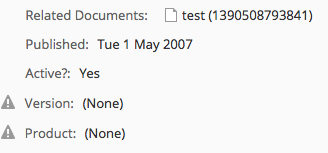

Remember the share-config-custom.xml file? It says that any time the default form or edit metadata form is used for `sc:whitepaper` objects, the `sc:relatedDocuments` associations should be shown. Alternatively, the Node Browser, available in the Alfresco Share Administration Console, is a handy way to view associations.

Searching for Content with OpenCMIS
-----------------------------------
Now that there are some instances of SomeCo’s custom types in the repository it is time to write code that will query for those. Starting with Alfresco 4.0, there are two options for search. The first option is to use Lucene, which is the embedded search engine that has always shipped with Alfresco. The second option is to use Solr. If you upgraded an existing pre-4.0 installation and made no other changes, you are using Lucene. If you installed 4.0 using the installer, you are using Solr. You can switch from one to the other—refer to the documentation to find out how.

Regardless of the search engine option you’ve chosen, content in the repository is automatically indexed by Alfresco. You can execute searches to find content based on full-text, property values, content types, and folder paths.

There are a number of supported search dialects. Prior to 3.4, the most common dialect was Lucene. Starting with 3.4, Alfresco introduced a new dialect called Alfresco FTS which is an abstraction that means you don’t have to learn the specific Lucene search syntax. XPath is also an option, although it’s not used that often. CMIS has its own query language which looks a lot like SQL.

If you are writing code against an Alfresco repository that is 3.4 or higher, you should use either Alfresco FTS or CMIS Query Language, if possible. This part of the tutorial is focused on CMIS, so let's write some CMIS Query Language queries.

Just like the content creation code, the [SomeCoCMISDataQueries](https://github.com/jpotts/alfresco-developer-series/blob/master/content/content-tutorial-cmis/src/main/java/com/someco/cmis/examples/SomeCoCMISDataQueries.java) class will be a runnable Java application that accepts the username, password, and folder name as arguments. It includes a generic method used to execute a query which is called repeatedly with multiple query examples.

If you are following along, you should either run the content creation code a few times or create some content manually so you can test out the queries more thoroughly.

Let's take a look at the generic query execution method first, then the method that calls it for each example query string.

The `getQueryResults()` method is pretty straightforward. It returns a list of `CmisObject` objects. It instantiates those objects by iterating over the query results, grabbing the `objectId` from each result, and making a `getObject()` call on the `session`.

    public List<CmisObject> getQueryResults(String queryString) {
        List<CmisObject> objList = new ArrayList<CmisObject>();
        Session session = getSession();
    
        // execute query
        ItemIterable<QueryResult> results = session.query(queryString, false);
    
        for (QueryResult qResult : results) {
            PropertyData<?> propData = qResult.getPropertyById("cmis:objectId");
            String objectId = (String) propData.getFirstValue();
            CmisObject obj = session.getObject(session.createObjectId(objectId));
            objList.add(obj);
        }
    
        return objList;
    };

The `doExamples()` method then executes a series of example queries and dumps the results. The first two queries are simple. One returns every instance of `sc:doc` including instances of types that inherit from `sc:doc`. The second one finds any objects residing in the folder passed in that contain the word “sample” anywhere in the content. Notice the SQL-like syntax of CMIS Query Language. It basically treats content types as if they were tables.

    System.out.println(RESULT_SEP);
    System.out.println("Finding content of type:" +
         SomeCoModel.TYPE_SC_DOC.toString());
    queryString = "select * from sc:doc";
    dumpQueryResults(getQueryResults(queryString));
    		
    System.out.println(RESULT_SEP);
    System.out.println("Find content in the root folder with text like 'sample'");
    queryString = "select * from cmis:document where contains('sample') and
         in_folder('" + getFolderId() + "')";
    dumpQueryResults(getQueryResults(queryString));

You might have noticed the `getFolderId()` call. The `in_folder` predicate expects an object ID. So the `getFolderId()` method does a query to find the object ID of the folder that was passed in as an argument to the class. It would be nice if you could do this in a single query, but you can’t.

### Queries on Aspect-based Properties

The next query looks for active content. This is when it starts to get interesting because the property that tracks whether or not a piece of content is active, `sc:isActive`, is defined on an aspect. The CMIS specification allows for joins in queries. But Alfresco does not support joins except in the special case of aspects. In Alfresco CMIS, joins are used to relate a base type to one of its aspects. That allows you to use an aspect-based property in a where clause.
    
    System.out.println(RESULT_SEP);
    System.out.println("Find active content");
    queryString = "select d.*, w.* from cmis:document as d join sc:webable as w on
         d.cmis:objectId = w.cmis:objectId where w.sc:isActive = True";
    dumpQueryResults(getQueryResults(queryString));

### Queries Across Multiple Aspects

The next query shows another special case. In this example the goal is to find the active content that has a product property set to a specific value. That’s a challenge because the `sc:isActive` property is defined by the `sc:webable` aspect while the `sc:product` property is defined by a different aspect, `sc:productRelated`. Unfortunately, there is no good way to get these results in a single query. The solution used here is to write a method called `getSubQueryResults()` that accepts two queries as arguments. The method runs the first query and then builds an `IN` predicate using the object IDs that come back, which it appends to the second query before invoking it.

    System.out.println(RESULT_SEP);
    System.out.println("Find active content with a product equal to 'SomePortal'");
    String queryString1 = "select d.cmis:objectId from cmis:document as d join
        sc:productRelated as p on d.cmis:objectId = p.cmis:objectId " + 
        "where p.sc:product = 'SomePortal'";
    String queryString2 = "select d.cmis:objectId from cmis:document as d join
        sc:webable as w on d.cmis:objectId = w.cmis:objectId " +
    	 "where w.sc:isActive = True";
    dumpQueryResults(getSubQueryResults(queryString1, queryString2));

### Queries Using Dates

The last query uses the aspect join trick to do a date range search on instances of `sc:whitepaper` published between a specific range.

    System.out.println(RESULT_SEP);
    System.out.println("Find content of type sc:whitepaper published between 1/1/2006
        and 6/1/2007");	
    queryString = "select d.cmis:objectId, w.sc:published from sc:whitepaper as d join
        sc:webable as w on d.cmis:objectId = w.cmis:objectId " +  
        "where w.sc:published > TIMESTAMP '2006-01-01T00:00:00.000-05:00' " +
        "  and w.sc:published < TIMESTAMP '2007-06-02T00:00:00.000-05:00'";
    dumpQueryResults(getQueryResults(queryString));

### Running the Queries

If you want to compile and run this on your own machine, you can use one of the Ant tasks in the build.xml file included in the code that accompanies this article. Just type:

    ant cmis-data-queries

Your results will vary based on how much content you've created and the values you've set in the content properties, but when I ran my test, the results were as shown below.

    ======================
    Finding content of type:doc
    ----------------------
    Result 1:
    id:c7c1a94e-8d9c-4434-89b0-cbe14ef94455;1.0
    name:test1.txt
    created:Jan 22, 2014 2:22:00 PM
    ----------------------
    Result 2:
    id:40ec2412-b1e6-4d86-af8b-4003adeeed46;1.0
    name:test (1390506931762)
    created:Jan 23, 2014 1:55:31 PM
    ----------------------
    Result 3:
    id:c3e61b61-e5d4-4edf-a3e9-0eac61c693e8;1.0
    name:test (1390507967128)
    created:Jan 23, 2014 2:12:47 PM
    ----------------------
    Result 4:
    id:bfd4b553-ff58-4d6e-a71b-00a470bd86c9;1.0
    name:test (1390508346539)
    created:Jan 23, 2014 2:19:06 PM
    ----------------------
    Result 5:
    id:dbe2a709-5fd8-453e-9f9d-dff1e4c785d3;1.0
    name:test (1390508353662)
    created:Jan 23, 2014 2:19:13 PM
    ======================
    Find content in the root folder with text like 'sample'
    ----------------------
    Result 1:
    id:40ec2412-b1e6-4d86-af8b-4003adeeed46;1.0
    name:test (1390506931762)
    created:Jan 23, 2014 1:55:31 PM
    ----------------------
    Result 2:
    id:c3e61b61-e5d4-4edf-a3e9-0eac61c693e8;1.0
    name:test (1390507967128)
    created:Jan 23, 2014 2:12:47 PM
    ----------------------
    Result 3:
    id:bfd4b553-ff58-4d6e-a71b-00a470bd86c9;1.0
    name:test (1390508346539)
    created:Jan 23, 2014 2:19:06 PM
    ----------------------
    Result 4:
    id:dbe2a709-5fd8-453e-9f9d-dff1e4c785d3;1.0
    name:test (1390508353662)
    created:Jan 23, 2014 2:19:13 PM
    ----------------------
    Result 5:
    id:4c9b0bda-ca90-4ad8-bf01-28ca6f9072bc;1.0
    name:test (1390508793841)
    created:Jan 23, 2014 2:26:33 PM
    ======================
    Find active content
    ----------------------
    Result 1:
    id:40ec2412-b1e6-4d86-af8b-4003adeeed46;1.0
    name:test (1390506931762)
    created:Jan 23, 2014 1:55:31 PM
    ----------------------
    Result 2:
    id:c3e61b61-e5d4-4edf-a3e9-0eac61c693e8;1.0
    name:test (1390507967128)
    created:Jan 23, 2014 2:12:47 PM
    ----------------------
    Result 3:
    id:bfd4b553-ff58-4d6e-a71b-00a470bd86c9;1.0
    name:test (1390508346539)
    created:Jan 23, 2014 2:19:06 PM
    ----------------------
    Result 4:
    id:dbe2a709-5fd8-453e-9f9d-dff1e4c785d3;1.0
    name:test (1390508353662)
    created:Jan 23, 2014 2:19:13 PM
    ----------------------
    Result 5:
    id:6d7de742-8604-4e50-8770-931ff81f9aa2;1.0
    name:dbe2a709-5fd8-453e-9f9d-dff1e4c785d3;1.0 (1390508459588)
    created:Jan 23, 2014 2:20:59 PM
    ======================
    Find active content with a product equal to 'SomePortal'
    ----------------------
    Result 1:
    id:648660bb-2a0f-4ffc-9200-1aded09255c0;1.0
    name:test (1390508759315)
    created:Jan 23, 2014 2:25:59 PM
    ======================
    Find content of type sc:whitepaper published between 1/1/2006 and 6/1/2007
    ----------------------
    Result 1:
    id:40ec2412-b1e6-4d86-af8b-4003adeeed46;1.0
    name:test (1390506931762)
    created:Jan 23, 2014 1:55:31 PM
    ----------------------
    Result 2:
    id:c3e61b61-e5d4-4edf-a3e9-0eac61c693e8;1.0
    name:test (1390507967128)
    created:Jan 23, 2014 2:12:47 PM
    ----------------------
    Result 3:
    id:bfd4b553-ff58-4d6e-a71b-00a470bd86c9;1.0
    name:test (1390508346539)
    created:Jan 23, 2014 2:19:06 PM
    ----------------------
    Result 4:
    id:dbe2a709-5fd8-453e-9f9d-dff1e4c785d3;1.0
    name:test (1390508353662)
    created:Jan 23, 2014 2:19:13 PM
    ----------------------
    Result 5:
    id:6d7de742-8604-4e50-8770-931ff81f9aa2;1.0
    name:dbe2a709-5fd8-453e-9f9d-dff1e4c785d3;1.0 (1390508459588)
    created:Jan 23, 2014 2:20:59 PM

Deleting Content with OpenCMIS
------------------------------
Now it is time to clean up after ourselves by deleting content from the repository. The delete logic in the [SomeCoCMISDataCleaner](https://github.com/jpotts/alfresco-developer-series/blob/master/content/content-tutorial-cmis/src/main/java/com/someco/cmis/examples/SomeCoCMISDataCleaner.java) class is similar to the search logic except that instead of dumping the results, the CmisObject’s `delete()` method gets called on every hit that is returned. 

    Session session = getSession();
        	
    // execute query
    String queryString = "select * from sc:doc";
    ItemIterable<QueryResult> results = session.query(queryString, false);
    
    // if we found some rows, create an array of DeleteCML objects    	
    if (results.getTotalNumItems() >= 0)
        System.out.println("Found " + results.getTotalNumItems() + " objects to delete.");
       		
    for (QueryResult qResult : results) {
        PropertyData<?> propData = qResult.getPropertyById("cmis:objectId");
        String objectId = (String) propData.getFirstValue();
        CmisObject obj = session.getObject(session.createObjectId(objectId));
        obj.delete(true);
        System.out.println("Deleted: " + objectId);
    }
    System.out.println("Done!");

Note that this code deletes every object in the repository of type `sc:doc` and instances of child types. You would definitely want to “think twice and cut once” if you were running this code on a production repository, particularly if you were using a broad content type like `cm:content`.

Similar to the other examples, you can compile and run this on the command line by executing the following:

    mvn exec:java \
    -Dexec.mainClass="com.someco.cmis.examples.SomeCoCMISDataCleaner" \
    -Dexec.args="admin admin SomeCo"
    
Again, your results will vary based on the content you've created but in my repository, running the code results in the following:

    Found 8 objects to delete.
    Deleted: 40ec2412-b1e6-4d86-af8b-4003adeeed46;1.0
    Deleted: c3e61b61-e5d4-4edf-a3e9-0eac61c693e8;1.0
    Deleted: bfd4b553-ff58-4d6e-a71b-00a470bd86c9;1.0
    Deleted: dbe2a709-5fd8-453e-9f9d-dff1e4c785d3;1.0
    Deleted: 6d7de742-8604-4e50-8770-931ff81f9aa2;1.0
    Deleted: 12e6f012-1831-4d2a-81f8-d130cd26e968;1.0
    Deleted: 4c9b0bda-ca90-4ad8-bf01-28ca6f9072bc;1.0
    Deleted: 648660bb-2a0f-4ffc-9200-1aded09255c0;1.0
    Done!

Now you know how to use CMIS, an industry-standard API, to create, relate, query, and delete objects in Alfresco. In fact, the code you've worked with here in Part 3 should work with any CMIS-compliant server (except for the aspect bits).

Other Topics to Explore on Your Own
===================================
This tutorial has shown how to extend Alfresco's out-of-the-box content model with your own business-specific content types, how to expose those types, aspects, and properties in Alfresco Share, and how to work with content via OpenCMIS, the Java API for CMIS that is part of Apache Chemistry. I've thrown in a few recommendations that will hopefully save you some time or at least spark some discussion.

There are many content model-related topics we didn't talk about that you can explore on your own, like:

* Controlling how your properties are indexed
* Using queries or services to populate constraints
* Creating custom form controls
* Hot-deploying content models
* Using a content modeling tool to create content models and forms through a user interface rather than XML

Where to Find More Information
==============================
* The complete source code for these examples is available on [GitHub](https://github.com/jpotts/alfresco-developer-series).
* Official documentation for both Enterprise Edition and Community Edition is available at [docs.alfresco.com](http://docs.alfresco.com/).
* [Share Extras](http://share-extras.github.io/) has many examples of deeper Share customization.
* The [Search-related pages](http://wiki.alfresco.com/wiki/Category:Search) on the Alfresco wiki provide query examples using both Lucene and XPath.
* The [Apache Chemistry Home Page](http://chemistry.apache.org/) has examples and source code that works with CMIS.
* See [“Getting Started with CMIS”](http://ecmarchitect.com/archives/2009/11/23/1094) on [ecmarchitect.com](http://ecmarchitect.com) for a brief introduction to CMIS. The [Alfresco CMIS](http://cmis.alfresco.com/) page is also a great resource. And there is now a [CMIS book](http://www.manning.com/mueller/) availaible.
* For deployment help, see [Packaging and Deploying Extensions](http://wiki.alfresco.com/wiki/Packaging_And_Deploying_Extensions) in the Alfresco wiki. 
* For general development help, see the [Developer Guide](http://wiki.alfresco.com/wiki/Developer_Guide). 
* For help customizing the data dictionary, see the [Data Dictionary](http://wiki.alfresco.com/wiki/Data_Dictionary_Guide) wiki page.
* If you are ready to cover new ground, try another [ecmarchitect.com](http://ecmarchitect.com) tutorial in the [Alfresco Developer Series](http://ecmarchitect.com/alfresco-developer-series).