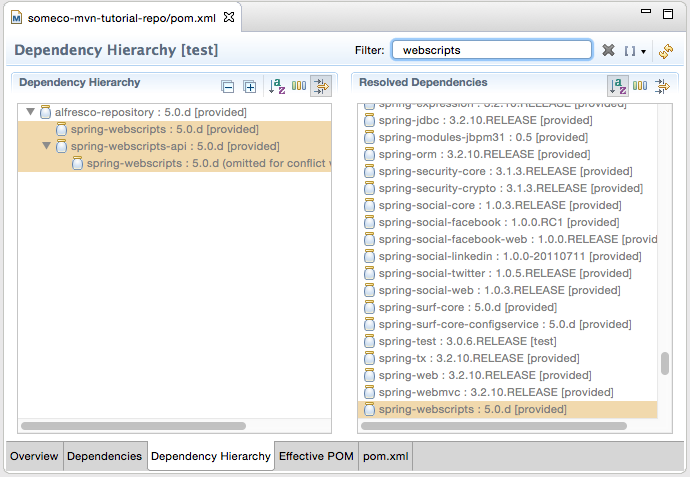

% Getting Started with the Alfresco Maven SDK
% Jeff Potts
% January, 2014

License
=======


This work is licensed under the Creative Commons Attribution-ShareAlike 3.0 Unported License. To view a copy of this license, visit http://creativecommons.org/licenses/by-sa/3.0/ or send a letter to Creative Commons, 444 Castro Street, Suite 900, Mountain View, California, 94041, USA.

Introduction
============
This tutorial is for people who have been handed a project that requires you to customize Alfresco in some way and you're thinking, "Now what?". By the end, you'll know:

* How to create a new Alfresco project using the Alfresco Maven SDK
* What goes where depending on the type of customization you are doing
* How to create and run tests
* How to produce an artifact suitable for deploying to your environment or sharing with the community.

This tutorial should be considered a pre-requisite before moving on to more detailed tutorials on things like content modeling, custom actions, behaviors, advanced workflows, or web scripts.

Before we jump in, a quick disclaimer: There are almost always multiple routes to a given solution. In this tutorial, I'm going to take you through the most direct, safest route that will get you up-and-going quickly. Later, if you decide you want to change things up or explore other paths, that's great.

Important Concepts
==================
You don't need to know much about Maven, Alfresco, or why this SDK exists before jumping in but it kind of helps set the scene, so let me take you through those three concepts quickly.

Apache Maven
------------

Apache Maven is essentially a build management tool. It has many features, but the primary time-saving feature is its ability to understand the dependencies your project relies on (and the dependencies of those dependencies and so on). Maven can then retrieve and cache those dependencies for you. If you've ever spent time chasing down JAR file after JAR file, the value of such a tool will be immediately obvious.

Alfresco Module Package (AMP)
-----------------------------

An AMP is a ZIP file with a folder structure that follows a specific convention. AMP files are used to make it easy to share and deploy customizations to the Alfresco platform. If your project is about making customizations to the repository tier (the /alfresco web application) you will create a "repo" AMP. If your project is about making customizations to the Share tier (the /share web application) you will create a "share" AMP. It is quite common for a project to require changes in both tiers, so in that case you will create two AMPs.

Alfresco Maven SDK
------------------

Today's developers are used to rails-like frameworks where you have an empty directory one moment and a fully instantiated, ready-to-run project the next. Why should Alfresco developers settle for anything less?

With the Alfresco Maven SDK you don't have to. The goal of the Maven-based SDK is to make it extremely easy for you to get started with Alfresco development. It consists of a project template (an "archetype" in Maven parlance) and some built-in smarts that make Maven understand how to create AMPs and deploy them to Alfresco.

If you are writing your own custom application that is separate from the Alfresco and Share WARs you don't need the Alfresco Maven SDK. But if you intend to write code that runs within either of those web applications, the Alfresco Maven SDK is where you need to start.

### What About the Old Ant-based SDK?

Alfresco has provided a downloadable SDK since the early-days. The SDK consisted of a ZIP that contained compile-time dependencies, source code, JavaDocs, and sample Eclipse projects. The sample projects used Ant-based builds.

There was nothing wrong with this approach, but as the platform evolved, the Ant-based SDK failed to evolve with it. Today, it contains examples for parts of the product that have fallen out-of-favor (the native Web Services API, for example, or the Alfresco Explorer user interface) and lacks examples for hugely important pieces of the product such as CMIS, Web Scripts, and advanced workflows using Activiti.

Aside from its out-of-date examples, the old Ant-based SDK required developers to do too much work. With the Alfresco Maven SDK, you don't even have to download anything yourself--you just create your project and start coding.

Now you have a high-level understanding of Apache Maven, AMPs, and the Alfresco Maven SDK. It's time to see them in action.

Your First Project
==================
Let me show you how easy it can be to get started with Alfresco development using the Alfresco Maven SDK. Before I start I'm going to assume you have JDK 1.7 installed as well as Apache Maven 3. You don't need to download anything else. Seriously. Not even Alfresco.

1. Create an empty directory. We're going to be creating some additional directories in here shortly.

2. Now let's create a new project. For now, let's assume you want to create something that you will deploy to the Alfresco repository tier such as a custom content model, some custom rule actions, a new set of web scripts, or some Activiti business processes. It doesn't really matter. To create the new project, run this command:
    
    ```    
    mvn archetype:generate \
    -DarchetypeCatalog=https://artifacts.alfresco.com/nexus/content/groups/public/archetype-catalog.xml \
    -Dfilter=org.alfresco.maven.archetype:
    ```
    
3. Maven will do some work and eventually ask you to choose an "archetype". You're basically selecting from a library of template projects. There are two available. One is called "alfresco-amp-archetype" and the other is called "alfresco-allinone-archetype". Our goal is to create an AMP that can be deployed to Alfresco so the first one is the one we want. Type 1 and hit enter.

4. Now Maven is asking you to specify the version of the archetype you want to base your project on. Currently, the latest version is 1.1.1 which is the 5th option in the list, so type 5 and hit enter.

5. Maven now asks for a groupId. You should be thinking "Java package". My examples always assume I am working at a fictitious company called SomeCo, so I will specify "com.someco" here. Specify what makes sense in your case and hit enter.

6. Next is the artifactId. You can think of this as what you want your project to be called. It will also be the ID of your AMP so make it something unique. You should also append the string "-repo" to your artifactId because this module is intended to be deployed to the repository tier. I'm going to specify "someco-mvn-tutorial-repo" for mine followed by enter.

7. At this point Maven will show you the values you entered plus some others that were defaulted and ask you to confirm your choices. If you want to change something you can specify "N" and then make changes or you can enter "Y" to continue. I can always change these values later if needed, so I'm going to specify "Y" followed by enter.

Now Maven is going to do some work. When it is done you will have:

* A project structure organized exactly how it needs to be to support your Alfresco development
* Default configuration files
* Minimal Java code and an accompanying unit test just to verify that everything works
* Configuration required to run a local instance of Alfresco suitable for testing
* A default POM (Project Object Model) XML file that tells Maven what your project depends on

Let's Run It
------------

You haven't downloaded anything. You haven't edited anything. All you've done is tell Maven to create a project based on a template. But the cool thing is this: Your project is runnable right now.

Try this:

    mvn integration-test -Pamp-to-war

If you watch the output, you'll see that Maven is downloading everything it needs to compile the project, creating an AMP, deploying the AMP to the Alfresco WAR, deploying the Alfresco WAR to the embedded Tomcat server, and starting the server up. Eventually you'll see:

    2014-01-15 18:01:19,339  INFO  [repo.module.ModuleServiceImpl] [localhost-startStop-1] Found 1 module(s).
    2014-01-15 18:01:19,480  INFO  [repo.module.ModuleServiceImpl] [localhost-startStop-1] Installing module 'someco-mvn-tutorial-repo' version 1.0.1401151758.

Which means that the module your project generated was recognized by the Alfresco server.

Once you see:

    Jan 16, 2014 8:38:20 AM org.apache.coyote.AbstractProtocol start INFO: Starting ProtocolHandler ["http-bio-8080"]

You should be able to go to:

    http://localhost:8080/alfresco

And log in using "admin" and "admin".

When you are done poking around, go back to the window where you ran your Maven command and type ctrl-c to shutdown the server.

What Just Happened?
-------------------
You asked maven to run the "integration-test" goal using the "amp-to-war" profile. This causes the project to be built, deployed as an AMP to a fresh Alfresco WAR, and run on the embedded Tomcat server. Once it started up, you were able to log in to the old Alfresco Explorer client and work with the repository to test your module.

If you go look in the target directory you'll see the AMP that was produced and subsequently deployed to the Alfresco WAR. In my case it is called "someco-mvn-tutorial-repo.amp". This file is what you would give to your IT team if you were ready to deploy your repository tier changes to a real Alfresco server.

Other Commands for Invoking the Build
-------------------------------------
You may not always need to start up the Alfresco server and leave it running. If you just want to build the project, run the unit tests, and package the AMP, you can run:

    mvn package

If you want to install the AMP into your local Maven repository you can run:

    mvn install

You may have noticed that the default project includes a simple unit test. By default, Maven will automatically run the unit tests in your project. You can see this happening in the output:

    -------------------------------------------------------
     T E S T S
    -------------------------------------------------------
    Running org.alfresco.demoamp.test.DemoComponentTest

It's a good practice to make sure that your project always includes unit tests and to run them every time you build. Many organizations run CI (Continuous Integration) tools that depend on this being the case. If you don't want to run tests for some reason you can skip them, like this:

    mvn install -DskipTests=true

If you want to delete all of the compiled artifacts that Maven created and start fresh you can run:

    mvn clean

If you also want to delete the embedded database, Alfresco content store, indexes, and log files that were created by running the test Alfresco server, you can run:

    mvn clean -Ppurge

Now you know how to create a new Alfresco project from an archetype and the fundamentals of running builds with and without unit tests. Next up, you'll learn about working with your new project in an IDE and you'll get a tour of the default project structure.

Logging
-------
In the log4j.properties file that exists in the module directory, the log4j.properties file includes

    log4j.logger.org.alfresco.demoamp.DemoComponent=${module.log.level}

You'll probably want to replace that with settings that match your package structure.

To set the module.log.level you can either do it when you run Maven, like this:

    mvn install -Dmodule.log.level=DEBUG

Or you can edit the pom.xml and add it to the properties, like this:

    <module.log.level>DEBUG</module.log.level>

If you change the pom.xml, then the AMP that gets produced will include that setting, and subsequently, the WAR the AMP gets deployed to will write log statements accordingly. This may or may not be what you want. If you aren't sure, it's probably best to set it using the command-line so it doesn't accidentally get set in your AMP.

Working With Your Project in an IDE
-----------------------------------
Althought it isn't required, most people prefer to work in an IDE when developing Alfresco customizations. Any IDE will do, but the most popular one is Eclipse so let's see how that works.

I'll be using the Kepler version of Eclipse Java EE IDE for Web Developers. It comes with built-in Maven support.

To open the project we created earlier in Eclipse, do this:

1. Select File, Import, Maven, Existing Maven Projects. Click Next.

    

2. Specify the directory that contains the someco-mvn-tutorial-repo folder. Eclipse will inspect that folder and show your project in the projects list. Make sure the checkbox next to the project name is checked, then click Next.

    

3. Eclipse will show the Setup Maven plugin connectors panel. You may see the "set-version" plugin complaining. That is safe to ignore for now. Click Finish.

    

Now the project is imported into your Eclipse workspace.

In the Markers panel you may see a Maven Problem listed that says, "Plugin execution not covered by lifecycle configuration".


To fix this:

1. Right-click on the error and select "Quick Fix".
2. Select "Permanently mark goal set-version in pom.xml as ignored in Eclipse build" then click Finish.
3. Select your POM location (mine is com.someco : someco-mvn-tutorial-repo : 1.0-SNAPSHOT) and click OK.

After the project rebuilds you may see one last problem listed, which is "Project configuration is not up-to-date with pom.xml". To fix this:

1. Right-click on the project and select Maven, Update Project.
2. Make sure the project is selected, then click OK.

Now Eclipse should be happy and the only errors left should be some Java warnings related to unused imports.

Understanding the Project Structure
-----------------------------------
The folder structure of your project is a bit more pleasant to explore in your IDE. Let's see what we've got.

* *pom.xml* In the root of the project directory you'll see pom.xml. This tells Maven everything it needs to know about your project. Remember those settings you specified when you created the project from the archetype? You can make changes to those settings here. For example, version 1.1.1 of the archetype assumes you are working with Alfresco Community Edition 4.2.e. If you wanted to work with a different version, you would simply change those properties and then tell Maven to update and it will take care of the rest.

* *src/main/java* This is where you should create your own packages to organize your Java code. Things like custom action executer classes, custom behaviors, Java-based controllers for web scripts go here. If you don't know what those are, don't worry, there are tutorials available [here](http://ecmarchitect.com/alfresco-developer-series). These files will ultimately be placed in a JAR. When the AMP is installed into the Alfresco WAR, the JAR will be placed under WEB-INF/lib.

* *src/test* Everything under src/test is about running unit tests. The unit tests themselves go in src/test/java. Any resources those classes need go in src/test/resources. In src/test/properties/local you'll see an alfresco-global.properties file. If you are already know something about Alfresco you know that this is used to configure Alfresco. In this case, it is only used when running the embedded Alfresco server for testing purposes.

* *src/main/amp* Everything else goes somewhere in this part of the project. The structure of an AMP is well-documented so I don't want to duplicate that here. Let me just point out the highlights:

    * The module.properties file tells Alfresco what it needs to know about this AMP such as its ID, version, the minimum and maximum version of Alfresco required to run the AMP, and any other AMPs on which this one depends.
    * The config/alfresco/module/someco-mvn-tutorial-repo directory is the heart of the AMP. This is where you place Spring config XML files, content model XML files, and user interface configuration. As you'll see in later tutorials, I prefer separate sub-directories for each of these things.
    * If your module includes web scripts or workflows, those don't reside under the module directory. Instead, those would go under config/alfresco/extension/templates/webscripts and config/alfresco/extension/workflows.
    * Your module may include client-side resources that need to be deployed to the root of the web application. Those go in src/main/amp/web in directories such as css, jsp, scripts, and images.

You should check this entire project into source code control. You will want to configure your source code control client to ignore the target directory and the alf_data_dev directory.

Now that you understand how to create a project for repository tier customizations, let's take a look at the Share tier. As part of that I'll show you another option for creating projects without leaving Eclipse.

Creating a Project for Share Tier Customizations
================================================
The first thing you should realize is that the structure for a project that creates repo tier customizations is exactly the same as one that targets Share tier customizations. From an Alfresco Maven SDK perspective, there are two things different about a Share project: The project's dependencies and the WAR the AMP will be deployed to.

Share project dependencies
--------------------------
We'll talk more about dependency management in a minute. For now realize that, by default, the archetype configures the project's pom.xml to have a dependency on the alfresco-repository artifact. Share projects have no such dependency. In fact, many Share projects don't use any Java at all. For now, edit the pom.xml and remove the alfresco-repository dependency. This will cause the demo component and its associated test class to fail to compile. They can be deleted.

Target WAR
----------
The other thing that is different about a Share project is the WAR the AMP will be deployed to. Instead of the alfresco WAR it needs to be deployed to the share WAR. This is configured in the alfresco.client.war property in pom.xml. By default it is set to "alfresco". For Share projects it should be set to "share".

### Try It: Create a Share Project Using the Archetype

Let's create a new project for Share customizations. You could go into the command line and run the exact same archetype command you ran earlier, specifying a new artifactId, and then changing the alfresco.client.war property to "share". If you are not using Eclipse, go ahead and do that now, then skip the next section.

Another option is to configure Eclipse so you can create new Alfresco projects using the Alfresco Maven SDK without leaving the IDE. Let's do that.

1. File, New Maven Project.
2. Specify the directory that contains the repo project directory, then click next.

    

3. Click Configure so we can add Alfresco's catalog to the list.

    

4. Click Add Remote Catalog
5. Specify "https://artifacts.alfresco.com/nexus/content/groups/public/archetype-catalog.xml" as the Catalog File. Specify "Alfresco Archetypes" as the description. Then, click OK and OK again to close the Preferences panel.

    

6. Now select "Alfresco Archetypes" in the catalog and you'll see a bunch of archetypes show up in the list.
7. Specify "org.alfresco.maven.archetype" in the filter and you'll see the same two archetypes that were presented to you as options on the command line at the start of the tutorial.
8. Select the alfresco-amp-archetype and click Next.

    

9. Specify "com.someco" for the groupId, "someco-mvn-tutorial-share" as the artifactId, and change alfresco_target_amp_client_war to "share". Then click Finish.

    

Now your Share customization project is in your workspace. The next time you create a new project using the archetype, it will be a few less steps because you won't have to add the catalog.

Understanding the Share Project Folder Structure
------------------------------------------------
As I mentioned earlier, the structure of this project is exactly the same as the one we created for our repo project. The only difference worth mentioning is that in the repo project, things like web scripts went into src/main/amp/config/alfresco/extension/templates/webscripts. In a Share project, those go in src/main/amp/config/alfresco/web-extension/site-webscripts.

Running an Integration Test with Share
--------------------------------------
Often you will work on both repo tier customizations and share tier customizations at the same time. Your Share tier needs an Alfresco repository to talk to. One way to do that is to tell Maven to start your repo project using:

    mvn integration-test -Pamp-to-war

And then start your Share project using:

    mvn integration-test -Pamp-to-war -Dmaven.tomcat.port=8081

Once both servers come up, you can go to http://localhost:8081/share and log in to test your module.

Dependency Management
=====================
The cool thing about Apache Maven is that it manages your projects dependencies for you. All you need to do is tell Maven about them by configuring your pom.xml. By default, the Alfresco Maven SDK will create two dependencies for your project: alfresco-repository and junit.

As I mentioned earlier, Alfresco Share projects don't depend on the Alfresco repository so for the someco-mvn-tutorial-share project, that dependency can be removed. But what if I wanted to put some Alfresco Java in my Share project, like maybe a Java-based web script? In that case, we'll need to adjust the dependencies.

Web scripts can run in either the repository tier or the share tier. If you write a Java-based web script in your repository project the class will compile because that project depends on the alfresco-repository artifact which in turn depends on the spring-webscripts artifact. You can see this if you go to the Dependency Hierarchy tab in Eclipse in your pom.xml file:



Alternatively, you can see the hierarchy by running:

    mvn dependency:list

So, to add a Java-based web script to our share tier project, we'd need to add spring-webscripts as a dependency. You can do this by editing the pom.xml, like this:

    <dependency>
        <groupId>org.springframework.extensions.surf</groupId>
        <artifactId>spring-webscripts</artifactId>
        <version>1.2.0-M14</version>
        <scope>provided</scope>
    </dependency>

Now a Java-based web script will be able to find its parent class, DeclarativeWebScript.

You might be wondering how you were supposed to know that the DeclarativeWebScript class was included in the spring-webscripts artifact. One way to find out is to go to <http://artifacts.alfresco.com>. You can do a search for a class and it will show you all of the artifacts that contain it.

Other Topics to Explore on Your Own
===================================
You now know how to use the Alfresco Maven SDK to create projects for both your Alfresco repository customizations and your Alfresco Share customizations. If you are new to Alfresco development, I hope you agree it is really easy to boostrap a project to get started. If you are an old hand at Alfresco but are still using the old SDK I hope this has motivated you to switch to the new SDK to produce your AMPs.

There are many topics that weren't covered in this tutorial. I'll leave you to explore those on your own. Here are a few:

 * The Alfresco Maven SDK supports dynamic class reloading when used in conjunction with a tool called [JRebel](http://zeroturnaround.com/software/jrebel/). See Gab's Alfresco Summit 2013 presentation linked to in the More Information section.
 * This tutorial covered the AMP archetype. But the Alfresco Maven SDK includes another archetype called All-in-One. That archetype gives you a complete Alfresco installation including SOLR.
 * The Alfresco Maven SDK supports both Community Edition and Enterprise Edition. If you need help accessing the Enterprise Edition artifacts, contact Alfresco Support.

Where to Find More Information
==============================
 - The [official documentation](http://docs.alfresco.com/community/topic/com.alfresco.community.doc/concepts/dev-extensions-maven-sdk.html) on the Alfresco Maven SDK is on <http://docs.alfresco.com>.
 - More detailed documentation on the Alfresco Maven SDK can be found at [artifacts.alfresco.com](https://artifacts.alfresco.com/nexus/content/groups/public/alfresco-lifecycle-aggregator/latest/archetypes/alfresco-amp-archetype/index.html).
 - Gab's Alfresco Summit presentation on [Test-Driven, Rapid Development, and Continuous Delivery of Alfresco Solutions](http://summit.alfresco.com/boston/sessions/enabling-test-driven-rapid-dev-continuous-delivery-alfresco-apps)
 - The [Instant Apache Maven Starter](http://www.amazon.com/Instant-Apache-Starter-Maurizio-Turatti/dp/1782167609) book by Maurizio Turatti and Maurizio Pillitu might be a good resource if you are interested in learning more about Apache Maven.
 - Gethin James' [Getting Started with Alfresco Development](http://summit.alfresco.com/barcelona/sessions/getting-started-alfresco-development) presentation from Alfresco Summit
 - The [Alfresco Developer Series](http://ecmarchitect.com/alfresco-developer-series) on [ECM Architect](http://ecmarchitect.com) has free tutorials on custom content models, actions, behaviors, workflows, and web scripts.
