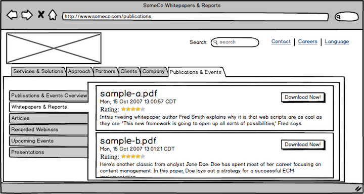
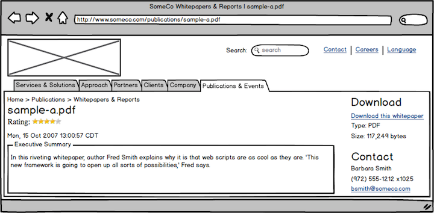
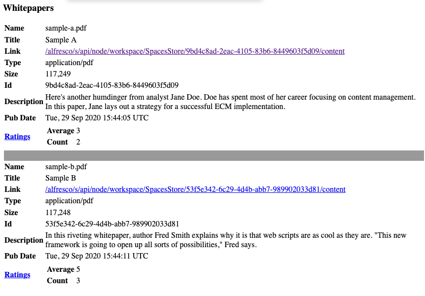
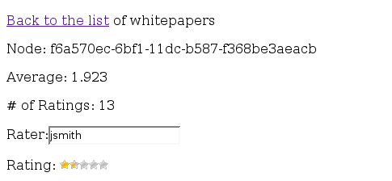

% Introduction to the Web Script Framework
% Jeff Potts
% February, 2014

License
=======


This work is licensed under the Creative Commons Attribution-ShareAlike 3.0 Unported License. To view a copy of this license, visit http://creativecommons.org/licenses/by-sa/3.0/ or send a letter to Creative Commons, 444 Castro Street, Suite 900, Mountain View, California, 94041, USA.

Introduction 
============
This tutorial is an introduction to the Alfresco Web Script Framework. It continues the “SomeCo Whitepapers” example started in previous tutorials. Here's what you have seen in the previous tutorials:

* The custom content types tutorial extended the out-of-the-box content model so that SomeCo could store custom
metadata about one of their document types, whitepapers.
* The custom actions tutorial showed how to create rule actions and UI actions. The tutorial created a UI action called "Set Web Flag" that toggles a flag used to determine whether or not the whitepaper should be shown on the web site.
* The custom behavior tutorial showed how to create business logic associated with a type or aspect. In that tutorial, a custom content model defines a new "rateable" aspect and a custom behavior is bound to that aspect that knows how to calculate the average user rating for a given piece of content. The calculation gets triggered every time a rating is created or deleted. The tutorial used unit tests and a quick-and-dirty web script to create ratings.

SomeCo is now ready to move to the next step: Exposing the rating
functionality on the Alfresco back-end as an API to the front-end. In their infinite wisdom, the team at
SomeCo realizes that Alfresco's web script framework provides a nice way to expose
a lightweight, RESTful API for working with whitepapers and ratings. The API can be used by SomeCo's front-end web site developers to retrieve whitepapers and let end-users rate those whitepapers.

In this tutorial, you'll learn how to roll your own REST API on top of Alfresco. The API will be used for:

* retrieving a list of whitepapers,
* retrieving the average rating for a given whitepaper,
* retrieving a specific rating,
* posting a new rating for a whitepaper, and
* deleting all ratings for a given whitepaper.

As you'll learn shortly, web scripts can be written in either server-side JavaScript or Java. This tutorial will use JavaScript for most of the controller logic but you'll see how to use Java as well.

The complete source code that accompanies this tutorial is available at [GitHub](http://github.com/jpotts/alfresco-developer-series).

Sound decent? Okay, let's get started.

What is the Web Script Framework? 
=================================

In today's everything-as-a-service environment, the CMS is increasingly seen as a black-box component. Other systems, both producers and consumers of content, need to interact with the CMS and other components via REST.

Alfresco provides an industry-standard, RESTful API for working with the repository called CMIS. But there are times when this API doesn't do everything you need to do. In that case, a great alternative is to create your own API using the web script framework.

Think of a web script as a chunk of code that is mapped to a human-readable URL. So, for example, a URL that returns expense reports pending approval might look like:

    /alfresco/service/expenses/pending

while a URL that returns expenses pending approval for a specific user
might look like:

    /alfresco/service/expenses/pending/jpotts

In the URL above, you could read the “jpotts” component of the URL as an
implied argument. A more explicit way to provide an argument would be
like:

    /alfresco/service/expenses/pending?user=jpotts

Or maybe “pending” is an argument as well which tells the web script
what status of expense reports to return. The point is that the
structure of the URL and how (and if) your URL includes arguments is
completely up to you.

The response the URL returns is also up to you. Your response might
return HTML, XML, JSON, or even a JSR-168 Portlet.

The web script framework makes it easy to follow the
Model-View-Controller (MVC) pattern, although it isn't required. The
**controller** is server-side JavaScript, a Java class, or both. The
controller handles the request, performs any business logic that is
needed, populates the model with data, and then forwards the request to
the **view**. The view is a FreeMarker template responsible for constructing
a response in the appropriate format. The **model** is a data
structure passed between the controller and the view.

The mapping of URL to controller is done through an XML *descriptor* which
is responsible for declaring the URL pattern, whether the script
requires a transaction or not, and the authentication requirements for
the script. The descriptor optionally describes arguments that can be
passed to the script as well as the response formats that are available.

The response formats are mapped to FreeMarker templates through naming
convention. So, for example, the FreeMarker template that returns
expenses as HTML would be named with an extension of “html” while the
one that returns XML would be named with an extension of “xml”.

The descriptor, the server-side JavaScript controller, and the FreeMarker templates that collectively make up a web script can reside either in the Alfresco content repository or on the file system. If a web script controller is written in Java, the class must reside somewhere on the classpath.

With these very basic building blocks you can build a lot of cool stuff. For example, you
can use web scripts to expose the Alfresco content repository through a
RESTful API to:

* Enable a front-end web application written in any language that can talk HTTP to retrieve repository data in XML, JSON, or any other format or to persist data to the repository;
* Populate JSR-168 portlets;
* Capture user-contributed content/data;
* Create ATOM or RSS feeds for repository content or business process data; and
* Respond to requests for data from the Alfresco Share front-end.

The last thing to mention is that web scripts are executed in a “web
script runtime”. There are three runtimes available
out-of-the-box:

1. The servlet runtime executes all web scripts requested
via HTTP/S.
2. The JSF runtime allows JSF components to execute scripts.
3. The JSR-168 runtime allows portlets to invoke web scripts directly.

You can write your own runtime if these don't meet your needs. Alfresco
may add more in the future. This tutorial focuses exclusively on the servlet runtime.

Your First Web Script
=====================
Let's walk through some examples. You're going to start with a very
simple "Hello World" web script. After that, the examples will get progressively more
complex until, at the end, you will have a REST-based interface for creating,
reading, and deleting SomeCo whitepaper ratings.

Hello World Example 
-------------------
Let's implement the most basic web script possible: A "Hello World" script
that echoes back an argument. You'll need one descriptor and one
FreeMarker template. Do the following:

1.  Log in to Alfresco Share as an administrator.
2.  In the Repository, navigate to /Company Home/Data Dictionary/Web Scripts.
3.  Create a file called helloworld.get.desc.xml with the following
    content:

    ```
    <webscript>
    <shortname>Hello World</shortname>
    <description>Hello world web script</description>
    <url>/helloworld?name={nameArgument}</url>
    </webscript>
    ```

4.  Create a file called helloworld.get.html.ftl with the following
    content:

    ```
    <html>
    <body>
    <p>Hello, ${args.name}!</p>
    </body>
    </html>
    ```

5.  Go to <http://localhost:8080/alfresco/service/index> and press the
    "Refresh Web Scripts" button. If you then click the “List Web Scripts” link you
    should be able to find the web script you just defined.
6.  Now go to <http://localhost:8080/alfresco/service/helloworld?name=Jeff>. You
    should see:

    ```
    Hello, Jeff!
    ```

    Notice that the URL starts with "/alfresco/service" but the descriptor you created in step 3 defines the URL to be "/helloworld". When you are invoking web scripts running in Alfresco over HTTP/S, the URL will always start with "/[alfresco web context]/service". You may also see the "service" part shortened to "s".

A few things to note. First, notice the file names include “get”. That's
the HTTP method used to call the URL. In later examples you'll see how to
use POST and DELETE. By differentiating on the HTTP method, you can have
multiple controllers for the same “service” depending on which method is used to call the service.

The second thing to notice is that there is only one argument being passed in. You can have as many as you want. Just remember that descriptors must be valid XML which means ampersands must be escaped. So the proper way to define a URL with multiple arguments is:

    <url>/helloworld?name={nameArgument}&amp;secondArg={anotherArg}</url>

You can also signify optional parameters by adding a question mark, like this:

    <url>/helloworld?name={nameArgument}&amp;secondArg={anotherArg?}</url>

Third, notice that this web script consists only of a descriptor and a FreeMarker template. It's got a view but not a controller. The web script still ran because controllers are optional.

Most web scripts are going to use a controller, though, so go ahead and add one.

1.  Create a file called helloworld.get.js with the following content:

    ```
    model.foo = "bar";
    ```

2.  Update your helloworld.get.html.ftl file with the following content:

    ```
    <html>
    <body>
    <p>Hello, ${args.name}!</p>
    <p>Foo: ${foo}</p>
    </body>
    </html>
    ```

3.  Go to <http://localhost:8080/alfresco/service/index> and press the
    "Refresh Web Scripts" button. This is required because you added a controller that
    the web script run-time didn't know about.
4.  Now go to your web browser and enter the same URL from the first
    example which was <http://localhost:8080/alfresco/service/helloworld?name=Jeff>. You
    should see:

    ```
    Hello, Jeff!
    
    Foo: bar
    ```

The web script framework executed the controller. The controller populated the model with a variable called "foo". The web script framework then passed the model on to the view, implemented by the FreeMarker template. The view can access any variables that are placed in the model. In this case, it output the value of `foo`. It also has access to the arguments passed to the web script.

The controller can do anything the Alfresco JavaScript API can do. In this case, the controller didn't leverage the
JavaScript API at all—it just put some data into the “model” object
which was then read by the FreeMarker template. In subsequent examples
the controller will have more work to do. Later, you'll see how to use Java
instead of JavaScript for the controller.

### Deploying web scripts to the repository versus deploying to the classpath

In this quick example you created the descriptor, controller, and view directly in the Alfresco repository through the Alfresco Share user interface. Most of the time, though, you'll be creating several web scripts that will be part of a larger project. Uploading all of those files to an Alfresco production environment leaves an opportunity for error. So, for the rest of the tutorial you'll be deploying your web scripts to the classpath on the file system.

The advantage of using the file system is that the web scripts that make
up your solution can be deployed alongside your other extensions without
requiring anyone to manually upload them to the repository. The disadvantage is
that some changes may require a server restart.

If the same web scripts are defined in the repository as well as the classpath, the
files in the repository take precedence over the files on the classpath.
The Alfresco wiki documents the search order for web scripts (See “Where
to find more information” at the end of this tutorial for a list of
references).

### Using the web scripts console

As you just saw when you refreshed the list of web scripts, Alfresco comes with a tool for listing and reloading web script definitions. To get to the tool, go to <http://localhost:8080/alfresco/service/index>. You'll see links that let you browse the list of deployed web scripts. This is a handy debugging tool and it also helps you figure out what web scripts are available out-of-the-box.

You have seen how to create a very simple web script using files created in a text editor or directly in the Alfresco Share user interface. Let's talk about the tools and the project organization next.

Setup
=====
Before getting too far down the road, let me tell you about the tools you'll need and then give you a description of the project organization.

Tools
-----
Here is what I am using on my machine:

* Mac OS X 10.9.1
* Java 1.7.0_51
* Apache Maven 3.0.5 (installed using Macports)
* Alfresco Maven SDK, AMP Archetype 1.1.1 (No download necessary)
* Eclipse Java EE IDE for Web Developers, Kepler
* Alfresco Community Edition 4.2.e ([Download](http://www.alfresco.com/products/community))

By default, when you create an Alfresco project using version 1.1.1 of the Alfresco Maven SDK the project will be configured to depend on Alfresco Community Edition 4.2.e.

The Eclipse IDE is optional. Most people working with Alfresco use Eclipse or something similar, so this tutorial will assume that's what you are using.

Project Organization
--------------------
You just saw that web scripts can be created by creating or uploading files to the Alfresco repository. For the rest of these examples, though, you'll create a project that will package the web scripts as an AMP (Alfresco Module Package). This is the recommended way to distribute your Alfresco customizations. It's a lot less error-prone than handing a bunch of files to someone and asking them to upload them to the proper place in the repository.

In previous tutorials you've seen examples that use multiple projects to house the customizations. In this tutorial you just need a single project created using the AMP archetype that is part of the Alfresco Maven SDK.

I am not going to spend much time talking about how the Alfresco Maven SDK works. If you aren't already familiar with it, you may want to read the [Getting Started with the Alfresco Maven SDK](http://ecmarchitect.com/alfresco-developer-series) tutorial on ecmarchitect.com first and then come back to this one.

If you are planning on following along, go ahead and use the Alfresco Maven SDK to create your project directory. Use a `groupId` of "com.someco" and an `artifactId` of "webscripts-tutorial-repo".

I'll refer to the directory where you created the project directory as $TUTORIAL_HOME. 

Creating Your Own REST API for Ratings
======================================

SomeCo wants a REST API that front-end developers can use to find
whitepapers and ratings as well as post new ratings. Before diving in,
it probably makes sense to rough out the API.

| URL | Method | Description | Response Formats |
| --- | ------ | ----------- | ---------------- |
| /someco/whitepapers | GET | Returns a list of whitepapers. | HTML, JSON |
| /someco/rating?id={id} | GET | Gets the average rating for a given whitepaper by passing in the whitepaper's noderef. | HTML, JSON |
| /someco/rating?id={id}&rating={rating}&user={user} | POST | Creates a new rating for the specified whitepaper by passing in a rating value and the user who posted the rating. | HTML, JSON |
| /someco/rating?id={id} | DELETE | Deletes all ratings for a specified whitepaper. | HTML |

Table: Planned ratings API

The URL pattern must be unique. In this tutorial all URLs will be prefixed with "someco". Alfresco reserves certain package names and URLs for their own use but by incorporating things like your domain name into your URLs and package names, you'll steer clear of those.

When this API is in place, front-end developers can incorporate whitepapers and user-contributed ratings into the SomeCo web site. The following mockups show how the front-end team plans to use the API you're going to build to query for whitepaper and ratings data.



You can't tell from the mockups, but the ratings widget is clickable. When clicked it sends an asynchronous post to the /someco/rating URL described in the table above. When the whitepaper link is clicked, the page below is displayed.



I reused the description from the index page for the Executive Summary. In the real world this would probably be a more lengthy description separate from the introduction on the index page. The “Download this white paper” link uses the standard “Download URL” to give the user direct access to the content.

Listing all whitepapers
-----------------------

As a quick review, recall that SomeCo writes whitepapers and manages those papers with Alfresco. Some whitepapers are published to the web site. A custom aspect called `scr:webable` includes a boolean property called `scr:isActive`. Whitepapers with the `scr:isActive` flag set to `true` should be shown on the web site.

Let's write a web script that returns all whitepapers. The list of whitepapers needs to be in two formats: HTML and JSON. HTML will allow you to easily test the service and JSON will make it easy for code on the front-end to process the list. This will require four files:

1. one descriptor,
2. one JavaScript controller,
3. one FreeMarker template for the HTML response, and
4. one FreeMarker template for the JSON response.

I'll walk you through the descriptor, controller, and the two views.

### Step 1: Write the descriptor

The first step is to create the descriptor file. Web scripts that are deployed in an AMP go in:

    $TUTORIAL_HOME/webscripts-tutorial-repo/src/main/amp/config/alfresco/extension/templates/webscripts

The Alfresco Maven SDK will have created the directory structure down to "/alfresco". You'll have to create everything below that.

The web script framework allows web script assets to be organized in a hierarchical folder or package structure within that directory. This keeps your web scripts from colliding with other people's web scripts or Alfresco's. Use a reverse domain name pattern just like you would for a Java package. This tutorial will use "com/someco" for its package. This particular web script is about whitepapers so the files that make up the whitepapers web script will reside in:

    $TUTORIAL_HOME/webscripts-tutorial-repo/src/main/amp/config/alfresco/extension/templates/webscripts/com/someco/whitepapers

To create the descriptor, create a new XML file called "[whitepapers.get.desc.xml](https://github.com/jpotts/alfresco-developer-series/blob/master/webscripts/webscripts-tutorial-repo/src/main/amp/config/alfresco/extension/templates/webscripts/com/someco/whitepapers/whitepapers.get.desc.xml)" in that directory.


Edit the file to have the following content:

    <webscript>
        <shortname>Get all whitepapers</shortname>
        <description>Returns a list of active whitepapers</description>
        <url>/someco/whitepapers</url>
        <url>/someco/whitepapers.json</url>
        <url>/someco/whitepapers.html</url>
        <format default="json">extension</format>
        <authentication>guest</authentication>
        <transaction>none</transaction>
    </webscript>

There are a few elements in this descriptor you didn't see in the Hello
World example. First, notice that there are multiple `url` elements. There
is one `url` element for each format plus one without a format. This shows how
to request a different output format from the same base URL. Because the
URLs differ only in format, it isn't strictly required that they be
listed in the descriptor, but it is a good practice.

The `format` element declares the which extension syntax the web script uses and defines a
default output format. In this case, the web script uses the “extension” syntax—the extension on the
URL specifies the format of the response. An alternative syntax is to use the “argument”
syntax like this:

    <url>/someco/whitepapers?format=json</url>
    <url>/someco/whitepapers?format=html</url>

Which syntax you use is really up to you. If you want to accept either syntax, you can use
“any” as the format.

Using the `format` element set to "extension" and the `default` attribute set to "json", if someone invokes the URL and passes in the format as an argument instead of as an extension, they'll get an error 500. If someone invokes the web script without specifying a format, they'll get a JSON response.

The `authentication` element declares the minimum level of authentication
required for this script. If your web script access the repository this must be set to "guest" or higher. Other options are "none", "user", and "admin".

The `transaction` element specifies the level of transaction required by
the script. Listing whitepapers doesn't need a transaction, so in this example it is set to "none". Other possible values are:

* **required**: the web script requires a transaction and can be part of an existing transaction if one has already been started
* **requiresnew**: the web script must be run in its own new transaction

The next step is to write the controller.

### Step 2: Write the controller

The controller is where the logic that queries the whitepapers will live. Create a file called "[whitepapers.get.js](https://github.com/jpotts/alfresco-developer-series/blob/master/webscripts/webscripts-tutorial-repo/src/main/amp/config/alfresco/extension/templates/webscripts/com/someco/whitepapers/whitepapers.get.js)" in the same directory as the controller. Edit the file with
the following content:

    <import resource="classpath:alfresco/extension/scripts/rating.js">
    
    var whitepapers = search.luceneSearch("PATH:\"/app:company_home/cm:Someco/*\" +TYPE:\"{http://www.someco.com/model/content/1.0}whitepaper\"");
    
    if (whitepapers == null || whitepapers.length == 0) {
        status.code = 404;
        status.message = "No whitepapers found";
        status.redirect = true;
    } else {
        var whitepaperInfo = new Array();
        for (i = 0; i < whitepapers.length; i++) {
            var whitepaper = new whitepaperEntry(whitepapers[i],
            getRating(whitepapers[i]));
            whitepaperInfo[i] = whitepaper;
        }
        model.whitepapers = whitepaperInfo;
    }
    
    function whitepaperEntry(whitepaper, rating) {
        this.whitepaper = whitepaper;
        this.rating = rating;
    }

The first thing to notice about the script is that it imports
another script. The rating.js script was created as part of the [custom behaviors tutorial](http://ecmarchitect.com/alfresco-developer-series-tutorials/behaviors/tutorial/tutorial.html) to contain logic related to ratings.

The next thing to notice is that the script queries the repository using
Lucene to get a list of whitepapers. Look at what happens if there are
no whitepapers found. The response code gets set to 404, which is the
standard HTTP response code for “File not found”. Alfresco has standard response templates for error codes but you can override them with your own by creating FreeMarker templates that follow a specific naming
convention. For example, you could have a custom 404 response template
for whitepapers by creating a file called "whitepapers.get.html.404.ftl".
See the official Alfresco documentation on [response status code templates](http://docs.alfresco.com/4.2/topic/com.alfresco.enterprise.doc/concepts/ws-component-name.html) for more information.

The last thing that happens is that the web script builds a new Array for the
results. The `model.whitepapers` variable could just be set to the `whitepapers`
variable that contains the query results but I want to add some data to
the result set, so I'm building a new Array and setting that to the
model.

The `getRating()` function that is getting called resides in rating.js, which is part of the AMP you created in the custom behaviors tutorial. Just for reference, that function looks like this:

    function getRating(curNode, curUser) {
        var rating = {};
        rating.average = curNode.properties["{http://www.someco.com/model/ratings/1.0}averageRating"];
        rating.count = curNode.properties["{http://www.someco.com/model/ratings/1.0}ratingCount"];
        rating.user = getUserRating(curNode, curUser);
        return rating;
    }

The function simply retrieves the `scr:averageRating` and `scr:ratingCount`
properties from the specified node as well as the current user's rating for this object, and returns everything in a single rating object.

### Step 3: Write the views

Assuming there are items in the search results, the web script will need FreeMarker
templates to return them in the appropriate format. Let's create the HTML response template
first. Create a new file called "[whitepapers.get.html.ftl](https://github.com/jpotts/alfresco-developer-series/blob/master/webscripts/webscripts-tutorial-repo/src/main/amp/config/alfresco/extension/templates/webscripts/com/someco/whitepapers/whitepapers.get.html.ftl)" in the same directory as the controller you just created. Edit the file with the following content:

    <#assign datetimeformat="EEE, dd MMM yyyy HH:mm:ss zzz">
    <html>
        <body>
            <h3>Whitepapers</h3>
            <table>
                <#list whitepapers as child>
                    <tr>
                        <td><b>Name</b></td>
			<td>${child.whitepaper.properties.name}</td>
                    </tr>
                    <tr>
                        <td><b>Title</b></td>
			<td>${child.whitepaper.properties["cm:title"]}</td>
                    </tr>
                    <tr>
                        <td><b>Link</b></td>
			<td><a href="${url.context}${child.whitepaper.url}?guest=true">${url.context}${child.whitepaper.url}</a></td>
                    </tr>
                    <tr>
                        <td><b>Type</b></td>
			<td>${child.whitepaper.mimetype}</td>
                    </tr>
                    <tr>
                        <td><b>Size</b></td>
			<td>${child.whitepaper.size}</td>
                    </tr>
                    <tr>
                        <td><b>Id</b></td>
			<td>${child.whitepaper.id}</td>
                    </tr>
                    <tr>
                        <td><b>Description</b></td>
                        <td><p><#if child.whitepaper.properties["cm:description"]?exists
                    && child.whitepaper.properties["cm:description"] !=
                    "">${child.whitepaper.properties["cm:description"]}</#if></p>
                        </td>
                    </tr>
                    <tr>
                        <td><b>Pub Date</b></td>
			<td>${child.whitepaper.properties["cm:modified"]?string(datetimeformat)}</td>
                    </tr>
                    <tr>
                        <td><b><a href="${url.serviceContext}/rating.html?id=${child.whitepaper.id}&guest=true">Rating</a></b></td>
                        <td>
                            <table>
                                <tr>
                                    <td><b>Average</b></td>
				    <td>${child.rating.average!"0"}</td>
                                </tr>
                                <tr>
                                    <td><b>Count</b></td>
				    <td>${child.rating.count!"0"}</td>
                                </tr>
                            </table>
                        </td>
                    </tr>
                    <#if !(child.whitepaper == whitepapers?last.whitepaper)>
                        <tr>
			    <td colspan="2" bgcolor="999999">&nbsp;</td>
			</tr>
                    </#if>
                </#list>
            </table>
        </body>
    </html>

This template iterates through the query results passed in by the
controller, and builds an HTML table with properties of each whitepaper.
(Yes, the table is ugly. Yes, you could use CSS to spruce it up
tremendously or even remove the table entirely. But for SomeCo, this
response template is really for debugging purposes only and I didn't
want to fool with the CSS so a table it is).

Now create the response template for the JSON response. In the same directory as the HTML response template, create a file called "[whitepapers.get.json.ftl](https://github.com/jpotts/alfresco-developer-series/blob/master/webscripts/webscripts-tutorial-repo/src/main/amp/config/alfresco/extension/templates/webscripts/com/someco/whitepapers/whitepapers.get.json.ftl)" with the following content:

    <#assign datetimeformat="EEE, dd MMM yyyy HH:mm:ss zzz">
    {"whitepapers" : [
        <#list whitepapers as child>
            {
                "name" : "${child.whitepaper.properties.name}",
                "title" : "${child.whitepaper.properties["cm:title"]}",
                "link" : "${url.context}${child.whitepaper.url}",
                "type" : "${child.whitepaper.mimetype}",
                "size" : "${child.whitepaper.size}",
                "id" : "${child.whitepaper.id}",
                "description" : "<#if child.whitepaper.properties["cm:description"]?exists && child.whitepaper.properties["cm:description"] != "">${child.whitepaper.properties["cm:description"]}</#if>",
                "pubDate" : "${child.whitepaper.properties["cm:modified"]?string(datetimeformat)}",
                "rating" : {
                    "average" : "${child.rating.average!"0"}",
                    "count" : "${child.rating.count!"0"}"
                }
            }
            <#if !(child.whitepaper == whitepapers?last.whitepaper)>,</#if>
        </#list>
        ]
    }

Again, just like the HTML response template, the script iterates through
the result set, but this one outputs JSON instead of HTML. The JSON structure is
completely arbitrary. In the real world, you would work this out with the front-end development team.

### Deploying the whitepaper web script

If you have everything your customizations need in a single project, you can use the Alfresco Maven SDK to launch Alfresco using an embedded Alfresco application server and H2 database. However, this tutorial has several dependencies that are in separate projects, each of which are packaged as individual AMPs. So to deploy the web scripts that are part of this tutorial you will need an Alfresco server that has the following AMPs already installed:

* **content-tutorial-repo**. This is required because the web script looks for content with the `scr:isActive` flag set and that's defined in the SomeCo Content Model that is part of that project.
* **behavior-tutorial-repo**. This is required because it contains a behavior that calculates the average rating for a piece of content and because it has the rating.js server-side JavaScript file that the controllers in this tutorial import.
* **actions-tutorial-repo**. This one is optional. It contains a UI action that is used to set the `scr:isActive` flag from within the Alfresco Share user interface.

You can deploy these AMPs to your Alfresco installation using the "apply_amps.sh" script. Alternatively, you can use the "alfresco:install" plugin that is part of the Alfresco Maven SDK to install each one.

For example, on my machine, I have all three of those projects checked out from source as well as the webscripts-tutorial-repo project. And, I have Alfresco running in $TOMCAT_HOME with an exploded Alfresco WAR. So, for each project I can do this:

1. Switch to \$TUTORIAL\_HOME/\$PROJECT_DIRECTORY
2. Run `mvn install` to build the AMP. Use `mvn install -DskipTests=true` to skip the unit tests some of those projects may have.
3. Run `mvn alfresco:install -Dmaven.alfresco.warLocation=$TOMCAT_HOME/webapps/alfresco` to install the AMP to the exploded Alfresco web application. If you are running the alfresco.war unexploded you can specify the path to the WAR file instead.

After doing that for all four projects (the three dependencies and the webscripts-tutorial-repo project) start Tomcat and test.

As you add web scripts in subsequent parts of the tutorial, you can just re-run the steps above for the webscripts-tutorial-repo project. If you are running the Alfresco WAR exploded, you may not have to restart Tomcat. The changes will either be picked up automatically or you can do a "Refresh Web Scripts" on the web script console to pick up the changes.

Now that your Alfresco server is running the webscripts-tutorial-repo AMP and its dependencies, you are ready to test out the whitepapers web script.

### Testing

You've deployed the project and its dependencies to your Alfresco installation and the server is running. You are now ready to test out the web script. Do this:

1. Upload some files to your Alfresco repository. It doesn't matter what they are. The files should go in "Company Home/Someco/Whitepapers". Capitalization matters.
2. Change the type on the files you uploaded to "SomeCo Whitepaper". You can save time if you set that up as a rule on your Whitepapers folder before you upload your test files in step 1.
3. If you are going to run the web script as a guest user, make sure that "Guest" is given "Consumer" access to the Whitepapers folder.

The web script descriptor says that this web script requires Guest access or higher. That means you have three options for running the web script:

1. Log in to Alfresco (/alfresco) before running the web script.
2. Run the web script and then authenticate with a valid user and password when the basic authentication dialog is presented.
3. Run the web script with “&guest=true” appended to the URL, like this:

    http://localhost:8080/alfresco/service/someco/whitepapers.html&guest=true

It doesn't matter which one you choose. The tutorial assumes you are going with option 3.

If you forget the ".html" extension in the URL, you'll get a JSON response because the descriptor set that format as the default.

If all goes well you should see something similar to the figure below:



### Debugging

Did it work? If not, it's time to debug. Debug logging verbosity is controlled by log4j.properties. There are many log4j.properties files. For turning on JavaScript logging, edit the one in:

    $TOMCAT_HOME/webapps/alfresco/WEB-INF/classes

Edit log4j.properties and change the ScriptLogger to DEBUG, like this:

    log4j.logger.org.alfresco.repo.jscript.ScriptLogger=DEBUG

This will cause any logger.log statements in your controller to write to catalina.out. If that isn't enough logging for you, you can set:

    log4j.logger.org.alfresco.repo.jscript=DEBUG

That will give you debug logging on all server-side JavaScript.

You may decide that you need to step through your server-side JavaScript. Assuming your server is running on a machine with a GUI, you can edit log4j.properties and set:

    log4j.logger.org.alfresco.repo.web.scripts.AlfrescoRhinoScriptDebugger=on

Then, when you restart your application server, Alfresco will launch the Rhino JavaScript Debugger in a GUI. You can use it to set breakpoints and step through your JavaScript controller.

Another tool you'll want to leverage is the web script console. The web script console is at:

    http://localhost:8080/alfresco/service/index

You can use it to see everything Alfresco knows about your script (and any other scripts it knows about). For example, you can go to:

    http://localhost:8080/alfresco/service/script/com/someco/whitepapers/whitepapers.get

and Alfresco will dump everything it knows about that web script, including the descriptor, the controller, and all of the response templates.

The node browser in Alfresco Share Admin Tools can be helpful to debug problems as well. You can get to it by going to:

    http://localhost:8080/share/page/console/admin-console/node-browser

In this case, for example, the JavaScript controller runs a Lucene query. If the
controller isn't finding any whitepapers even though you've created test
data, try executing the query in the node browser. If it doesn't return
results, there's something wrong with your test data (or your query). You can use the node browser to navigate to the test data and inspect its type, aspects, and property values.

Remember that if you make changes to the web script without restarting the application server, you may need to use the web script console to refresh the web scripts.

Retrieving the ratings for a specific whitepaper 
------------------------------------------------

You have a working web script that fetches a list of whitepapers. Now let's create a web script that retrieves rating summary data for a specific object.

This is pretty easy because of the existing `getRating()` function in
rating.js. The controller is called "[rating.get.js](https://github.com/jpotts/alfresco-developer-series/blob/master/webscripts/webscripts-tutorial-repo/src/main/amp/config/alfresco/extension/templates/webscripts/com/someco/ratings/rating.get.js)" and it resides in:

    $TUTORIAL_HOME/webscripts-tutorial-repo/src/main/amp/config/alfresco/extension/templates/webscripts/com/someco/ratings

All the controller has to do is grab the ID of the rateable object that is being requested, locate
the node, then call `getRating()` as shown below:

    <import resource="classpath:alfresco/module/behavior-tutorial-repo/scripts/rating.js">
    if (args.id == null || args.id.length == 0) {
        status.code = 400;
        status.message = "Node ID has not been provided";
        status.redirect = true;
    } else {
        var curNode = search.findNode("workspace://SpacesStore/" + args.id);
        if (curNode == null) {
            status.code = 404;
            status.message = "No node found for id:" + args.id;
            status.redirect = true;
        } else {
            model.rating = getRating(curNode, args.user);
        }
    }

The descriptor and response templates are very similar to the whitepaper
example so I won't include them here. If you want to grab them to copy them into your project, they are:

* [rating.get.desc.xml](https://github.com/jpotts/alfresco-developer-series/blob/master/webscripts/webscripts-tutorial-repo/src/main/amp/config/alfresco/extension/templates/webscripts/com/someco/ratings/rating.get.desc.xml)
* [rating.get.html.ftl](https://github.com/jpotts/alfresco-developer-series/blob/master/webscripts/webscripts-tutorial-repo/src/main/amp/config/alfresco/extension/templates/webscripts/com/someco/ratings/rating.get.html.ftl)
* [rating.get.json.ftl](https://github.com/jpotts/alfresco-developer-series/blob/master/webscripts/webscripts-tutorial-repo/src/main/amp/config/alfresco/extension/templates/webscripts/com/someco/ratings/rating.get.json.ftl)

Now you can deploy and test the rating web script.

### Deploying and testing the rating web script

If you are following along, build the AMP and install it. If you need details on this, see the earlier discussion on deploying the whitepaper web script. Here are the steps:

1. Switch to $TUTORIAL_HOME/webscripts-tutorial-repo.
2. Run `mvn install` to create the AMP.
3. Run `mvn alfresco:install -Dmaven.alfresco.warLocation=$TOMCAT_HOME/webapps/alfresco` to install the AMP to the exploded Alfresco web application.
4. If Tomcat was running, go to <http://localhost:8080/alfresco/s/index> and click "Refresh Web Scripts". If it was not running, start it up.

Now invoke the whitepaper web script you created earlier:

    http://localhost:8080/alfresco/service/someco/whitepapers.html&guest=true

The HTML the whitepaper web script returns includes a link that invokes your new rating web script for a specific whitepaper. The link should look similar to:

    http://localhost:8080/alfresco/s/someco/rating.html?id=43946f68-1fc6-4d54-b730-33a20633b432&guest=true

If you change the ".html" suffix to ".json", the result should look like this:

    {"rating" :
        {
            "average" : "1.923",
            "count" : "13"
        }
    }

Now you have a web script that can retrieve the rating information for a specific object. Next, you'll add a web script that creates new ratings.

Posting a rating with a Java-backed Web Script 
----------------------------------------------

You have seen how to retrieve whitepapers and rating data about specific whitepapers. Now let's create a web script that can create ratings. But first, a few words about authentication.

All of the web scripts created thus far require Guest access or
higher. As you've seen, that means the URL has to include "&guest=true" or a session has to be established with a valid login. (A third option would be to pass in a ticket, but that's out-of-scope for this tutorial).

Remember that the goal here is for SomeCo to let users come to its web site, retrieve whitepapers, and rate whitepapers. How will SomeCo web site users be authorized to create whitepaper rating objects? There are three options:

1. Set the permissions to allow write access for Guest users on the /Someco/Whitepapers folder. This isn't a good option because SomeCo doesn't want Guests to be able to upload arbitrary content to their repository.
2. Set the web script descriptor to use "user" authentication and require Guests to authenticate as registered users before rating whitepapers. This isn't a terrible option but SomeCo doesn't want their web site users to have to register for an account and login before rating whitepapers.
3. Let guest users call the web script but tell Alfresco to run the web script as a specific user that *does* have authorization to create new objects. In this case that user will be "admin" but a user account dedicated to the purpose of creating ratings is probably a better idea in the real world.

Option 3 is the one SomeCo chooses to go with.

Although it isn't required, this example will use a Java-based controller instead of server-side JavaScript so you can see how that works. Even though Java will be used, the steps are the same at a high-level:

1. Write the descriptor
2. Write the Java controller
3. Write the views

The descriptor, together with the two views, reside in the same folder as the GET rating web script you worked on in the previous section, which is:

    $TUTORIAL_HOME/webscripts-tutorial-repo/src/main/amp/config/alfresco/extension/templates/webscripts/com/someco/rating

The controller will be written in the Java source code folder for the project, compiled, and packaged in a JAR as part of the AMP.

Let's look at each of the steps needed to implement the post rating web script.

### Step 1: Write the descriptor

The descriptor, [rating.post.desc.xml](https://github.com/jpotts/alfresco-developer-series/blob/master/webscripts/webscripts-tutorial-repo/src/main/amp/config/alfresco/extension/templates/webscripts/com/someco/ratings/rating.post.desc.xml), has two things you haven't seen yet. First, the `authentication` element uses the `runas` attribute to specify that the web script should be executed as "admin" even though it only requires Guest access or higher to execute:

    <authentication runas="admin">guest</authentication>

Note that using `runas` in this way only works for web scripts that are loaded from the classpath. For security reasons, it will not work for web scripts uploaded to the repository.

The second piece of the descriptor to look at is the `transaction` element. Unlike the GET web scripts you've seen so far, this web script creates new content so the web script will need a transaction:

    <transaction>required</transaction>

The descriptor will cause Alfresco to invoke the web script as if it were being run by "admin", regardless of who calls it, and it will run within a transaction. The next step is to write the Java controller.

### Step 2: Write the Java controller

This step actually has three parts:

a. Write the business logic for creating the rating. That's going to go into a class that doesn't know anything about web scripts so that it is easier to reuse.
b. Write a Java class that functions as the web script controller. This class will do some basic error checking and then call the class created in the previous step to actually create a rating.
c. Configure the web script controller via Spring so that Alfresco knows to invoke it when the web script is called.

Let's take a look.

#### Step 2a: Write the business logic for creating the rating

At some point there might be other Java classes that need to create ratings. So the logic that does that should be generic. This class has a dependency on the "behavior-tutorial-common" project created in an earlier tutorial, so the first thing to do is to edit this project's [pom.xml](https://github.com/jpotts/alfresco-developer-series/blob/master/webscripts/webscripts-tutorial-repo/pom.xml) file, which lives in:

    $TUTORIAL_HOME/webscripts-tutorial-repo

And add the dependency, which looks like this:

    <dependency>
        <groupId>com.someco</groupId>
        <artifactId>behavior-tutorial-common</artifactId>
        <version>1.0-SNAPSHOT</version>
        <scope>provided</scope>
    </dependency>

Create a new package called "com.someco.beans" in:

    $TUTORIAL_HOME/webscripts-tutorial-repo/src/main/java

In that package, create a new class called "[RatingBean](https://github.com/jpotts/alfresco-developer-series/blob/master/webscripts/webscripts-tutorial-repo/src/main/java/com/someco/beans/RatingBean.java)". The class (without the imports) looks like this:

    public class RatingBean {
    
        // Dependencies
        private NodeService nodeService;
    
        public void create(final NodeRef nodeRef, final int rating, final String user) {
            // add the aspect to this document if it needs it
            if (nodeService.hasAspect(nodeRef, QName.createQName(SomeCoRatingsModel.NAMESPACE_SOMECO_RATINGS_CONTENT_MODEL, SomeCoRatingsModel.ASPECT_SCR_RATEABLE))) {
            } else {
                nodeService.addAspect(nodeRef, QName.createQName(SomeCoRatingsModel.NAMESPACE_SOMECO_RATINGS_CONTENT_MODEL, SomeCoRatingsModel.ASPECT_SCR_RATEABLE), null);
            }
            Map<QName, Serializable> props = new HashMap<QName, Serializable>();
            props.put(QName.createQName(SomeCoRatingsModel.NAMESPACE_SOMECO_RATINGS_CONTENT_MODEL, "rating"), rating);
            props.put(QName.createQName(SomeCoRatingsModel.NAMESPACE_SOMECO_RATINGS_CONTENT_MODEL, "rater"), user);
            nodeService.createNode(nodeRef, QName.createQName(SomeCoRatingsModel.NAMESPACE_SOMECO_RATINGS_CONTENT_MODEL, SomeCoRatingsModel.ASSN_SCR_RATINGS), QName.createQName(SomeCoRatingsModel.NAMESPACE_SOMECO_RATINGS_CONTENT_MODEL, "rating" + new Date().getTime()), QName.createQName(SomeCoRatingsModel.NAMESPACE_SOMECO_RATINGS_CONTENT_MODEL, SomeCoRatingsModel.TYPE_SCR_RATING), props);
        }
    
        public NodeService getNodeService() {
            return nodeService;
    	}
    
    
        public void setNodeService(NodeService nodeService) {
            this.nodeService = nodeService;
    	}    
    }

The `create()` method expects a `nodeRef` that is being rated, a `rating`, and the `user` creating the rating. The method checks the node to see if it already has the rateable aspect and adds it if it does not. Then, it sets up the rating and user properties to be set on the rating object. Finally, it calls `createNode()` on the Alfresco node service to create the rating as a child of the object being rated.

As you can see, this class does not know that it will be invoked by a web script. It's generic enough to be used by anything that needs to create a rating.

With that in place, you can now create the Java web script controller.

#### Step 2b: Write the controller class

The `create()` method in the `RatingBean` class provides a handy method for creating new ratings on any object. Now all we have to do is write a Java controller for the rating POST web script that grabs the id of the object being rated, the rating, and the person creating the rating, and pass all of that to the `create()` method.

To do that, create a new package called "com.someco.scripts" in:

    $TUTORIAL_HOME/webscripts-tutorial-repo/src/main/java

Within that package, create a new class called "[PostRating](https://github.com/jpotts/alfresco-developer-series/blob/master/webscripts/webscripts-tutorial-repo/src/main/java/com/someco/scripts/PostRating.java)". The class name isn't significant but following a descriptive convention is helpful as the number of Java-backed web scripts grows.

The class needs to extend `org.alfresco.webscripts.DeclarativeWebScript`. The logic goes in `executeImpl` as shown below.

    public class PostRating extends DeclarativeWebScript {
    
        private RatingBean ratingBean;
        private NodeService nodeService;
    
        @Override
        protected Map<String, Object> executeImpl(WebScriptRequest req,
                Status status) {
            String id = req.getParameter("id");
            String rating = req.getParameter("rating");
            String user = req.getParameter("user");
    
            if (id == null || rating == null || rating.equals("0") || user == null) {
                status.setCode(400, "Required data has not been provided");
                status.setRedirect(true);
            } else {
                NodeRef curNode = new NodeRef("workspace://SpacesStore/" + id);
                if (!nodeService.exists(curNode)) {
                    status.setCode(404, "No node found for id:" + id);
                    status.setRedirect(true);
                } else {
                    ratingBean.create(curNode, Integer.parseInt(rating), user);
                }
    
            }
    
            Map<String, Object> model = new HashMap<String, Object>();
            model.put("node", id);
            model.put("rating", rating);
            model.put("user", user);
    
            return model;
        }
    
        public NodeService getNodeService() {
            return nodeService;
        }
    
        public void setNodeService(NodeService nodeService) {
            this.nodeService = nodeService;
        }
    
        public RatingBean getRatingBean() {
            return ratingBean;
        }
    
        public void setRatingBean(RatingBean ratingBean) {
            this.ratingBean = ratingBean;
        }
    
    }

This code should look strikingly similar to a JavaScript controller and
in fact it does the same thing. It checks the arguments, sets an error
code if the arguments are missing, and then writes some data to the
model.

The controller gets the `RatingBean` class through Spring dependency
injection.

The next step is to configure both of these Java classes in Spring.

#### Step 2c: Create Spring configuration for the web script controller

The Java controller for the web script exists, but both the controller class, `PostRating`, and the bean that contains the business logic, `RatingBean`, have dependencies that need to be injected. And, the web script framework needs to know to invoke the `PostRating` class when the web script is called. All of that happens through Spring configuration.

You learned in earlier tutorials that the Spring context file for a module is called [service-context.xml](https://github.com/jpotts/alfresco-developer-series/blob/master/webscripts/webscripts-tutorial-repo/src/main/amp/config/alfresco/module/webscripts-tutorial-repo/context/service-context.xml) and it lives in:

    $TUTORIAL_HOME/webscripts-tutorial-repo/src/main/amp/config/alfresco/module/webscripts-tutorial-repo/context

The Alfresco Maven SDK created that file for you when you used it to bootstrap the project.

Edit that file and make the `beans` element look like this:

    <beans>
        <bean id="ratingBean" class="com.someco.beans.RatingBean">
            <property name="nodeService">
                <ref bean="NodeService" />
            </property>
        </bean>
    
        <bean id="webscript.com.someco.ratings.rating.post" class="com.someco.scripts.PostRating" parent="webscript">
        	<property name="ratingBean">
        		<ref bean="ratingBean" />    	
            </property>
            <property name="nodeService">
                <ref bean="NodeService" />
            </property>
        </bean>    
    </beans>

The first `bean` element is simple--the `RatingBean` class needs the Alfresco `NodeService` so one is being injected.

The second `bean` element is where the web script framework finds out about the `PostRating` class. The magic is in the `id` and `parent` attributes. The `id` attribute follows a naming convention. The convention is:

    webscript.package.service-id.method

Pay close attention to the use of the singular "webscript" here versus the plural "webscripts" in other places. Accidentally using the plural form here is a potential multi-hour debugging session ending in a forehead slap and a “Doh!” if you aren't careful.

It is probably worth mentioning that a decision to use a Java-backed web script doesn't exclude the use of JavaScript for the same web script. If you have both a Java class and a JavaScript file for the same web script, the Java class gets executed first followed by the JavaScript. The script has access to everything the Java class put in the model and can update the model before passing it along to the view. Implementing both a Java-based controller and a JavaScript-based controller for the same web script is potentially confusing to you and the rest of your team so don't do it unless you have good reason, and if you do make sure to document it well.

### Step 3: Write the views

The response templates for this web script look like the examples you've seen so far. Like previous examples, this web script can respond with either an HTML or JSON response:

* [rating.post.html.ftl](https://github.com/jpotts/alfresco-developer-series/blob/master/webscripts/webscripts-tutorial-repo/src/main/amp/config/alfresco/extension/templates/webscripts/com/someco/ratings/rating.post.html.ftl)
* [rating.post.json.ftl](https://github.com/jpotts/alfresco-developer-series/blob/master/webscripts/webscripts-tutorial-repo/src/main/amp/config/alfresco/extension/templates/webscripts/com/someco/ratings/rating.post.json.ftl)

These should look similar to the views you've already created.

### Deploying the post web script

This web script is written in Java so you'll need to shutdown the server, build the AMP, and deploy it to your Alfresco server as you've done in prior steps, then start Tomcat back up.

### Testing the post web script with curl

Curl, and other types of HTTP clients, are great for testing web scripts. For example, using curl you can post a rating like this:

    curl -X POST "http://localhost:8080/alfresco/s/someco/rating?id=802d6f27-82ec-4c9c-8e29-9b6e4a3401ef&rating=5&user=jpotts&guest=true

That `id` is from the node reference of an existing whitepaper.

Running this returns:

    {"rating" : 
            {
             "node" : "802d6f27-82ec-4c9c-8e29-9b6e4a3401ef",
             "rating" : "5",
             "user" : "jpotts"
            }
    }

Assuming everything is okay, you now have web scripts that can retrieve as well as create content in the repository. Let's finish up the custom ratings API by creating a web script that deletes ratings.

Deleting ratings 
----------------

This should be old hat by now. Creating a web script to delete the ratings associated with a specific whitepaper is similar to the other web scripts, it's just that this one is invoked with the DELETE HTTP method. Let's look at the descriptor and the controller.

### Step 1: Configure the descriptor to restrict the web script to administrators

It seems rare that you would want to delete all ratings for a given node but highly likely that if you are going to
expose it, it should be for admins only. So let's tell Alfresco that this web script can only by run by administrators. The descriptor is named [rating.delete.desc.xml](https://github.com/jpotts/alfresco-developer-series/blob/master/webscripts/webscripts-tutorial-repo/src/main/amp/config/alfresco/extension/templates/webscripts/com/someco/ratings/rating.delete.desc.xml). It lives in:

    $TUTORIAL_HOME/webscripts-tutorial-repo/src/main/amp/config/alfresco/extension/templates/webscripts/com/someco/ratings

To restrict the web script to administrators, set the `authentication` element like this:

    <authentication>admin</authentication>

Now only administrators can execute the web script.

### Step 2: Write the controller

As in previous examples, the controller JavaScript, [rating.delete.js](https://github.com/jpotts/alfresco-developer-series/blob/master/webscripts/webscripts-tutorial-repo/src/main/amp/config/alfresco/extension/templates/webscripts/com/someco/ratings/rating.delete.js), reads and checks the arguments then calls a function. In this case it is the `deleteRatings()` function that already exists in the rating.js file packaged in the behavior-tutorial-repo project. The body of the function is:

    function deleteRatings(curNode) {
        // check the parent to make sure it has the right aspect
        if (curNode.hasAspect("{http://www.someco.com/model/content/1.0}rateable")) {
            // continue, this is what we want
        } else {
            logger.log("Node did not have rateable aspect.");
            return;
        }

        // get the node's children
        var children = curNode.children;
        
        if (children != null && children.length \> 0) {
            logger.log("Found children...iterating");
            for (i in children) {
                var child = children[i];
                logger.log("Removing child: " + child.id);
                child.remove();
            }
        }
    }

The script bails if the node doesn't have the rateable aspect (because there wouldn't be any ratings). Otherwise, it grabs the children and deletes them. Note the important assumption that the only children that exist are ratings. If there's a possibility of other child associations, you'd obviously want to be more discriminating.

### Step 3: Create the view

The delete web script has only a single view, [rating.delete.html.ftl](https://github.com/jpotts/alfresco-developer-series/blob/master/webscripts/webscripts-tutorial-repo/src/main/amp/config/alfresco/extension/templates/webscripts/com/someco/ratings/rating.delete.html.ftl), and it is pretty boring. It echos back the ID of the object from which the ratings were deleted, then provides a link back to the GET rating web script.

### Testing the delete web script with curl

There is no reason to shutdown Alfresco when you deploy this web script. As you've done previously, run `mvn install` to build the AMP, then use `mvn alfresco:install` to install the AMP into your Alfresco web application. Once that's done you can use the web scripts console to refresh the list of web scripts and you are ready to test.

One way to test this web script is to use curl. For example, if you know the node reference of a piece of content with ratings, you can grab the ID part of the nodeRef and invoke the DELETE web script like this:

    curl -uadmin:admin -X DELETE "http://localhost:8080/alfresco/s/someco/rating/delete.html?id=802d6f27-82ec-4c9c-8e29-9b6e4a3401ef

Notice that the admin username and password are being passed in. The web script requires an administrator to execute it.

If everything goes as planned you will see something similar to:

    <html>
    <body>
    <p>Successfully deleted ratings for node: 802d6f27-82ec-4c9c-8e29-9b6e4a3401ef</p>
    <p><a href="/alfresco/s/someco/rating.html?id=802d6f27-82ec-4c9c-8e29-9b6e4a3401ef>Back to Ratings</a></p>
    </body>
    </html>

If you then visit the GET rating web script, either in your browser or through curl, you'll see the object no longer has any ratings.

Example summary 
---------------

You've seen how to implement two GET web scripts (one that retrieves a list of whitepapers and that retrieves a specific rating), a POST web script for creating new ratings, and a DELETE web script for clearing out ratings. At this point SomeCo has everything they need to build a front-end that talks to the Alfresco repository via REST.

One piece of functionality I didn't show, but I've included in the source, is the ability for an optional “user” argument to be passed in to the two GET scripts. When present, the web script will return the last rating for the specified user in addition to the overall rating data.

Invoking web scripts with ajax
==============================

SomeCo's custom ratings API is in place but it would be nice to have a user interface for creating ratings. In this section, you'll add a little five star ratings widget to the rating.get.html.ftl template that uses client-side JavaScript to make POSTs against the rating web script to create ratings.

If you have no interest in calling web scripts from client-side JavaScript you can safely skip this entire section. Otherwise, read on.

Here is what the HTML view of the rating GET web script should look like when this is working:



The purpose of the rating widget is two-fold. First, it graphically displays the average rating for a whitepaper. Second, each star in the widget is hot. When one of the stars is clicked, an asynchronous post is made to the rating POST web script which causes a new rating object to get created.

The name of the person submitting the rating would normally be passed in based on some sort of credential, maybe from a portal session or a cookie. In this test form, the rater's name is specified as a plain text field.

To implement this you'll need to:

1. Copy the client-side assets the widget needs into the appropriate folder in the AMP.
2. Modify the GET rating web script with client-side JavaScript that instantiates the widget and calls the POST web script when it is clicked.

Step 1: Copy the client-side assets into the project
----------------------------------------------------

I found a five star widget online written in client-side JavaScript and used that as a starting point (the original site has gone offline). The widget leverages the [prototype](http://prototypejs.org/) JavaScript library.

The first step is to copy the JavaScript and images into the AMP project structure. The images reside in:

    $TUTORIAL_HOME/webscripts-tutorial-repo/src/main/amp/web/images

And the client-side JavaScript resides in:

    $TUTORIAL_HOME/webscripts-tutorial-repo/src/main/amp/web/scripts

Next you'll modify the rating web script to leverage these.

Step 2: Modify the GET rating web script to include client-side JavaScript
--------------------------------------------------------------------------

Recall that the FreeMarker view for the rating GET web script resides in:

    $TUTORIAL_HOME/webscripts-tutorial-repo/src/main/amp/config/alfresco/extension/templates/webscripts/com/someco/ratings

The file is called [rating.get.html.ftl](https://github.com/jpotts/alfresco-developer-series/blob/master/webscripts/webscripts-tutorial-repo/src/main/amp/config/alfresco/extension/templates/webscripts/com/someco/ratings/rating.get.html.ftl), but let's focus on the main body of the HTML first. Here it is:

    <p><a href="${url.serviceContext}/someco/whitepapers.html?guest=true">Back to the list</a> of whitepapers</p>
    <p>Node: ${args.id}</p>
    <p>Average: ${rating.average}</p>
    <p># of Ratings: ${rating.count}</p>
    <#if (rating.user > 0)>
        <p>User rating: ${rating.user}</p>
    </#if>
    <form name="login">
        Rater:<input name="userId"></input>
    </form>
    Rating: <div class="rating" id="rating_${args.id}" style="display:inline">${rating.average}</div>
    <p><a href="#" onclick=deleteRatings("${args.id}")>Delete ratings</a> for this node</p>

This is all basic HTML/FreeMarker stuff you've seen before. The last
line sets up a `div` for the ratings widget. The `id` of the `div` uses the
node ref of the whitepaper. This allows multiple ratings widgets to be
on the same page and makes it easy for the JavaScript to pass the node
ref on to the rating POST web script.

Now take a look at the inline JavaScript. I'm going to omit some of the less
interesting functions and just show the functions related to posting
ratings.

    function submitRating(evt) {
        var tmp = Event.element(evt).getAttribute('id').substr(5);
        var widgetId = tmp.substr(0, tmp.indexOf('_'));
        var starNbr = tmp.substr(tmp.indexOf('_')+1);
        if (document.login.userId.value != undefined && document.login.userId.value != "") {
            curUser = document.login.userId.value;
        } else {
            curUser = "jpotts";
        }
        postRating(widgetId, starNbr, curUser);
    }           
    
    function postRating(id, rating, user) {
        if (receiveReq.readyState == 4 || receiveReq.readyState == 0) {
            receiveReq.open("POST", "${url.serviceContext}/someco/rating?id=" + id + "&rating=" + rating + "&guest=true&user=" + user, true);
            receiveReq.onreadystatechange = handleRatingPosted;
            receiveReq.send(null);
        }
    }

    function handleRatingPosted() {
        if (receiveReq.readyState == 4) {
            window.location.reload(true);
        }
    }

Those of you familiar with AJAX techniques may be wondering why I didn't use the prototype library to make the post--it is already already being used with the rating widget. I had trouble getting prototype to play nicely with the web script framework and this particular version of prototype is quite old, so rather than spend time upgrading the library and debugging the problem, I chose to use the lower-level `XMLHttpRequest`.

Dealing with the cross-domain scripting limitation 
--------------------------------------------------

In this example, the Alfresco server and the server serving up the page with the ratings widget are the same machine. In production, Alfresco and the front-end might be different machines. Browsers hitting the front-end web site will be able to make AJAX calls to the front-end servers but not the Alfresco server. This known as the “cross-domain scripting limitation”. Ways to deal with the limitation are widely documented on the Internet. The web script framework does provide a callback mechanism if you choose to go that route.

Conclusion 
==========
This tutorial provided an introduction to the Alfresco web script framework. It began with a very simple "Hello World" web script deployed to the content repository and then gradually moved to more complex examples.

By the end of the tutorial you created a REST API for retrieving whitepapers, getting the average rating for a specific whitepaper, posting new ratings for a given whitepaper, and deleting all ratings for a specific whitepaper.

You saw how to use both JavaScript and Java to implement web script controller logic. You used FreeMarker to render web script output in HTML as well as JSON.

Finally, you saw one example of how to invoke web scripts from client-side JavaScript by implementing a five star ratings widget that creates new ratings when clicked. That discussion included options for working around the cross-domain scripting limitation.

Things to Explore on Your Own
=============================

There are still topics left to explore. For now, that's up to you. Here are some suggestions for things you might want to investigate further...

* Web scripts are almost self-documenting. Help yourself and your team by giving web scripts a meaningful `description` in the descriptor XML. You can also set the `family` element to group web scripts to make them easier to find in the web script console.
* Web scripts can have an associated "config" file. This is useful when you would like administrators to be able to modify variables or settings for your web script without risking inadvertent changes to your code.
* The individual files that make up a web script can be overridden. For example, suppose you want to change how the HTML view of an out-of-the-box web script works but you don't want to change its descriptor, controllers, or other views. If you create a file in your project under the extension directory that has the same name and file path as Alfresco's, yours will take precedence.
* You can use web scripts to create portlets for portlet containers like like Liferay or JBoss Portal.
* This example showed web scripts running in the "repo" tier but the "share" tier also includes the web script framework. Web scripts are a fundamental building block of the Alfresco Share user interface. Any custom work you do in Share will most likely involve web scripts at some point.
* These examples showed the common case where the web script framework sends the response to the requester in its entirety. But you can also write web scripts that stream their responses.
* With a little bit of work you can write web script controllers in other languages besides JavaScript and Java.

The number of web scripts shipped with Alfresco has grown tremendously over the years. Before writing your own, browse the web script index to see what you might be able to leverage. Be careful, though. Not all out-of-the-box web scripts are meant for public use. The web script console can sort web scripts by "lifecycle". Avoid web scripts marked "deprecated" or "internal".

Where to Find More Information 
==============================

* The complete source code for these examples is available on [GitHub](https://github.com/jpotts/alfresco-developer-series).
* Official documentation for both Enterprise Edition and Community Edition is available at [docs.alfresco.com](http://docs.alfresco.com/).
* For deployment help, see [Packaging and Deploying Extensions](http://wiki.alfresco.com/wiki/Packaging_And_Deploying_Extensions) in the Alfresco wiki.
* For general development help, see the [Developer Guide](http://wiki.alfresco.com/wiki/Developer_Guide).
* Ask questions about web scripts in the [forums](http://forums.alfresco.com).
* If you are ready to cover new ground, try another [ecmarchitect.com](http://ecmarchitect.com) tutorial in the [Alfresco Developer Series](http://ecmarchitect.com/alfresco-developer-series).
* Alfresco wiki pages related to [Web Scripts](http://wiki.alfresco.com/wiki/Web_Scripts):
    * [Alfresco Web Script Runtimes](http://wiki.alfresco.com/wiki/Web_Script_Runtimes)
    * [Alfresco JavaScript API](http://wiki.alfresco.com/wiki/JavaScript_API)
    * [Alfresco Template Guide](http://wiki.alfresco.com/wiki/Template_Guide) (FreeMarker
        info)
* Learn more about FreeMarker at [freemarker.sourceforge.net](http://freemarker.sourceforge.net/).
* Learn more about JSON at [json.org](http://www.json.org/)

