% Creating Custom Advanced Workflows in Alfresco
% [Jeff Potts](http://www.ecmarchitect.com/)
% February, 2012

About the Second Edition 
========================
This tutorial was originally written in November of 2007. Since then,
Alfresco has added the Share web client and the Activiti workflow
engine, so, at first glance you could say that a lot has changed. On the
other hand, if you've already worked through the Custom Content Types
and Custom Actions tutorials, you'll already be comfortable with
configuring the form service for Alfresco Share. And, although Activiti
is an entirely new workflow engine, it was built by the same guys that
built jBPM, after all, so it is similar enough in concept that people
already familiar with building Alfresco workflows using jBPM should have
a pretty easy transition moving to Activiti.

The original version of this tutorial spent a little too long on details
up front, which I tried to fix when this tutorial was used as the basis
of the workflow chapter in the Alfresco Developer Guide. So, for this
edition of the tutorial, I cut down on theory and moved into some Hello
World examples as quickly as I could.

I also did a little bit of rearranging to provide two distinct parts to
the tutorial so that the first part covers everything you need to know,
from concepts to deploying and running processes, with the focus being
on the steps and tools using simple processes. The second part focuses
on using those tools for a more complex example.

In the 2^nd^ edition of the content types and custom actions tutorials,
I kept the Alfresco Explorer steps and moved them to the Appendix of
those documents. At over 45 pages, this tutorial is long enough, so if
you want the jBPM with Alfresco Explorer example, refer to the 1^st^
edition. If you want jBPM with Share, you should be able to combine what
you learn in the 1^st^ edition about jBPM with what you learn about
Share configuration in this and other updated tutorials to figure it
out. The high-level steps of configuring Activiti for the Share
interface are the same for jBPM.

As always, please let me know if you found this helpful. Any and all
feedback is welcome on my blog at
[http://ecmarchitect.com](http://ecmarchitect.com/).

Have fun!

Jeff

Introduction
============
This article is about the advanced workflow functionality available in
Alfresco through its embedded Activiti workflow engine. First, because
“workflow” can mean different things to different people, I'll talk
about my definition of the term. Then, I'll introduce some Activiti
concepts that will help you understand how processes are defined and how
the workflow engine actually works. Once that foundation is in place,
I'll walk through some examples that features many of the different
concepts.

This tutorial builds upon the “SomeCo” examples covered in earlier
tutorials. In it, I'll implement a business process that helps SomeCo
route whitepapers for review and approval by internal as well as
external parties.

Part 1: A Gentle Introduction 
=============================

This section starts out with a brief description of what workflow is,
then moves on to describe the workflow implementation within Alfresco.
I'll take you through a few Hello World examples so you can get your
feet wet by learning how to create very simple process definitions,
deploy them to Alfresco, and use the workflow console. Then, in Part 2,
I'll take you through a more realistic example.

What is a workflow? 
-------------------

When Alfresco released version 1.4 of the product, they made a huge leap
forward in enterprise readiness. That was the release when Alfresco
embedded the JBoss jBPM engine into the product which meant that
enterprises could route Alfresco repository content through complex
business processes. A content repository without the ability to
facilitate business processes that produce, consume, or transform the
content within it is little more than a glorified file server, so this
was a welcome addition.

But before I geek out on the wonders of graph based execution languages
let's agree on what the term *workflow* means. Generically, a workflow
is “a reliably repeatable pattern of activity enabled by a systematic
organization of resources...that can be documented and
learned”[^1^](#sdfootnote1sym). The term has been around since people
started studying the nature of work in the early 20^th^ century in an
effort to streamline manufacturing processes.

In fact, in the world of ECM, it is sometimes helpful to think of an
assembly line or manufacturing process when thinking about how content
flows through an organization. Content is born of raw material (data),
shaped and molded by one or more people (collaboration) or machines
(systems), reviewed for quality, and delivered to consumers. Content may
go through a single process or many sub-processes. Content may take
different routes through a process based on certain aspects of that
content. The output of an organization or department of knowledge
workers is essentially the content that comes rolling off the assembly
line (the collection of workflows that define that organization's
business processes).

Although not always formalized or automated, almost everyone in modern
society has been involved in a workflow in some way:

-   When you submit an insurance claim, you are initiating a workflow.

-   If you witness drunk and disorderly conduct on an airline flight and
    are asked to provide a statement to the airline, you are
    participating in a workflow. (Seriously, it happens more often than
    you'd think).

-   When you check on the status of your loan application, you are
    asking for metadata about a running workflow.

-   When someone brings you a capital request that requires your
    approval because it is over a certain dollar amount, a
    characteristic of that request (the dollar amount) has triggered a
    decision within the workflow that routes the capital request to you.

-   When you give the final approval for a piece of web content to be
    published, it is likely you are completing a workflow.

As varied as these examples are, all of them have a couple of things in
common that make them relevant to ECM: (1) They are examples of
human-to-human and, in some cases, human-to-machine interaction and (2)
They are content- or document-centric.

These are two very important characteristics that help clarify the kind
of workflow we're talking about. There are standalone workflow engines
(in fact, Activiti is one of them) that can be used to model and execute
all sorts of “repeatable patterns of activity”, with or without content,
but in the ECM space, the patterns focused on most often are those that
involve humans working with content.[^2^](#sdfootnote2sym)

### Workflow options

Some of you are saying, “You're right. Workflows are everywhere. I could
really streamline my organization by moving processes currently
implemented with email, phone calls, and cubical drive-bys into a more
formalized workflow. What are my options?” Let's talk about three: Roll
your own, Standalone workflow engines, and Embedded workflow engines.

**Roll your own**. People are often tempted to meet their workflow
requirements with custom code. Very basic systems might be able to get
by with a single flag on a record or an object that declares the status
of the content like “Draft” or “In Review” or “Approved”. But flags only
capture the “state” of a piece of content. If you want to automate *how*
content moves from state to state, the coding and maintenance becomes
more complex. Sure, you can write code as part of your application that
knows that once Draft documents are submitted for review, they need to
go to Purchasing first and then to Finance, if and only if the requested
cash outlay is more than \$10m but do you really want to?

People intent on rolling their own workflow often realize the
maintenance problem this creates, so they create an abstraction used to
describe the flow from state-to-state that keeps them from embedding
that logic in compiled code. Once they've done that, though, they've
essentially created their own proprietary workflow engine that no one
else in the world knows how to run or maintain. And with all of the open
source workflow engines available, why would you want to do that? So the
“roll your own” option is really not recommended for any but the most
basic workflow requirements.

**Standalone engines**. There are a number of standalone workflow
engines—sometimes more broadly referred to as BPM (Business Process
Management)—both open source and proprietary. These are often extremely
robust and scalable solutions that can be used to model, simulate, and
execute any process you can think of from high-volume loan processing to
call center queue management. Often, these workflow engines are
implemented in conjunction with a rules engine which lets business users
have control over complicated if-then-else decision trees.

Standalone engines are most appropriate for extremely high volume or
exceedingly complex solutions involving multiple systems. Another good
use for standalone engines is when you are developing a custom
application that has workflow requirements. Standalone engines can
usually talk to any database or content management repository you might
have implemented, but they won't be as tightly integrated into the
content management system's user interface as the workflow engine
built-in to the CMS. For this reason, for content-centric solutions that
operate mostly within the scope of the CMS, it is usually less
complicated (and less costly) to use the workflow engine embedded within
the CMS, provided it has enough functionality to meet the business'
workflow requirements.

**Embedded workflow engines**. Almost every CMS available today, whether
open source or proprietary, has a workflow engine of some sort embedded
within it. However, the capability of each of these vary widely. If you
are in the process of selecting a CMS and you already know the kind of
workflow requirements you'll face, it is important to understand the
capabilities of the workflow engine embedded within the systems you are
considering before making a final selection.

The major benefit of leveraging an embedded workflow engine is the tight
level of integration for users as well as developers. Users can initiate
and interact with workflows without leaving the CMS client. Typically,
developers customizing or extending the CMS can work with workflows
using the core CMS API.

### Alfresco workflow 

Alfresco has two options for implementing workflows within the product.
For very simplistic workflows, non-technical end-users can leverage
Alfresco's Basic Workflow functionality. For more complex needs,
Alfresco has Advanced Workflow functionality.

Basic workflows are a nice end-user tool. You should know how they work
and what the features and limitations are so you can make good decisions
about when to use them. Basic workflows use folders and a “forward
step/backward step” model to implement serial processes. When a piece of
content is dropped in a folder, a rule is triggered that associates a
“forward step” and a “backward step” (one or the other or both) with the
content. These steps are tied to Alfresco actions such as “Set a
property” or “Move the content to a specified folder”. End users can
then click on the appropriate step for a given piece of content.

For example, suppose SomeCo has a simple submit-review-approve process
in which content is submitted, then reviewed, then approved or rejected.
One way to implement this with basic workflows is to use three
folders—let's say they are called “Draft”, “In Review”, and
“Approved”—each of which have a rule set that applies a basic workflow.
The workflow for content in the Draft folder would have a single forward
step labeled “Submit” and its action would move content to the “In
Review” folder and send an email to the approver group. The “In Review”
folder would have a workflow in which the forward step would be labeled
“Approve” and it would copy the content to an “Approved” folder. The
backward step would be labeled “Reject” and its action would move the
content back to the “Drafts” folder.

In the “Custom Content Actions” tutorial, you created a custom rule
action called “Move Replaced” that could be used in conjunction with
this basic workflow to move old content out of the Approved folder and
into an Archived folder, for example.

You can see that basic workflows are useful, and when combined with
rules and actions, you can automate simple business processes. But basic
workflows are limited with regard to the complexity of the business
processes they can handle.

Although I haven't yet covered the detailed capabilities of Alfresco
advanced workflows, I thought it would be a good idea to compare basic
and advanced workflows at a high level now so I can leave the topic of
basic workflows behind and spend the rest of the article on advanced
workflows:

| Alfresco basic workflows... | Alfresco advanced workflows... |
| --------------------------- | ------------------------------ |
| - Are configurable by non-technical end-users via the Alfresco web client (Either Explorer or Share) | - Are defined by business analysts and developers using a graphical tool or by writing XML |
| - Leverage rules, folders, and actions | - Leverage the power of an embedded workflow engine (JBoss jBPM or Activiti) |
| - Can only handle processes with single-step, forward and/or backward, serial flows | - Can model any business process including decisions, splits, joins, parallel flows, sub-processes, wait states, and timers |
| - Do not support decisions, splits, joins, or parallel flows | - Can include business logic written either in JavaScript or Java, either of which can access the Alfresco API |
| - Do not maintain state or metadata about the process itself | - Maintain state and process variables (metadata) about the process itself) |
| - Do not support the concept of task assignment | - Support assigning tasks to individuals, groups, and pools of users |

Table: Difference between basic and advanced workflows

Now that you understand the definition of workflow in the context of
ECM, some of the options for implementing workflow requirements, and the
options within Alfresco specifically, it's time to take a closer look at
the Activiti engine.

Activiti concepts 
=================

This section introduces you to some Activiti concepts. First, I'll
discuss why there are two workflow engines embedded within Alfresco in
the first place. Then I'll move into Activiti and the Activiti Process
Designer. Finally, I'll take you through some extremely simple Hello
World processes just to show how the whole thing works from end-to-end.

Why two advanced workflow engines?
----------------------------------
Starting with Alfresco 4, Alfresco has two embedded Advanced Workflow
engines to choose from: JBoss jBPM and Activiti.

The JBoss jBPM engine is the original Advanced Workflow engine included
with Alfresco. Desiring to have an Apache-licensed workflow engine,
Alfresco hired jBPM creator, Tom Baeyens, and some of his team to start
a new open source project aimed at building an Apache-licensed, BPMN 2.0
compliant workflow engine. The result is Activiti.

Both jBPM and Activiti are open source and both can be used as
standalone workflow engines in solutions completely unrelated to
Alfresco and document management.

Because both engines exist in Alfresco 4, you can choose the engine that
meets your needs. If you are starting with a fresh Alfresco
installation, Activiti is the default and all jBPM example workflows
have been undeployed. If you upgrade an existing Alfresco installation,
you can continue to use jBPM for old workflows and use Activiti as you
see fit.

Alfresco has obviously made a significant investment in Activiti, so, if
possible, you should use Activiti for your Alfresco workflows going
forward. If you can't, for some reason, and would like to read more
about jBPM, refer to the first edition of this tutorial. The rest of
this document focuses on Activiti.

BPMN 2.0 
--------
I mentioned earlier that Activiti is BPMN 2.0-compliant. BPMN stands for
Business Process Modeling Notation. It's a specification managed by the
Object Management Group (OMG) that defines exactly what the name
suggests: A standard syntax for describing business processes. The
specification is aimed at both humans (i.e., graphical notation of a
business process) and machines (i.e., XML syntax describing the business
process).

The two main benefits of using a BPMN-compliant workflow engine are:

1.  When business analysts collaborate on business process projects,
    they can use a common diagram and language to discuss the process,
    regardless of the tool that is ultimately used to implement it.

2.  Any tool that produces BPMN-compliant XML can be used to define a
    business process and the resulting XML should theoretically work
    with any compliant workflow engine.

### Process definitions 

A business process can be described as a graph of connected nodes. In
Activiti (and really, in BPMN) these nodes are essentially events
(start, stop, timer), tasks, and gateways. These nodes are connected by
“sequence flows”. You can model just about any business process you can
think of by organizing events, tasks, gateways, and sequence flows on a
diagram.

The OMG has a great document called, “BPMN 2.0 by Example” that shows
several examples of business process diagrams and then walks you through
each. There's a link to it at the end of this document. The diagrams
include features not currently included in Activiti, but they do
illustrate the kinds of things you can do with BPMN 2.0. For example,
here's a diagram from that document called “The Pizza Collaboration”:

A process, then, is a collection of events, tasks (some automated, some
performed by humans), and gateways, connected by sequence flows.

### What is Activiti? 

Activiti is an open source, standalone workflow engine. All it needs is
Java. It can run in a servlet container or it can be embedded in any
Java application. The Activiti engine is responsible for managing
deployed processes, instantiating and executing processes, persisting
process state and metadata to a relational database, and tracking task
assignment and task lists.

Activiti is its own independent open source project. It just happens
that the founders of the project and several other members of the
development team are employed by Alfresco. Activiti is built to be
embedded in any application that has workflow requirements. What's cool
is that the work of integrating it with Alfresco has already been done
for you.

### Activiti Process Designer 

There are many tools available that can produce BPMN 2.0 diagrams. Many
of you are already Eclipse users, so you'll be glad to know that there
is an Activiti BPMN 2.0 Process Designer plug-in. You can install the
latest by pointing Eclipse at the Activiti update site or you can
download a specific version and install it into Eclipse manually.

Let's create a couple of super simple Hello World processes using the
Activiti Process Designer. These processes will not be wired into the
Alfresco web client user interface. Instead, I'll use the workflow
console to start them. Once I've run through the basic steps of
diagramming and deploying workflows, I'll show you examples that are
fully integrated into the user interface.

Before starting, a quick note: The examples in this tutorial build upon
the code created from earlier tutorials. I'm copying that code into two
new Eclipse projects: workflow-article-repo and workflow-article-share.
The workflow-article-repo project is where the business process
definitions live. I'm going to place mine in
config/alfresco/extension/workflows. The workflow-article-share project
is where the Share configuration lives.

#### The helloWorld process 

The helloWorld process will consist of a start event, a user task, and
an end event. I want it to do nothing more than write “Hello, World!” to
the Alfresco log.

Right-clicking on the workflows folder, choosing New, Other, Activiti
Diagram, and specifying “helloWorld” for the name gives me a blank
canvas to start drawing my business process. After dragging and dropping
a start event, user task, and end event from the palette and connecting
them with sequence flows, the diagram looks like this:

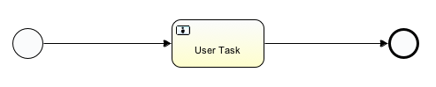

Initially, the diagram will not save because the User Task is missing an
assignee. I'll talk more about assignees later. For now, if it isn't
open already, open the “Properties” view, click the User Task task, and
specify “Assignee” for the performer type and
“\${initiator.properties.userName}” for the Expression, like this:

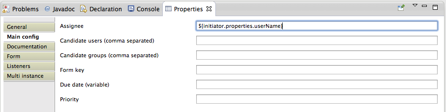

Now the diagram should save.

If you look at the files in your project, you should notice that a new
file, helloWorld.bpmn20.xml, was automatically created when the
.activiti file was saved. That's the actual process definition written
in BPMN XML and it is the file that will get deployed to the Activiti
engine.

I want to put a little logger statement in the process to show you how
to add code to a process. Activiti supports multiple scripting
languages, but in Alfresco's embedded Activiti, JavaScript is the most
practical because it gives you access to the full JavaScript API.

After making sure the .activiti file is saved, I'm going to open up the
BPMN file and look for the sequence flow that connects the start event
to the user task. It should look something like this:

    <sequenceFlow id="flow2" name="" sourceRef="startevent1" targetRef="usertask1"></sequenceFlow>

Activiti has all kinds of hook points for custom code. I want to log a
message when this sequence flow starts, so I'll add an execution
listener on the flow, like this:

    <sequenceFlow id="flow2" name="" sourceRef="startevent1" targetRef="usertask1">
        <extensionElements>
            <activiti:executionListener event="start" class="org.alfresco.repo.workflow.activiti.listener.ScriptExecutionListener">
                <activiti:field name="script">
                    <activiti:string>logger.log("Hello, World!");</activiti:string>
                </activiti:field>
            </activiti:executionListener>
        </extensionElements>
    </sequenceFlow>

You can see that the event I'm hooking into is “start” and the class I'm
executing is an out-of-the-box class called ScriptExecutionListener. The
“activiti:string” element could contain any server-side JavaScript I
need. For right now, I'm keeping it simple with a logger statement. In a
later example, I'll iterate over the documents in the workflow package
and run an action against each one.

The Activiti process designer will keep the diagram (the .activiti file)
synchronized with the BPMN file (the bpmn20.xml file). **But it is very
important to note that in versions 5.7.1 of the process designer and
earlier, the synchronization is one-way, from the diagram to the BPMN
file**. Right now, I have changes in the XML that the diagram doesn't
know about. So I'm going to save the BPMN file and then delete the
activiti file. The next time I open the BPMN file, the activiti file
will be re-created. If I fail to do this, and then make a change to the
activiti file, my beautiful logger statement will be overwritten. After
version 5.7, the synchronization becomes two-way. It is safe to use a
newer version of the process designer than the version of the Activiti
engine that is embedded within Alfresco (Activiti 5.7 is in Alfresco 4).

Before I show you how to deploy the process definition to Alfresco,
let's do another Hello World example that does a fork and a join. I'll
create a new diagram in the workflows folder, but this time I'll call it
“helloWorldFork”. This process will have two user tasks. I will split
the flow using a gateway. I want the two user tasks to happen at the
same time so I'll use a parallel gateway. If I wanted instead to choose
only one path of execution, I'd use an exclusive gateway.

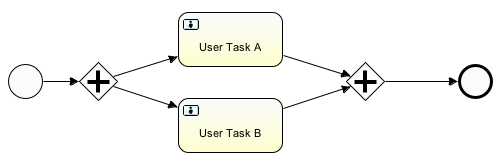

Similar to the first example, I can add a logger statement to the
sequence flows leading to the two user tasks:

    <sequenceFlow id="flow36" name="" sourceRef="parallelgateway5" targetRef="usertask8">
        <extensionElements>
            <activiti:executionListener event="start" class="org.alfresco.repo.workflow.activiti.listener.ScriptExecutionListener">
                <activiti:field name="script">
                    <activiti:string>
                        logger.log("Hello, World, from transition to User Task A!");
                    </activiti:string>
                </activiti:field>
            </activiti:executionListener>
        </extensionElements>
    </sequenceFlow>
    <sequenceFlow id="flow39" name="" sourceRef="parallelgateway5" targetRef="usertask9">
        <extensionElements>
            <activiti:executionListener event="start" class="org.alfresco.repo.workflow.activiti.listener.ScriptExecutionListener">
                <activiti:field name="script">
                    <activiti:string>
                        logger.log("Hello, World, from transition to User Task B!");
                    </activiti:string>
                </activiti:field>
            </activiti:executionListener>
        </extensionElements>
    </sequenceFlow>

With a couple of, admittedly, ridiculously simple examples saved in my
Eclipse project, I'm ready to deploy.

### Deploying processes 

If you are using Alfresco 4 Enterprise, you have a couple of deployment
options. The first option is to use the Activiti Workflow Console which
is accessible to administrators through a link in the Share
Administration console, or by navigating directly to
[http://localhost:8080/alfresco/activiti-admin](http://localhost:8080/alfresco/activiti-admin).
From there clicking Deployments, Upload New will display a file upload
dialog which can be used to upload the bpmn20.xml file.

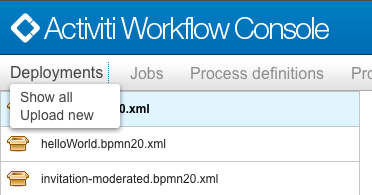

Although we are working to get it added to the Community Edition, the
Activiti Workflow Console isn't there yet, so everyone else will have to
use the other option, which is to include the process definitions in
your classpath and then use either the Explorer Workflow Console,
Spring, or both, to deploy the process.

I'm going to use Spring to deploy my workflows initially. Then, I'll use
the Explorer Workflow Console to deploy subsequent versions if I need
to. In my Eclipse project, in config/alfresco/extension, I'll create a
new Spring context file called someco-workflow-context.xml. In it, I'll
add a workflow deploy bean, like this:

    <bean id="someco.workflowBootstrap" parent="workflowDeployer">
        <property name="workflowDefinitions">
            <list>
                <props>
                    <prop key="engineId">activiti</prop>
                    <prop key="location">alfresco/extension/workflows/helloWorld.bpmn20.xml</prop>
                    <prop key="mimetype">text/xml</prop>
                    <prop key="redeploy">false</prop>
                </props>
                <props>
                    <prop key="engineId">activiti</prop>
                    <prop key="location">alfresco/extension/workflows/helloWorldFork.bpmn20.xml</prop>
                    <prop key="mimetype">text/xml</prop>
                    <prop key="redeploy">false</prop>
                </props>
            </list>
        </property>
    </bean>

I've got “redeploy” set to false to prevent the workflows from being
redeployed every time I restart the web application.

The JavaScript in these business processes contain “logger” statements.
To get those to show up in the log, I'm going to edit
\$TOMCAT\_HOME/webapps/alfresco/WEB-INF/classes/log4j.properties to
change the ScriptLogger to debug:

    log4j.logger.org.alfresco.repo.jscript.ScriptLogger=debug

Now everything is ready to go. The Ant build.xml file included with the
project will put everything in the appropriate extension directory when
I run “ant deploy”. If you are following along, you'll see some content
models and some Java classes getting deployed as well, but they aren't
relevant to these two hello world processes.

You may be wondering what happens to running workflow instances when a
new version of the process definition is checked in. The answer is that
Activiti handles that—it makes sure that running workflows continue to
run with their original process definition. By default, all new
workflows will use the most current version of the process definition.

### Using the workflow console 

I want to make sure my workflows were deployed successfully and I want
to start instances of my hello world processes. The workflow console can
be used to do just that. It can also be a handy workflow debugging tool.

For reasons that cannot be fully explained, the Alfresco Explorer
Workflow Console is not linked to anywhere in the user interface. Like
Easter Island, the pyramids, and Stonehenge, it is one of the great
mysteries of our time. You just have to know that the URL is
[http://localhost:8080/alfresco/faces/jsp/admin/workflow-console.jsp](http://localhost:8080/alfresco/faces/jsp/admin/workflow-console.jsp).
Make sure you log in to Alfresco Explorer as an administrator first.

Once there I can do a “show definitions all” to see what process
definitions have been deployed:

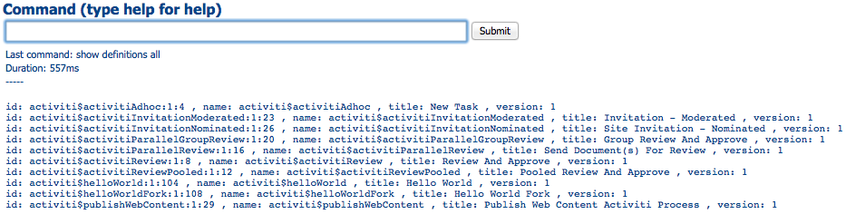

Sure enough, there are helloWorld and helloWorldFork. I want to start an
instance of helloWorld, so I'll do a “use definition
activiti\$helloWorld:1:6104”. Subsequent commands having to do with a
workflow definition will now use that one by default. Simply typing
“start” and clicking “Submit” starts the workflow:

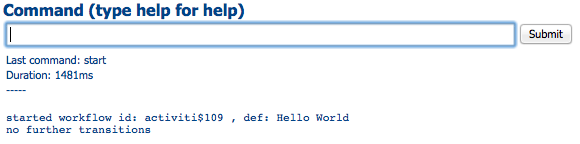

And if I look at catalina.out, I can see the log message:

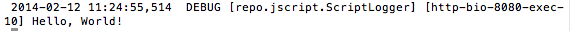

If you are following along, you should be able to do a “use” followed by
a “start” to launch an instance of the helloWorldFork process and see
the log messages from both user tasks.

After running helloWorldFork I want to see if any workflow instances are
still running, so I do, “show workflows all”. I don't fully understand
why, but the helloWorld process completes on its own while the
helloWorldFork process does not. If you are following along, you can
either log in to the web client and end those tasks using the UI, or you
can issue a “use workflow” command followed by a “delete workflow” to
kill the workflow. You should also be able to use “end task” in the
workflow console to end the tasks, but I received a null pointer
exception when attempting to do so.

I've shown how to start workflows and list running workflows from the
workflow console. The table below shows some other common commands and
what they do.

| Command | What it does |
| ------- | ------------ |
| show workflows all | Shows all running workflows. |
| use workflow \<workflow id\> where \<workflow id\> is something like activiti\$6300 | Makes all subsequent commands happen in the context of the specified workflow. |
| show transitions | Shows all leaving transitions. |
| signal \<path id\> \<transition\> where \<path id\> is something like activiti\$6334 and transition is the name of the leaving transition you want to take. Leave off the transition to take the default. | Signals the token. Good when your workflow is stuck on a node or when you want to take a transition without fooling with the task management UI. |
| desc path \<path id\> where \<path id\> is something like activiti\$6334 | Dumps the current context. Great for debugging process variables. |
| end workflow \<workflow id\> where \<workflow id\> is something like activiti\$6300 | Cancels the specified workflow. |
| show definitions all | Shows the current deployed workflows. |
| undeploy definition \<workflow id\> or undeploy definition name \<workflow name\> | Undeploys the specified workflow and stops any workflows running with that definition. The \<workflow id\> variant undeploys a specific version of a workflow.|

Table: Partial list of workflow console commands

These are a subset of the commands available. Type “help” and click
Submit to see the full list of commands.

### Process Variables 

Often, there is metadata about a process that needs to be tracked. A due
date or a priority flag are two examples. A due date isn't really a
property of the content being routed through the workflow—it's a
property of the process itself. Activiti gives us the ability to store
this kind of data as part of the running process through *process
variables.*

Process variables are name-value pairs that will get persisted with the
rest of the process state.

In the example below, I use a “script” element to initialize a couple of
variables:

    <scriptTask id="scripttask1" name="Submit" scriptFormat="javascript">
        
    </scriptTask>

Elsewhere in the process I could read the value of the variable with an
expression like: \${scwf\_tpApproved} or I could test its value in an
expression like \${scwf\_tpApproved == false}.

### Tasks 

Tasks can be assigned to human performers. Activiti maintains a list of
tasks assigned to each participant. How users interact with the task
list is up to each application. In Alfresco, a dashlet displays a to-do
list for the currently logged in user. As users complete their tasks the
tasks are removed from the to-do list. An empty to do list is shown
below.

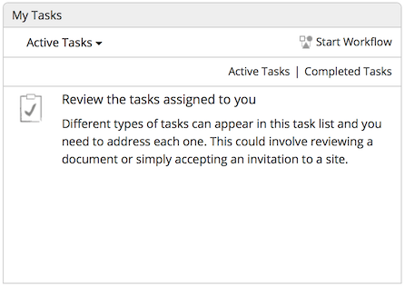

### Task Assignment 

If tasks are steps a human performs, how do tasks get assigned to the
people who need to perform them? Activiti has extended BPMN with their
own attribute called “activiti:assignee”. The value of the attribute can
be a literal username or group name, or it can be an expression. Recall
from the earlier Hello World example that I assigned the user task to
\${initiator.properties.userName}. Initiator is a special object that
will always contain the object representing the person who started the
workflow.

    <userTask id="usertask1" name="User Task" activiti:assignee="${initiator.properties.userName}"\></userTask>

#### Pooled Assignments 

When defining a business process it is important to understand how the
participants in the process will do the work. One specific area that
needs to be considered is whether to use a “pooled assignment” for a
given task. Suppose, for example, you assigned a task to a group of ten
people. You could iterate through the group and assign a task to each
and every member of the group and then not consider the task complete
until some or all group members have taken action. An alternative is to
use a pooled assignment. Using a pool, all members of a group are
notified of the task, but as soon as one group member takes “ownership”
of the task, it is removed from everyone else's to do list. The owner
can then either complete the task or return it to the pool. If it is
returned to the pool, all members of the group see the task in their to
do list until another person takes ownership or completes the task. To
use pooled assignment, use the “activiti:candidateGroups” attribute on
the userTask element instead of the “activiti:assignee” element.

The decision to use pooled actors or not depends entirely on the
business process—there is no best practice approach.

Wiring a process to the Alfresco UI 
-----------------------------------

So far I've covered the definition of workflow, specifics around the
Activiti engine, and process deployment. And I showed how to run a
couple of simple processes entirely from the workflow console. But I
haven't addressed how to expose a process to Alfresco web client users.

Workflows are exposed to the user interface through the form service.
The form service takes a description of a content model as well as a
form configuration and spits out a nice form. So, configuring the
workflow in the user interface is simply a matter of defining a
corresponding content model and then configuring the form service to use
it, just as you would for a content model unrelated to workflow.

If you need a refresher on how this works, take a look at the “Custom
Content Types” tutorial. The steps are:

1.  Define a content model for your workflow in which workflow tasks map
    to content types.

2.  Configure the web client to tell Alfresco how to expose the process
    metadata to the web client user interface. Recall from the “Custom
    Content Types” tutorial that web-client-config-custom.xml is used to
    configure Alfresco Explorer while share-config-custom.xml is used to
    configure the Alfresco Share web client.

3.  Externalize the strings.

I'm going to walk you through one more Hello World example. But this one
will incorporate the user interface. After that, I'll take you through a
real world example that builds upon the SomeCo work started in previous
tutorials.

The goal here is to create a workflow which will capture a piece of
metadata (a name the logger should for a greeting) when the workflow is
submitted, and then write the greeting out to the log. So, over in my
Eclipse project, I'll create a new process in my workflows folder called
helloWorldUI with the following:

-   a start event,
-   an end event,
-   an Alfresco User Task, and
-   an Alfresco Script Task.

I'm using the Alfresco-specific tasks just for fun. They can save you a
bit of typing.

After hooking everything up, the diagram looks like this:

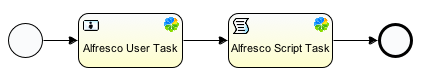

The next step is to set the properties on the Alfresco User Task. The
performer type and expression is the same as in prior examples. What's
new is that I am going to set the form key. Because I used the Alfresco
User Task, it already knows the out-of-the-box form keys. I'll pick
“wf:activitiReviewTask”. That value is actually a type defined in the
out-of-the-box content model. The type defines a set of properties. And
the out-of-the-box form configuration already knows how to display those
properties.

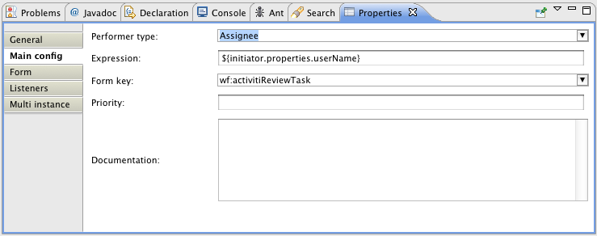

The requirement is to let the workflow initiator specify a name that the
logger will use in a greeting. So the start event needs to point to a
custom form key. I'll call it “scwf:submitHelloWorldTask”. I'll create a
custom type of that name in a new content model shortly.

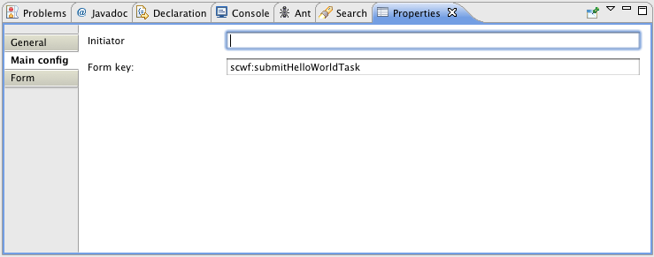

### Add logic to the process definition 

The diagram is done. Now I'll switch to the BPMN XML and add just a
little bit of logic. The review task lets the user select “approve” or
“reject”. The execution of the workflow needs the value of that
selection, so I need to add some logic to make that happen:

    <userTask id="usertask1" name="User Task" activiti:assignee="${initiator.properties.userName}" activiti:formKey="wf:activitiReviewTask">
        <extensionElements>
            <activiti:taskListener event="complete" class="org.alfresco.repo.workflow.activiti.tasklistener.ScriptTaskListener">
                <activiti:field name="script">
                    <activiti:string>execution.setVariable('wf_reviewOutcome', task.getVariable('wf_reviewOutcome'));</activiti:string>
                </activiti:field>
            </activiti:taskListener>
        </extensionElements>
    </userTask>

Next, I want the log to print the greeting:

    <sequenceFlow id="flow1" name="" sourceRef="startevent1" targetRef="usertask1">
        <extensionElements>
            <activiti:executionListener event="start" class="org.alfresco.repo.workflow.activiti.listener.ScriptExecutionListener">
                <activiti:field name="script">
                    <activiti:string>logger.log("Hello, " + scwf_helloName + "!");</activiti:string>
                </activiti:field>
            </activiti:executionListener>
        </extensionElements>
    </sequenceFlow>

And, finally, just to show that a value can be set in one task and read
in another, I'll log the value of the approve/reject selection. I'll do
this from within the Alfresco Script service task:

    <serviceTask id="alfrescoScripttask1" name="Alfresco Script Task" activiti:class="org.alfresco.repo.workflow.activiti.script.AlfrescoScriptDelegate">
        <extensionElements>
            <activiti:field name="script">
                <activiti:string>logger.log("The outcome of the review task is: " + wf_reviewOutcome);</activiti:string>
            </activiti:field>
        </extensionElements>
    </serviceTask>

Now the process is ready to go. The next step is to get the workflow
content model squared away.

### Define a workflow-specific content model 

The workflow-specific content model defines the data structure for the
process. Workflow models use the same fundamental building blocks—types,
properties, aspects, and associations—as “normal” Alfresco content model
definitions. In fact, if you already have a custom model, you can define
your workflow-specific model in the same content model XML file,
although to reduce confusion, I recommend you keep your content types
separate from your workflow types by using at least two different model
files.

What is the purpose of the workflow-specific model? Think of it like any
other content model. Custom content models are used to define the
metadata that needs to be captured about a piece of content. The
metadata (properties) are grouped into types and aspects. By virtue of
defining these properties as part of the content model, Alfresco takes
care of persisting the data to the underlying database.

Workflow models function in the same way. Suppose you have a process in
which three different departments are involved in an approval process.
Maybe you'd like the workflow initiator to be able to define which of
those departments are required approvers and which are optional or “FYI”
reviewers. A workflow model would define how that information is going
to be stored.

As in other content models, you don't have to start from scratch.
Alfresco ships out-of-the-box with some workflow-specific types already
defined. There are two model definition files related to this. One is
called called bpmModel.xml. It resides in your Alfresco web application
root under WEB-INF/classes/alfresco/model. The other is called
workflowModel.xml and it resides under
WEB-INF/classes/alfresco/workflow.

The **bpmModel** file contains the lowest-level workflow classes such as
the base definition for all tasks and the default start task. It also
contains important aspects such as a set of “assignee” aspects that
define associations between tasks and users or groups.

The **workflowModel** file contains the content model for the
out-of-the-box process definitions. This model file offers a lot of
potential for reuse in your custom processes. For example, if your
process starts by allowing the submitter to specify a list of several
people to receive a task, you could use the
“wf:submitParallelReviewTask” type. If you want to base an approval on
the percentage of individuals who approve a task, you can use the
“wf:submitConcurrentReviewTask” type. Of course just like any model you
are free to use these as-is, extend them, or not use them at all.

When users interact with the workflow via the web client, Alfresco will
use the workflow content model and the web client configuration file to
figure out what metadata to expose to the UI and how to present it just
as it does when viewing content properties. In Activiti, Alfresco uses
the value of the form key attribute to figure out the appropriate
workflow content type. So, **all tasks in which there are Alfresco web
client user interactions must be given a form key that corresponds to
the name of a workflow content type.**

In the helloWorldUI example, I defined the following start event:

    <startEvent id="startevent1" name="Start" activiti:formKey="scwf:submitHelloWorldTask"></startEvent>

Now I need to create a content model with a custom type that corresponds
to the form key value. From previous tutorials you know that models are
defined in XML and reside in the Eclipse project under
config/alfresco/extension/model. I'll create a content model just for
SomeCo workflows in a file called scWorkflowModel.xml. It defines a
namespace, “scwf”, and a type. Here's a snippet:

    <types>
        <type name="scwf:submitHelloWorldTask">
            <parent>bpm:startTask</parent>
            <properties>
                <property name="scwf:helloName">
                    <type>d:text</type>
                    <mandatory>true</mandatory>
                    <multiple>false</multiple>
                </property>
            </properties>
        </type>
    </types>

The type is a child of bpm:startTask and declares a property called
“scwf:helloName”. That's a text property that will be displayed as a
text field the workflow initiator can use to tell the workflow who to
greet.

Alfresco needs to know about this model. I'll add it to the workflow
context file shortly.

### Configure the web client 

The next step is to tell Alfresco how to display the process metadata.
This works exactly like custom content types. Continuing the example, I
need to tell the user interface to show the “scwf:helloName” property
when the “scwf:submitHelloWorldTask” is used. The snippet below shows
how to do that in the web-client-config-custom.xml for Alfresco
Explorer:

    <config evaluator="node-type" condition="scwf:submitHelloWorldTask" replace="true">
        <property-sheet>
            <show-property name="scwf:helloName" />
        </property-sheet>
    </config>

And here is how to do that in share-config-custom.xml for Alfresco
Share:

    <config evaluator="string-compare" condition="activiti$helloWorldUI">
        <forms>
            <form>
                <field-visibility>
                    <show id="bpm:workflowDescription" />
                    <show id="packageItems" />
                    <show id="scwf:helloName" />
                    <show id="transitions" />
                </field-visibility>
                <appearance>
                    <set id="" appearance="title" label-id="workflow.set.general" />
                    <set id="items" appearance="title" label-id="workflow.set.items" />
                    <set id="other" appearance="title" label-id="workflow.set.other"/>
                    <set id="response" appearance="title" label-id="workflow.set.response" />
                    <field id="bpm:workflowDescription" label-id="workflow.field.message">
                        <control template="/org/alfresco/components/form/controls/textarea.ftl">
                            <control-param name="style">width: 95%</control-param>
                        </control>
                    </field>
                    <field id="packageItems" set="items" />
                    <field id="helloName" set="other" />
                    <field id="transitions" set="response" />
                </appearance>
            </form>
        </forms>
    </config>

Now, when someone starts the helloWorldUI workflow from either web
client, the form will render a field that will capture the
“scwf:helloName” property.

### Externalize the strings 

The final step is to externalize the strings used to display things like
the workflow title and description that show up in the “Start Advanced
Workflow” dialog, and titles and descriptions for individual tasks. The
identifiers for these strings follow a specific format. I'll put my
properties in config/alfresco/extension/messages/scWorkflow.properties:

    # Workflow related strings
    helloWorldUI.workflow.title=Hello World UI (Activiti)
    helloWorldUI.workflow.description=A simple hello world process using Activiti
    
    # Workflow Model related strings
    scwf_workflowmodel.type.scwf_submitHelloWorldTask.title=Start Hello World UI Workflow
    scwf_workflowmodel.type.scwf_submitHelloWorldTask.description=Submit a workflow that says hello in the log
    scwf_workflowmodel.property.scwf_helloName.title=Name
    scwf_workflowmodel.property.scwf_helloName.description=Say hello to this person

I tend to think of these properties as belonging to two groups. One
group is the set of model-related properties. These properties
externalize the strings in the workflow content model. The other is the
set of process-related properties. These properties externalize the
strings users see when they are working with the process (the workflow
title, the workflow history, etc.).

Alfresco has to be told about the properties file. I also need to tell
it about the custom workflow model. The helloWorldUI workflow needs to
be added to the list of workflows to be added as well. I'll update the
someco-workflow-context.xml file I created earlier with:

                <props>
                    <prop key="engineId">activiti</prop>
                    <prop key="location">alfresco/extension/workflows/helloWorldUI.bpmn20.xml</prop>
                    <prop key="mimetype">text/xml</prop>
                    <prop key="redeploy">false</prop>
                </props>
            </list>
        </property>
        <property name="models">
            <list>
                <value>alfresco/extension/model/scWorkflowModel.xml</value>
            </list>
        </property>
        <property name="labels">
            <list>
                <value>alfresco.extension.messages.scWorkflow</value>
            </list>
        </property>
    </bean>

The helloWorldUI example is now ready to deploy.

Implementation summary 
----------------------

I've covered a lot of ground so far. The following summarizes the
advanced workflow implementation steps:

1.  Model the process using the Activiti Process Designer. Add logic
    using expressions, Alfresco JavaScript, or Java classes.
2.  Define a workflow content model. If you use a new content model
    file, remember to update the Spring context XML file to point to the
    new content model definition XML file.
3.  Update the appropriate web client configuration files
    (web-client-config-custom.xml and share-config-custom.xml) to expose
    workflow tasks to the Alfresco web client.
4.  Create/update a workflow-specific properties file to externalize the
    strings in both the workflow model and the process definition.
5.  Deploy the process definition using the workflow deployer Spring
    bean.

If you are following along, you can deploy using “ant deploy”. After
starting Tomcat, you be able to log in and see the Hello World UI
workflow in the list of workflows:

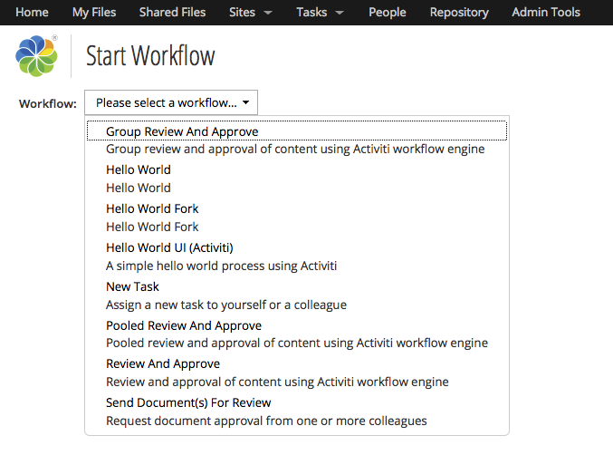

And when you select the Hello World UI workflow, the greeting field
should be displayed:

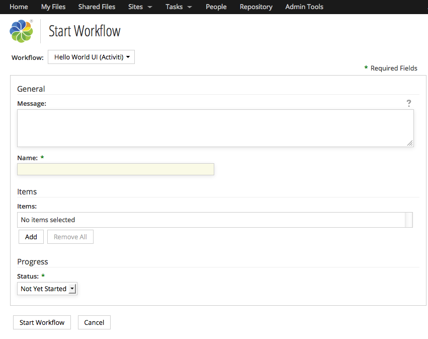

After the workflow starts, you should see the greeting in the log:

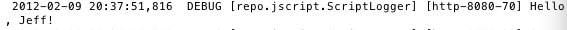

After approving or rejecting the review task, you should see a log
message showing which one you selected:

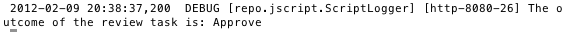

At this point you know enough about advanced workflows to be dangerous.
Let's work through an example to put some of this new knowledge to work.

Part 2: SomeCo Whitepaper submission example 
============================================

This example continues the SomeCo example from the past several
“Alfresco Developer Series” tutorials. SomeCo is going to use Advanced
Workflows to route Whitepapers for approval before being flagged for
publication on the web site. The next section describes the process.

Business process description 
----------------------------

Anyone that can log in to Alfresco can submit a whitepaper for
publication on the web site. The only information the submitter needs to
specify is the email address of an external third-party reviewer, if
applicable. More on that shortly.

The whitepaper needs to be reviewed by the Engineering team as well as
the Marketing team. It doesn't matter who on the team does the
review—SomeCo wants to notify each team and then let one representative
from each team “own” the review task. Either team can reject the
whitepaper. If rejected, the person who submitted the whitepaper can
make revisions and resubmit. If both teams approve, the whitepaper moves
on to the next step.

Some whitepapers need to be reviewed by an external third-party. The
third-party won't actually log in to Alfresco—they'll get an email and
click a link to approve or reject the whitepaper. If the third-party
doesn't do anything in a certain amount of time, the whitepaper should
be automatically approved.

High-level steps 
----------------

Alright. We're going to implement this process in four major steps.
Here's a look at the major steps and the respective sub-steps:

1.  Implement the basic flow and workflow user interface
    1.  Lay out the process using the Activiti Process Designer.
    2.  Configure user tasks with appropriate assignments.
    3.  Add decision logic.
    4.  Implement the workflow content model, the workflow client
        configuration, and the workflow properties.
    5.  Deploy and test.
2.  Implement web scripts and actions for external third-party
    integration and other business logic
    1.  Execute the “set web flag” action (created in an earlier
        tutorial) against every whitepaper in the workflow package. The
        action adds the “sc:webable” aspect to the whitepaper and sets
        the properties appropriately.
    2.  Write a web script to handle approval/rejection via HTTP. The
        logic needs to grab the task and then set the outcome with the
        appropriate “approve” or “reject” flag.
    3.  Write an Activiti taskListener Java class that sends a
        notification to the third-party email address.
    4.  Deploy and test.
3.  Add a timer to the third-party task
    1.  Add a timer to the Third Party Review task so that if the third
        party doesn't respond in a timely fashion the task will
        automatically approve.
    2.  Deploy and test.

Now that you know where we're headed at a high-level, let's get into the
details.

Step 1: Implement the basic flow and workflow user interface 
------------------------------------------------------------

Just like in the Hello World examples, the first thing to do is diagram
the process. Then, I'll assign tasks, add a bit of logic and establish
the workflow content model before a quick deploy and test.

### Layout the process 

I'm going to place my workflow in a file called publishWhitepaper in the
workflows folder alongside the previous examples.

Using the Activiti Process Designer, lay out the process as follows:

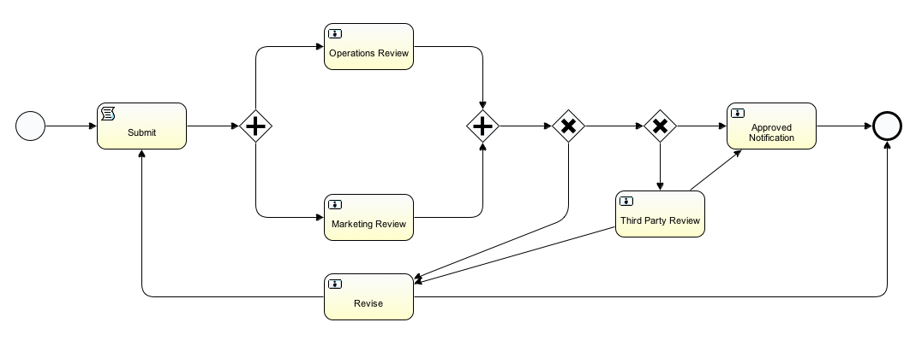

Submit is a Script Task. The rest are User Tasks. I'm not using the
Alfresco-specific events or tasks for any of these in this example, but
feel free to do so in your own diagrams to save some typing.

### Configure User Tasks with Assignments 

This table tells you how to set the performer type, expression, and form
key on each task:

| Task | Performer Type | Expression | Form Key |
| ---- | -------------- | ---------- | -------- | 
| Start Event | N/A | N/A | scwf:submitReviewTask |
| Operations Review | Candidate Groups | GROUP\_Operations | scwf:activitiOperationsReview |
| Marketing Review | Candidate Groups | GROUP\_Marketing | scwf:activitiMarketingReview |
| Revise | Assignee | \${initiator.properties.userName} | scwf:activitiRevise |
| Third-Party Review | Assignee | \${initiator.properties.userName} | scwf:activitiThirdPartyReview |
| Approved Notification | Assignee | \${initiator.properties.userName} | scwf:activitiApprovedNotification |

Table: Settings for performer, expression, & form key

### Add decision logic 

At this point the .activiti file should save without a problem. Now it
is time to switch to the BPMN XML and add some decision logic to the
process.

The process definition has two decisions. One decision figures out if
all required approvals have been obtained. If so, the process continues.
If not, the initiator gets a chance to make revisions. The other
decision is used to determine if a third-party review is required based
on whether or not the initiator provided an email address.

These are pretty easy decisions to make based on process variables. For
the “All Approved” decision, I will increment a counter when the process
follows an “approve” sequence flow. If the counter is equal to 2, I know
the package received both approvals.

I need to be careful to initialize the counter to 0 and the approved
variable to false because it's possible that a whitepaper may go through
several review cycles. The “Submit” node is a convenient place to do
that:

    <scriptTask id="scripttask1" name="Submit" scriptFormat="javascript">
        
    </scriptTask>

Now I need to increment the counter when the approve sequence flow is
taken. Looking at the Operations Review as an example, I can add some
JavaScript that will run when the task completes to increment the
counter:

    <userTask id="usertask1" name="Operations Review" activiti:candidateGroups="GROUP_Operations" activiti:formKey="scwf:activitiOperationsReview">
        <extensionElements>
            <activiti:taskListener event="complete" class="org.alfresco.repo.workflow.activiti.tasklistener.ScriptTaskListener">
                <activiti:field name="script">
                    <activiti:string>    
                        if(task.getVariableLocal('scwf_approveRejectOutcome') == 'Approve') {
                            var newApprovedCount = scwf_approveCount + 1;
                            execution.setVariable('scwf_approveCount', newApprovedCount);
                        }
                    </activiti:string>
                </activiti:field>
            </activiti:taskListener>
        </extensionElements>
    </userTask> 

The code is identical for the Marketing Review, so I'll leave that out.
With those two task listeners in place, I can add code to the decision
that will choose the appropriate path based on the counter:

    <sequenceFlow id="flow8" name="" sourceRef="exclusivegateway1" targetRef="usertask3">
        <conditionExpression xsi:type="tFormalExpression"><![CDATA[${scwf_approveCount < 2}]]></conditionExpression>
        </sequenceFlow>
        <sequenceFlow id="flow9" name="" sourceRef="exclusivegateway1" targetRef="exclusivegateway2">
        <conditionExpression xsi:type="tFormalExpression"><![CDATA[${scwf_approveCount ==
        2}]]></conditionExpression>
    </sequenceFlow>

For the “Third Party” decision I'll do something similar. In this case
I'm going to check a user-provided value.

    <sequenceFlow id="flow10" name="" sourceRef="exclusivegateway2" targetRef="usertask5">
        <conditionExpression xsi:type="tFormalExpression"><![CDATA[${scwf_reviewerEmail != ''}]]></conditionExpression>
    </sequenceFlow>
    <sequenceFlow id="flow11" name="" sourceRef="exclusivegateway2" targetRef="usertask4">
        <conditionExpression xsi:type="tFormalExpression"><![CDATA[${scwf_reviewerEmail == ''}]]></conditionExpression>
    </sequenceFlow>

There are two more places condition expressions are needed. One is on
the two flows that leave Third Party Review. I want to go to the
Approved Notification if the third-party approves and Revise if they do
not:

    <sequenceFlow id="flow13" name="" sourceRef="usertask5" targetRef="usertask3">
        <conditionExpression xsi:type="tFormalExpression"><![CDATA[${scwf_tpApproved == false}]]></conditionExpression>
    </sequenceFlow>
    <sequenceFlow id="flow16" name="" sourceRef="usertask5" targetRef="usertask4">
        <conditionExpression xsi:type="tFormalExpression"><![CDATA[${scwf_tpApproved ==
    true}]]></conditionExpression>
    </sequenceFlow>

Then, on the Revise user task, I want to go to the Submit script task if
the initiator re-submits and the end if they decide to withdraw or abort
their request:

    <sequenceFlow id="flow14" name="" sourceRef="usertask3" targetRef="endevent1">
        <conditionExpression xsi:type="tFormalExpression"><![CDATA[${scwf_resubmit ==
    false}]]></conditionExpression>
    </sequenceFlow>
    <sequenceFlow id="flow15" name="" sourceRef="usertask3" targetRef="scripttask1">
        <conditionExpression xsi:type="tFormalExpression"><![CDATA[${scwf_resubmit ==
    true}]]></conditionExpression>
    </sequenceFlow>

You may be thinking that my sequence flow ID's aren't very helpful. I
agree. I'd love to use more descriptive ID's but the Activiti Process
Designer plug-in always changes them back for some reason.

### Workflow content model, UI config, and localization 

The process has been defined. It doesn't have all of the logic it will
have eventually, but it has enough that I can step through all paths in
the process.

The next step is to integrate the process with the Alfresco user
interface by defining the content model and updating the client
configuration.

In the earlier examples, I already created a workflow content model XML
file and pointed to that as well as my message bundle in a Spring bean
configuration. So the first thing I need to do is update the content
model XML (scWorkflowModel.xml) with types and aspects specific to the
publish whitepaper process.

    <type name="scwf:submitReviewTask">
        <parent>bpm:startTask</parent>
        <mandatory-aspects>
            <aspect>scwf:thirdPartyReviewable</aspect>
        </mandatory-aspects>
    </type>
    <type name="scwf:activitiMarketingReview">
        <parent>scwf:activitiReviewTask</parent>
    </type>
    <type name="scwf:activitiOperationsReview">
        <parent>scwf:activitiReviewTask</parent>
    </type>
    <type name="scwf:activitiThirdPartyReview">
        <parent>scwf:activitiReviewTask</parent>
    </type>
    <type name="scwf:activitiRevise">
        <parent>bpm:activitiOutcomeTask</parent>
        <properties>
            <property name="scwf:reviseOutcome">
                <type>d:text</type>
                <default>Abort</default>
                <constraints>
                    <constraint type="LIST">
                        <parameter name="allowedValues">
                            <list>
                                <value>Re-submit</value>
                                <value>Abort</value>
                            </list>
                        </parameter>
                    </constraint>
                </constraints>
            </property>
        </properties>
        <overrides>
            <property name="bpm:packageItemActionGroup">
            <default>edit_package_item_actions</default>
            </property>
            <property name="bpm:outcomePropertyName">
            <default>{http://www.someco.com/model/workflow/1.0}reviseOutcome</default>
            </property>
        </overrides>
    </type>
    <type name="scwf:activitiReviewTask">
        <parent>bpm:activitiOutcomeTask</parent>
        <properties>
            <property name="scwf:approveRejectOutcome">
                <type>d:text</type>
                <default>Reject</default>
                <constraints>
                    <constraint type="LIST">
                        <parameter name="allowedValues">
                            <list>
                                <value>Approve</value>
                                <value>Reject</value>
                            </list>
                        </parameter>
                    </constraint>
                </constraints>
            </property>
        </properties>
        <overrides>
            <property name="bpm:packageItemActionGroup">
                <default>read_package_item_actions</default>
            </property>
            <property name="bpm:outcomePropertyName">
                <default>{http://www.someco.com/model/workflow/1.0}approveRejectOutcome</default>
            </property>
        </overrides>
    </type>
    <type name="scwf:activitiApprovedNotification">
        <parent>bpm:workflowTask</parent>
        <overrides>
            <property name="bpm:packageItemActionGroup">
                <default>read_package_item_actions</default>
            </property>
        </overrides>
    </type>

There's one type for each task. The name of each type matches the form
key of the user task.

You'll notice that each type inherits from a type defined in the BPM
content model. If you look at the bpmModel.xml file you'll see that the
bpm:startTask has helpful properties such as the workflow description,
due date, and priority.

The bpm:workflowTask has an association called bpm:package. The
bpm:package points to a bpm:workflowPackage which is the aspect applied
to a container (like a folder) that holds the documents being routed
through a workflow. When you write code that needs to access the content
being routed in a workflow you can get to it through the bpm:package
association.

The “bpm:packageItemActionGroup” defines what actions are available for
working with the content in the workflow at that particular step in the
process. In our case, I want the initiator to be able to change the
contents of the workflow when the workflow is started and when making
revisions, but I don't want the reviewers to be able to add or remove
anything to or from the workflow.

The start task has a mandatory aspect called
“scwf:thirdPartyReviewable”. I'll define that aspect to contain a
property I can use to store the third-party reviewer's email address:

    <aspects>
        <aspect name="scwf:thirdPartyReviewable">
            <title>Someco Third Party Reviewable</title>
            <properties>
                <property name="scwf:reviewerEmail">
                    <type>d:text</type>
                    <mandatory>true</mandatory>
                    <multiple>false</multiple>
                </property>
            </properties>
        </aspect>
    </aspects>

Now I need to tell Alfresco how to render the properties in the workflow
model. You saw how to do this earlier. Alfresco Explorer is configured
in web-client-config-custom.xml while Alfresco Share is configured in
share-config-custom.xml. Because it is mostly repetitive, I'll just show
the “scwf:activitiReviewTask” configuration for Alfresco Share here and
if you want to see the Explorer configuration or the rest of the Share
configuration, you can look at the source that accompanies this article.

    <config evaluator="task-type" condition="scwf:activitiReviewTask">
        <forms>
            <form>
                <field-visibility>
                    <show id="bpm:workflowDescription" />
                    <show id="packageItems" />
                    <show id="scwf:approveRejectOutcome" />
                    <show id="transitions" />
                </field-visibility>
                <appearance>
                    <set id="" appearance="title" label-id="workflow.set.general" />
                    <set id="info" appearance="" template="/org/alfresco/components/form/2-column-set.ftl" />
                    <set id="assignee" appearance="title" label-id="workflow.set.assignee" />
                    <set id="items" appearance="title" label-id="workflow.set.items" />
                    <set id="response" appearance="title" label-id="workflow.set.response" />
                    <field id="bpm:workflowDescription" label-id="workflow.field.message">
                        <control template="/org/alfresco/components/form/controls/textarea.ftl">
                            <control-param name="style">width: 95%</control-param>
                        </control>
                    </field>
                    <field id="packageItems" set="items" />
                    <field id="scwf:approveRejectOutcome" set="response" />
                    <field id="transitions" set="response" />
                </appearance>
            </form>
        </forms>
    </config>

Something that isn't immediately obvious without looking closely at the
accompanying Share form configuration is that there are multiple
workflow form configurations needed for a given workflow. This table can
help you figure out what configuration does what:

| For example, this configuration... | Is used by Share to figure out... |
| ---------------------------------- | --------------------------------- |
| \<config evaluator="string-compare" condition="activiti\$publishWhitepaper"\> | What form to use when a workflow is started that has an ID matching the condition. |
| \<config evaluator="task-type" condition="scwf:activitiReviewTask"\>\<form\>...\</form\> | What form to use when someone manages a task with an activiti:formKey that matches the condition. |
| \<config evaluator="task-type" condition="scwf:activitiReviewTask"\>\<form id=”workflow-details”\>...\</form\> | What form to use when someone opens the “Workflow Details” page (e.g., from Workflows I've Started) where the last completed task has an activiti:formKey that matches the condition. |

Table: What does the config do?

The last step is to externalize the strings in the model and process.
Remember that in the helloWorldUI example the strings went into
scWorkflow.properties. So I'll add the publish whitepaper properties to
that file. The first set of strings to add have to do with the process:

    publishWhitepaper.workflow.title=Publish Whitepaper to Web (Activiti)
    publishWhitepaper.workflow.description=Review and approve Someco Whitepaper content using Activiti

Note that the first part of the property key matches the name I gave the
process definition. The values for the workflow.title and
workflow.description keys will be what the user sees when she clicks
“Start Advanced Workflow” in the Alfresco web client.

The next set of properties are directly related to the workflow model:

    scwf_workflowmodel.type.scwf_submitReviewTask.title=Start Someco Web Review
    scwf_workflowmodel.type.scwf_submitReviewTask.description=Submit Someco Web documents for review & approval to a group of people
    
    scwf_workflowmodel.type.scwf_activitiMarketingReview.title=Marketing Review
    scwf_workflowmodel.type.scwf_activitiMarketingReview.description=Review documents for impact on Someco marketing message
    
    scwf_workflowmodel.type.scwf_activitiOperationsReview.title=Operations Review
    scwf_workflowmodel.type.scwf_activitiOperationsReview.description=Review documents for technical accuracy and best practices
    
    scwf_workflowmodel.type.scwf_activitiThirdPartyReview.title=Third Party Review
    scwf_workflowmodel.type.scwf_activitiThirdPartyReview.description=Obtain third party approval
    
    scwf_workflowmodel.type.scwf_activitiRevise.title=Revise
    scwf_workflowmodel.type.scwf_activitiRevise.description=Make changes then resubmit or abort
    
    scwf_workflowmodel.type.scwf_activitiReviewTask.title=Review
    scwf_workflowmodel.type.scwf_activitiReviewTask.description=Approve or reject this change
    
    scwf_workflowmodel.property.scwf_reviewerEmail.title=Reviewer email
    scwf_workflowmodel.property.scwf_reviewerEmail.description=Third-party reviewer email address
    
    scwf_workflowmodel.property.scwf_approveRejectOutcome.title=Outcome
    scwf_workflowmodel.property.scwf_approveRejectOutcome.description=Reviewer outcome
    
    scwf_workflowmodel.property.scwf_reviseOutcome.title=Outcome
    scwf_workflowmodel.property.scwf_reviseOutcome.description=Reviewer outcome

The first part of the key is the name of the workflow model, then
whether or not this key is for a type or a property, then the name of
the type or property. These are the strings shown when someone manages a
task.

### Deploy and test 

If you are following along, you can use “ant deploy” in both the repo
project and the Share project to deploy the workflow, content model, and
user interface config to the alfresco and Share WARs.

If you haven't done so already, create a group called “Operations” and a
group called “Marketing” and place one or more test users in each group.

You should be able to create a piece of test content and then run
through the workflow. It won't change the status of the whitepaper just
yet, but at least it will verify that the tasks flow from one to another
like you expect.

Step 2: Implement web scripts and actions 
-----------------------------------------

Now that the base process is running and it's hooked in to the Alfresco
UI, it's time to pimp it out with some business logic.

### Call the set-web-action in the Approved node 

I'll work on the Approved node first because it's easy. When a
whitepaper is approved I want to add the “sc:webable” aspect to it and
set the “isActive” and “published” properties. You may recall from the
“Custom Actions” article that I already have an action that does this,
so all I have to do is tell the process to execute it via Alfresco
JavaScript:

    <userTask id="usertask4" name="Approved Notification" activiti:assignee="${initiator.properties.userName}" activiti:formKey="scwf:activitiApprovedNotification">
        <extensionElements>
            <activiti:taskListener event="create" class="org.alfresco.repo.workflow.activiti.tasklistener.ScriptTaskListener">
                <activiti:field name="script">
                    <activiti:string>
                        var setWebFlagAction = actions.create("set-web-flag");
                        setWebFlagAction.parameters["active"] = true;
                        for (var i = 0; i &lt; bpm_package.children.length; i++) {
                            logger.log("Approving node:" + bpm_package.children[i].nodeRef);
                            setWebFlagAction.execute(bpm_package.children[i]);
                        }
                    </activiti:string>
                </activiti:field>
            </activiti:taskListener>
        </extensionElements>
    </userTask>

This is a straightforward piece of Alfresco JavaScript that executes the
custom action called “set-web-flag” for every piece of content in the
workflow package. The action adds the aspect and sets the properties
appropriately.

That's all that's needed to handle the approval. Now for the Third Party
Review.

### Implement the external third-party review 

Activiti may have an out-of-the-box mechanism for exposing business
processes to external parties. I'm porting my jBPM third-party review,
so, honestly, I didn't spend much time investigating whether it would
work for my use case or not.

In my example, I'm rolling my own notification and third-party approval
using the out-of-the-box mail action and web scripts. There are two
pieces required to make this work. The first piece is some Java code
that will send an email to the third party with “approve” and “reject”
links in the email body. The recipient will open their email and click
on either the approve link or the reject link. This won't require
logging in to Alfresco at all. The second part is a web script that gets
called when the recipient clicks the links. The web script will get a
handle to the workflow task and set the outcome appropriately.

This may seem backwards, but I'll build the web script that handles the
links first, then I'll build an Activiti task listener class that sends
the email notification.

#### Implement the Web Script 

I've covered the Web Script Framework in a previous tutorial (See “More
Information”) so let me just show you the Java class that acts as the
web script controller. Here's the executeImpl() method:

    protected Map<String, Object> executeImpl(WebScriptRequest req, Status status) {
        final String id = req.getParameter("id");
        final String action = req.getParameter("action");
        
        if (id == null || action == null) {
            status.setCode(400);
            status.setMessage("Required data has not been provided");
            status.setRedirect(true);
        }
        
        Map<String, Object> model = new HashMap<String, Object>();
        Map<QName, Serializable> props = new HashMap<QName, Serializable>();
        
        props.put(QName.createQName(SomeCoModel.NAMESPACE_SOMECO_WORKFLOW_CONTENT_MODEL,
        SomeCoModel.PROP_APPROVE_REJECT_OUTCOME), action);
        
        workflowService.updateTask(id, props, null, null);
        workflowService.endTask(id, action);
        
        return model;
    }

The class grabs the task ID and the action to take (the outcome) and
then uses the workflow service to update and end the task. So, for
example, if someone were to post this URL:

    http://localhost:8080/alfresco/service/someco/bpm/review?id=activiti\$89&action=Approve

the Java class would update the task identified by activiti$89 with the
“Approve” outcome[^3^](#sdfootnote3sym).

#### Create a custom task listener 

The second piece to the Third Party Review is sending the email to the
third-party. There is an out-of-the-box mail action, and you've already
seen how to call an action from a workflow using Alfresco JavaScript,
but there are a few things to take care of other than simply sending an
email, so I'll write a custom task listener class to handle it.

I'll create a new class called com.someco.bpm.ExternalReviewNotification
that implements TaskListener. I need to build an email that has two
links—one for approve and one for reject—that represent the two possible
outcomes of the Third Party Review user task. The links need to include
the task ID and the desired outcome as arguments.

The task listener's notify method will be called by Activiti. Here is
what the method looks like:

    public void notify(DelegateTask task) {
    
        String recipient = (String)
        task.getVariable(ExternalReviewNotification.RECIP_PROCESS_VARIABLE);
        
        StringBuffer sb = new StringBuffer();        
        sb.append("You have been assigned to a task named ");
        sb.append(task.getName());
        sb.append(". Take the appropriate action by clicking one of the links below:rnrn");
        sb.append(getLink(task.getId(), "Approve"));
        sb.append(getLink(task.getId(), "Reject"));
        
        ActionService actionService = getServiceRegistry().getActionService();
        Action mailAction = actionService.createAction(MailActionExecuter.NAME);
        
        mailAction.setParameterValue(MailActionExecuter.PARAM_SUBJECT, ExternalReviewNotification.SUBJECT);
        mailAction.setParameterValue(MailActionExecuter.PARAM_TO, recipient);
        mailAction.setParameterValue(MailActionExecuter.PARAM_FROM, ExternalReviewNotification.FROM_ADDRESS);
        mailAction.setParameterValue(MailActionExecuter.PARAM_TEXT, sb.toString());
        
        actionService.executeAction(mailAction, null);
        
        return;        
    }

The first thing the method does is grab the recipient from a process
variable. Next, I start building the message body with a string buffer.
The task.getName() call grabs the node name (“Third Party Review”).

In the jBPM version of this code, rather than hardcode the outcomes,
“Approve” and “Reject”, I iterate over the leaving transitions. To do
that here, I think I'd have to use the Dictionary Service to look up the
constraints on that outcome variable.

The getLink() call is just a helper method that produces a link that
looks like this:

    http://localhost:8080/alfresco/service/someco/bpm/review?id=activiti\$999&action=Approve&guest=true

The method has the host and port hardcoded which is another thing you'd
want to fix if you did this for real.

The last major block of code uses the action service to execute the
Alfresco mail action. Sure, you could use the Java mail API to do it
yourself, but why not leverage the mail action? That way you can
leverage the same SMTP configuration settings already configured for
Alfresco in alfresco-global.properties.

The last thing I have to do is tell the process about the task listener,
so I'll update the Third Party Review user task as follows:

    <userTask id="usertask5" name="Third Party Review" activiti:assignee="${initiator.properties.userName}" activiti:formKey="scwf:activitiThirdPartyReview">
        <extensionElements>
            <activiti:taskListener event="create" class="com.someco.bpm.ExternalReviewNotification"></activiti:taskListener>
            <activiti:taskListener event="complete" class="org.alfresco.repo.workflow.activiti.tasklistener.ScriptTaskListener">
            <activiti:field name="script">
            ...

Now the process will send an email to a third-party reviewer if an email
address is specified, the third-party reviewer can click on the
appropriate outcome link which will trigger a web script causing the
workflow to continue along the right path, and if the whitepaper is
ultimately approved, the workflow will invoke the “set web flag” action
to set its properties so it can be searched for and displayed on a web
site.

### Deploy and test 

It's time to deploy and test. If you want to try out the notification
piece, you'll need access to an SMTP server. For developing and testing
locally, Apache James works great. Remember to edit
alfresco-global.properties to set your outgoing email settings to match
your environment.

If all goes well, you should get an email that looks like this:

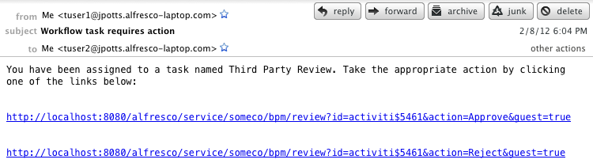

If you click on a link, it should cause the workflow to proceed along
the specified path.

**Warning: The Third Party example is *not* production-ready**

I included the third-party example to show one type of
wait-state/asynchronous behavior in a process. It's got a long way to go
before it can be used in production. A short list list of obvious issues
includes:

-   The email recipient doesn't get a copy of the documents being
    reviewed. One way to address this would be to have the notification
    action send a zip of the documents in the workflow package. Another
    way would be to write additional web scripts or send them a download
    link. I simply didn't have time to implement this and figured it was
    a bit off-topic anyway.
-   It'd be really easy for an unauthorized person to signal any node in
    the system because my controller class doesn't do any validation
    whatsoever and the task ID's are trivial. In real life, you'd want
    to check that (1) the person making the request is the person
    assigned to the task, (2) that the task is still active, and (3)
    possibly use an additional security mechanism like a shared secret
    of some kind.
-   The email body should probably come from a Freemarker template. That
    way you could reuse the notification class in any number of
    processes and it simplifies email body maintenance.

So, long story short, feel free to use this idea, but realize that I've
cut corners for brevity's sake.

Step 3: Add a timer to the third-party task 
-------------------------------------------

What if you sent an email to the third party and they never took action?
One way to handle that problem is with a timer.

One way to do this is to add a boundary timer to the Third Party Review
task. When the timer expires, the timer can cancel the Third Party
Review task and then route to the Approved task. To implement this, I
added the following to my process definition:

    <boundaryEvent id="boundarytimer1" cancelActivity="true" attachedToRef="usertask4">
        <timerEventDefinition>
            <timeDuration>PT5M</timeDuration>
        </timerEventDefinition>
    </boundaryEvent>
    <sequenceFlow id="toExpiredApprove" name="" sourceRef="boundarytimer1" targetRef="usertask5"></sequenceFlow>

Note that if you are following along, your task IDs may be different
than mine, so pay attention that the “attachedToRef” attribute of the
“boundaryEvent” element is pointing to the ID of the Third Party Review
task and that the “targetRef” attribute of the “sequenceFlow” element is
pointing to the Approved Notification task.

I've got the timer set for 5 minutes—that's what the “PT5M” expression
means--but you could obviously set it for as long or as short as you
wish. That expression is part of the ISO 8601 standard for durations.

Setting an absolute date works as well. The due date could also be the
result of an expression. To use a specific date instead of a duration,
use a “timeDate” element instead of a “timeDuration” element.

### Deploy and test 

Adding a timer doesn't require a restart. Just redeploy the process
using the workflow console then start a new workflow. When the timer
expires, the process should continue as if someone signaled the
“approve” transition.

Conclusion 
==========
You should now know the ins and outs of implementing advanced workflows
using the Activiti engine embedded within Alfresco. You know when
Alfresco's basic workflows will suffice and when advanced workflows are
more appropriate. I showed you that process definitions are collections
of events, tasks, and gateways joined by sequence flows. The
representation of a process definition, both as a diagram, and as XML,
is standardized through BPMN. And, you now know how to add business
logic to workflows using expressions, Alfresco JavaScript and Java.

I also walked you through the overall process of implementing advanced
workflows in Alfresco by walking through some simple Hello World
examples and then a more complex example that used many different node
types and business logic options. I even spiced things up a bit by
exposing the business process to a third-party via SMTP and HTTP with
the help of the web script framework.

Hopefully, this has sparked some ideas about how you can leverage
Alfresco and Activiti in your own projects and has given you some
concrete examples you can leverage in your own projects going forward.

Deploying and testing 
---------------------

To deploy the sample code included with this article, all you have to do
is:

1.  Unzip the advanced-workflow-article.zip file.
2.  Import the advanced-worklfow-article-repo-project.zip file into
    Eclipse. (Or just expand it on your file system).
3.  Change build.properties to match your environment.
4.  Run “ant deploy”.
5.  Import the advanced-workflow-article-share-project.zip file into
    Eclipse. (Or just expand it on your file system).
6.  Change build.properties to match your environment.
7.  Run “ant deploy”.

The deploy Ant task in each project will compile all necessary code, JAR
it up, zip up the JAR and the extensions into the appropriate folder
structure, and then unzip on top of the Alfresco and Share web roots
which deploys the custom model, Spring config files, web client
customizations, scripts, web scripts, and all other assets to the
appropriate directories.

In case you are curious, my environment is:

-   Mac OS X Lion 10.7.2
-   MySQL 5.1.61 (Macports)
-   Tomcat 6.0.32
-   Java 1.6.0\_29
-   Alfresco 4.0.d Community, WAR-only distribution
-   Activiti Eclipse BPMN 2.0 Designer 5.7.1
-   Eclipse Helios Service Release 2
-   Apache James 2.3.1 (for testing third-party notification via SMTP)

Obviously, other operating systems, databases, and application servers
will work as well. Activiti just became available as an embedded
workflow engine with Alfresco 4. If you are running a release older than
Alfresco 4, you should read the first edition of this tutorial to see
the same examples running with jBPM.

Where to find more information 
==============================
-   The complete source code that accompanies this article is available
    [here](http://ecmarchitect.com/images/articles/alfresco-workflow/alfresco-workflow-tutorial.zip)
    from [ecmarchitect.com](http://ecmarchitect.com/).
-   You may also enjoy previous articles in the Alfresco Developer
    Series at ecmarchitect.com:
    -   “[Working with Custom Content Types, 2nd
        Edition](http://ecmarchitect.com/images/articles/alfresco-content/content-article-2ed.pdf)”,
        January, 2012.
    -   [“](http://ecmarchitect.com/images/articles/alfresco-actions/actions-article-2ed.pdf)[Developing
        Custom Actions, 2nd
        Edition”](http://ecmarchitect.com/images/articles/alfresco-actions/actions-article-2ed.pdf),
        January, 2012.
    -   “[Intro to the Web Script
        Framework](http://ecmarchitect.com/archives/2007/10/25/777)”,
        October, 2007.
    -   [“](http://ecmarchitect.com/archives/2007/09/26/770)[Implementing
        Custom
        Behaviors”](http://ecmarchitect.com/archives/2007/09/26/770),
        September, 2007.
-   [Alfresco wiki and docs pages related to this
    topic:](http://wiki.alfresco.com/wiki/Web_Scripts)
    -   [Workflow
        Architecture](http://docs.alfresco.com/4.0/topic/com.alfresco.enterprise.doc/concepts/wf-architecture.html)
        page on docs.alfresco.com
    -   [Alfresco JavaScript
        API](http://wiki.alfresco.com/wiki/JavaScript_API) wiki page
    -   For deployment help, see [Packaging and Deploying
        Extensions](http://wiki.alfresco.com/wiki/Packaging_And_Deploying_Extensions)
        in the Alfresco wiki.
    -   For general development help, see the [Developer
        Guide](http://wiki.alfresco.com/wiki/Developer_Guide).
    -   For help customizing the data dictionary, see the [Data
        Dictionary](http://wiki.alfresco.com/wiki/Data_Dictionary_Guide)
        wiki page.
-   Activiti and BPMN
    -   The [Activiti home page](http://activiti.org/) has documentation
        and tutorials.
    -   Archived Activiti Process Designer installation bundles live
        [here](http://activiti.org/designer/archived/).
    -   Ask questions about Activiti embedded within Alfresco in the
        [Workflow
        forum](http://forums.alfresco.com/en/viewforum.php?f=34).
    -   OMG hosts [bpmn.org](http://www.bpmn.org/), which is where the
        [BPMN 2.0 spec](http://www.omg.org/spec/BPMN/2.0/) lives as well
        as the [BPMN by
        Example](http://www.omg.org/cgi-bin/doc?dtc/10-06-02) document.

Footnotes
=========

[1](#sdfootnote1anc) [http://en.wikipedia.org/wiki/Workflow](http://en.wikipedia.org/wiki/Workflow)

[2](#sdfootnote2anc) Of course document-centric workflows may include
fully automated steps and machine-to-machine interactions—the point is
that document-centric workflows in which humans review, approve, or
collaborate in some way are in the scope of the discussion while
processes which run lights-out system-to-system orchestration or
integration are not.

[3](#sdfootnote3anc) The web script configuration that maps the URL to
the controller and view resides in
alfresco/extension/templates/webscripts/com/someco/bpm. The controller
class is com.someco.scripts.GetReview.
